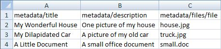

# EBI Overview

The EQUELLA Bulk Importer (EBI) is a program that allows non-technical users to import large amounts of content into EQUELLA. It is supported on Windows, Mac and Linux.
 
[You can download the EBI and user manual here](ebi_manual.pdf)
 
 
### HOW IT WORKS

To upload content into EQUELLA with the EBI you must first form a list of your content and metadata in a spreadsheet-like text file called a comma separated view (CSV). The EBI then reads your CSV one row at a time and creates an EQUELLA item for each row. For each item it uses the row data as metadata and attaches any files listed in the row.
 
 
### GETTING STARTED
 
Put the files you wish to upload into a folder.
 
In that folder create a CSV (best done with Microsoft Excel). The first row should contain column headings. Include a column for each metadata field you wish to upload and a column for your filenames. The column headings should be the XPaths to the corresponding fields in your collection that you are uploading into.
 
 
#### For example: 
 

 
In the above example the XPaths in the headings match the metadata targets of the EQUELLA collection's wizard controls used for title, description and attachments.
 
 
In the EBI, put in your EQUELLA connection settings, load the CSV, identify which column has files (the third column in the example) and start the import. The EBI then creates a corresponding item for each row in the CSV.
 
The files for this example are attached below. For a step-by-step walkthrough of this example see the Quick Start Guide in the EBI user manual.
 
 
#### ADVANCED FEATURES
 
 
The EBI is quick and easy to set up for creating EQUELLA items with simple metadata and attachments. It also has many advanced features for other tasks and content with more complexity:
 
 
* Update existing items in EQUELLA
* Bulk delete items
* Export items
* IMS/SCORM package import
* Set owners and collaborators
* Create items in draft status
Run in non-visual mode
Expert scripting
and much, much more!