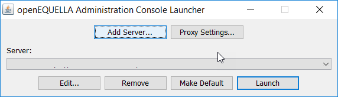
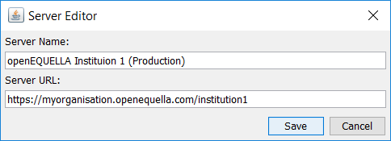
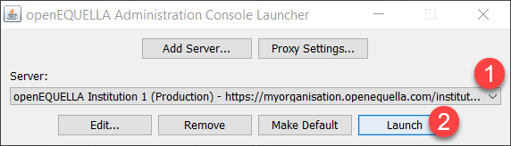

Administration Console Package
------------------------------

In openEQUELLA versions prior to 2019.1, the Administration Console was launched
from the openEQUELLA Settings page using Java Web Start. As time progresses, there are an
increasing number of organisations who would prefer not to have Java installed
on the client side as part of the Standard Operating Environment (SOE).

Until the Administration Console functionality can be transferred to the web, an
interim solution in the form of an Administration Console ‘package’ is available
to use with openEQUELLA 2019.1 and future releases. This package bundles the
Java Runtime Environment (JRE) with the Administration Console and allows users
to access the Administration Console on local systems. This will remove the
requirement to install Java locally and this package will be the access point to
the Administration Console from openEQUELLA 2019.1 forward.

### Downloading the package

There are three Administration Console Packages available on GitHub, one each
for Windows, Mac and Linux operating systems.

##### To download the package

1.  Go to https://github.com/openequella/openEQUELLA-admin-console-package/releases
    and download the required operating system package.

2.  Extract the package files to your preferred location on your local drive.

### Opening the Launcher 

The Launcher enables the configuration of openEQUELLA servers and the launching
of their respective Administration Consoles, as well as various other functions.

To open the Launcher, double-click the relevant launcher file
(`Windows-launcher.bat`, `Mac-launcher.sh`, or `Linux-launcher.sh`). You may wish
to create a shortcut for this file as you will use it each time to access an
Administration Console. The **openEQUELLA Administration Console Launcher**
displays. An example is shown in Figure 1.

**Figure 1 openEQUELLA Administration Console Launcher**

#### openEQUELLA Administration Console Launcher components

The **openEQUELLA Administration Console Launcher** has the following functions:

-   **Add Server** – enables the openEQUELLA servers and their institutions to
    be configured so that their Administration Consoles can be launched. See
    [Adding servers](#adding-servers).

-   **Proxy Settings –** enables the details of a Proxy Host to be configured to
    allow access to the Administration Console.

-   **Server** – a drop-down list of configured openEQUELLA servers and their
    institutions.

-   **Edit** – enables the details of the currently selected Server to be
    modified.

-   **Remove** – removes the currently selected Server.

-   **Make Default** – click to make the currently selected Server display as
    the default when the Launcher app is opened.

-   **Launch** – launches the Administration Console for the selected Server.

### Adding servers

Once the package is installed, each openEQUELLA server and institution must be
configured to access their respective Administration Consoles. For example, if
your organisation has a production environment and a test environment and you
have access to the Administration Console for both instances, you are required
to add both servers. Additionally, if there are multiple institutions on each
server, a server record must be added for each institution.

##### To add a server

1.  Open the Launcher using the relevant launcher file (`Windows-launcher.bat`,
    `Mac-launcher.sh`, or `Linux-launcher.sh`).

2.  Select **Add Server.** The **Server Editor** dialog displays, as shown in
    Figure 2.

**Figure 2 Server Editor**

1.  Enter a **Server Name** - a descriptive name for the openEQUELLA
    institution.

2.  Enter the **Server URL -** the full openEQUELLA domain, including the
    institution name. For example,
    `https://myorganisation.openequella.com/institution1`.

3.  Click **Save.**

### Cloning servers

Once one server has been configured, on selection of the **Add Server** button,
the user is presented with the option to clone the currently selected server.
Selecting **Yes** to this option will prefill the **Server Name** and **Server
URL** fields with the currently selected server details, and the user can adjust
them to the required values.

Selecting **No** to this option will leave the **Server Name** and **Server
URL** fields blank.

### Launching the package

Once a server record has been added for an institution, the Administration
Console for that institution can be opened.

##### To launch the Administration Console

1.  From the **openEQUELLA Administration Console Launcher**, select the
    required Server.

2.  Select **Launch** to open the Admin Console for the selected
    server/institution. An example is shown in Figure 3.

**Figure 3 Launch the Admin Console**

The **Enter login credentials** dialog displays. An example is shown in Figure 4

**Figure 4 Enter login credential dialog**

3.  Enter your login credentials

NOTE: Login credentials will be requested each time an Administration Console is
launched.

The Administration Console for the selected Server/Institution opens.
