# Advanced search overview 

The openEQUELLA **Advanced search** function provides a means of searching
within specific metadata associated with a resource. Each advanced search
must be associated with a particular metadata schema, which makes it
customised for certain resource types, enabling refined searches within
those resource types. It makes searching for a particular resource easier,
and can be targeted to specific users, groups or roles.

The purpose of this guide is to provide administrators with an understanding
of the configuration and use of the Advanced Search function.

Please note that this guide has been developed to best reflect the full
capabilities of openEQUELLA and as such may differ in appearance to your own
installation.

## Advanced search configuration

Advanced searches are created and maintained via the **Advanced Searches**
configuration tool accessed from the Administration Console.

##### To access Advanced Searches configuration tool

1.  Log in to the openEQUELLA **Administration Console** and select **Advanced
    Searches**, as shown in Figure 2.

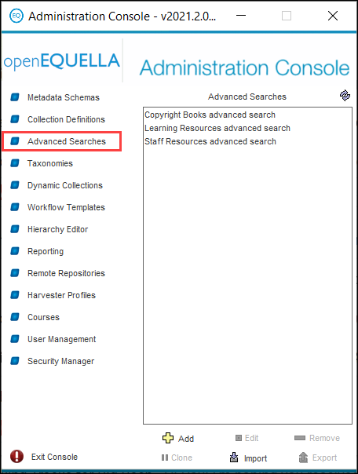

Figure 2 Administration console—Advanced Searches

### Administration console elements

When a tool has been selected the **Add**, **Edit**, **Remove**, **Clone***,*
**Import** and **Export** buttons are enabled.

-   **Add**—click to display the **Advanced Search Editor** where a new advanced
    search can be created. See Create an advanced search.

-   **Edit**—select an Advanced search then click **Edit**, or double-click on
    an advanced search, to display the **Advanced Search Editor** to modify the
    selected advanced search. If the selected advanced search is being edited by
    another user a **Locked** dialog is displayed as shown in Figure 3,
    providing the following options:

-   **Open as read-only**—disables the **Save** button so that no changes can be
    committed.

-   **Forcefully unlock**—unlocks the entity from the previous editor. Editing
    is possible but changes by other users may be lost.

-   **Do not open**—the advanced search configuration screen will not be opened.

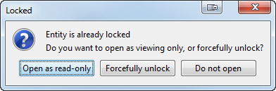

Figure 3 Locked entity dialog

-   **Remove**—click to delete the selected advanced search.

-   **Clone**—click to copy an existing advanced search. The cloned search can
    then be modified by selecting the **Edit** button.

-   **Import**—click to import an advanced search that has previously been
    exported from the Administration Console. A warning dialog displays, as
    shown in Figure 4. (*NOTE: Only ZIP files that have been exported from the
    Administration Console should be imported—other ZIP files may adversely
    affect the stability of the system*.)

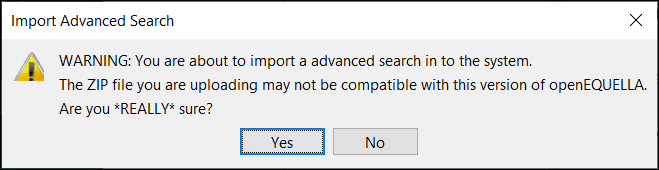

Figure 4 Import Advanced Search warning dialog

-   **Export**—click to export an advanced search as a ZIP file.

## Metadata targets

Every advanced search must be associated with a metadata schema and the
collections that use that schema. When configuring an advanced search, defined
metadata targets, or nodes, within the schema are selected. Each one of these
metadata targets must be set up for advanced search indexing.

##### To set up metadata schema nodes to index for advanced searching

1.  Select the **Metadata Schemas** option from the Administration Console to
    display the Metadata Schemas pane on the right-hand side of the page. A list
    of existing metadata schemas displays. An example is shown in Figure 5.

    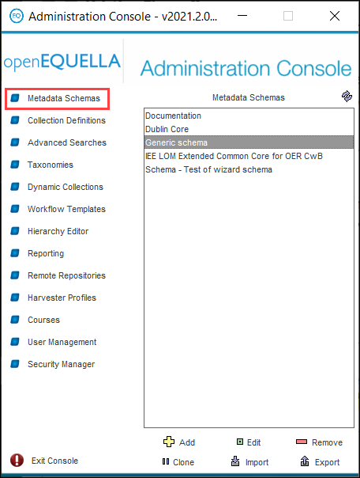

    Figure 5 Administration Console—Metadata Schemas pane

2.  Select the relevant schema from the list*.*

3.  Double-click or select the **Edit** link. The **Schema Manager** will open
    at the **Details** page as shown in Figure 6.

    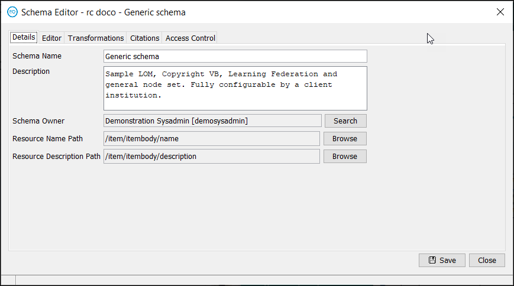

    Figure 6 Schema Manager—Details page

4.  Select the **Editor** tab. The **Schema Manager**—**Editor** page is
    displayed as shown in Figure 7.

    

    Figure 7 Schema Manager—Editor page

Previously created metadata schemas display an information bar stating that the
schema is ‘partially locked’, meaning that only certain types of actions can be
performed that will not be detrimental to existing resources contributed with
this schema. Unlocking a schema allows for complete control, but some changes to
a schema can cause associated collections or searches to create invalid data or
not perform correctly. Be mindful of this risk when choosing to unlock and
change any elements of an existing schema.

You will need to choose to unlock the schema to access the advanced search
indexing field:

5.  Click the gold information bar. The **Schema Partially Locked** dialog is
    displayed. An example is shown in Figure 8.

    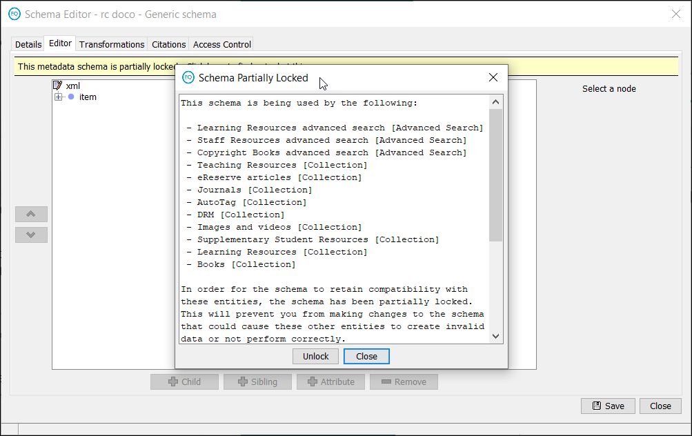

    Figure 8 Schema Partially Locked dialog

6.  Click **Unlock**. A confirmation dialog is displayed.

7.  Click **Yes**.

##### To configure the schema

1.  Click the **+** button beside the item node to open the tree.

2.  Select the appropriate node.

3.  Check the **Index for Advanced Searches** checkbox, as shown in Figure 9.

    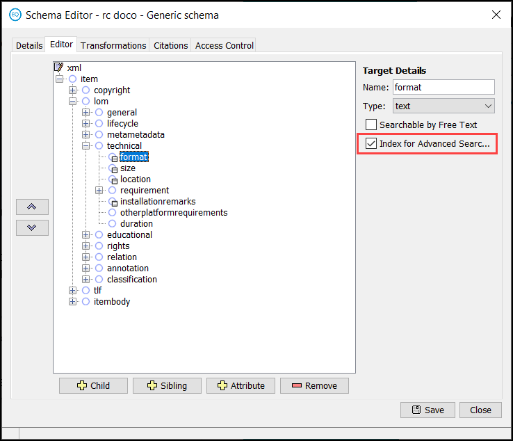

    Figure 9 Index for Advanced Searches checkbox

4.  Select further nodes for indexing as necessary.

5.  Click **Save**.

6.  Click **Close** to return to the Administration Console.

## Create an advanced search

##### To create a new advanced search

1.  Select the **Advanced Searches** option from the Administration Console.

2.  Select the **Add** link. The **Advanced Search Editor—Details** tab
    displays, as shown in Figure 10.

### Details tab

The **Details** tab is where the metadata schema and related collections to be
associated with the advanced search are selected.

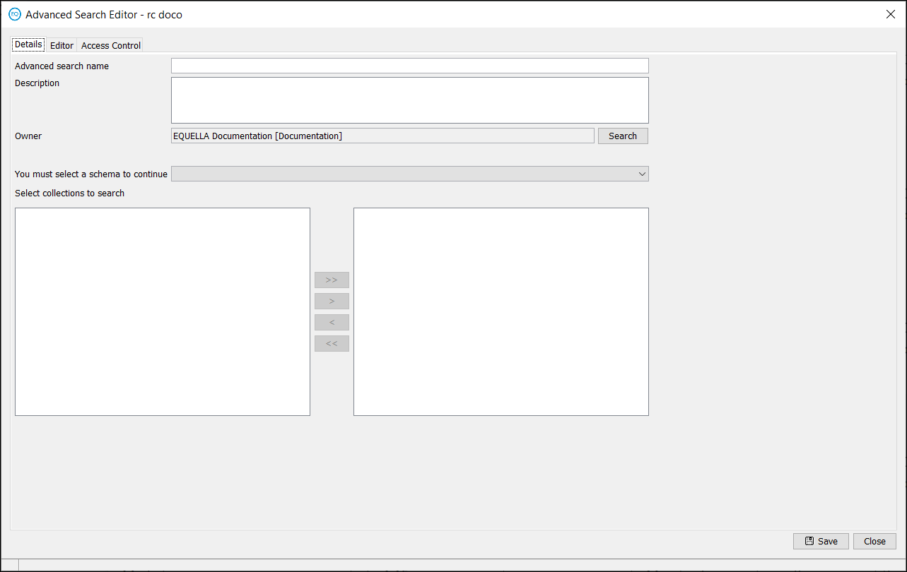

Figure 10 Advanced Search Editor—Details tab

The configurable **Details** page elements are:

-   **Advanced Search name** and **description**—enter a meaningful name and
    description to enable users to easily identify the purpose of the search.

-   **Owner**—the owner of the search (by default this is the search’s creator).

-   **Select metadata schema**—select the schema the search will target.

-   **Select collections to search**—select from the displayed collections
    associated with the chosen schema.

#### Configure the Details page

1.  Enter the name of the search (e.g. *Learning Resources*) in the Advanced
    search name field.

2.  Enter a description of the search in the **Description** field, if required.

3.  The **Owner** field is set to default to the current user. If required,
    click the **Search** button to open a **Select Recipients...** dialog to
    select a different owner.

4.  Select a schema from the **You must select a schema to continue** drop-down
    list. All collections that are associated with the selected schema will be
    displayed in the **Select collections to search** pane. An example is shown
    in Figure 11.

    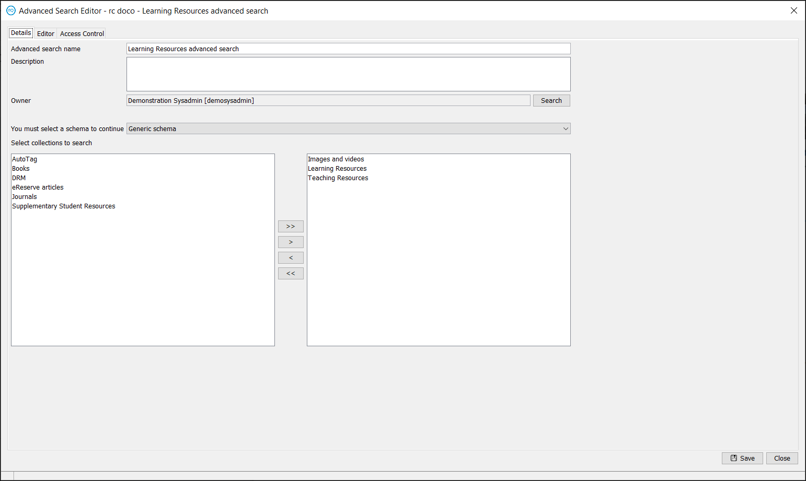

    Figure 11 Advanced Search Editor—Details page with schema selected

An advanced search can be limited to search only within particular collections.
To select which collections to be searched:

5.  Select the required collection and click the right button to move it to the
    right-hand pane, or

6.  Click the double-arrow right button to select all collections for searching.
    All collections are moved to the right-hand pane as shown in Figure 12.

    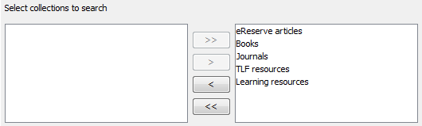

    Figure 12 Selected collections displayed in right-hand pane

7.  Move unwanted collections back to the left-hand pane by clicking the arrow
    buttons.

8.  Select the **Editor** tab to display the Editor page, as shown in Figure 13.

### Editor tab

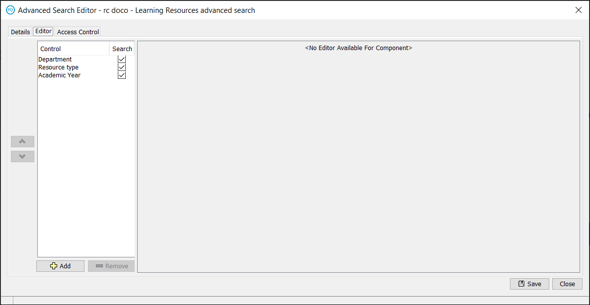

Figure 13 Advanced Search Editor—Editor tab

An advanced search can be regarded as a simplified wizard. Unlike wizards,
advanced searches display only one page and use a restricted set of controls.
The **Editor** page displays controls in the **Control list** pane located on
the left-hand side of the page. Each control targets a node from the metadata
schema. The targeted nodes are searched using the criteria entered or selected
by the user.

The **Editor** page contains the following elements:

##### Control list pane

The **Control list** pane is located on the left-hand side of the page. This
pane displays the controls that are shown to users of the advanced search.
Select a control to display its details in the **Control Editor** pane on the
right-hand side of the page.

##### Control Editor pane

The **Control Editor** pane is located on the right-hand side of the page. This
pane displays the details of the selected control. Its appearance will differ
for each control.

##### Navigation arrows

The buttons to the left of the control list pane allow the user to change the
order the controls appear in the advanced search. The up arrow moves the
selected control upwards on the page, and the down arrow moves it downwards.

##### Add button

**Add** opens the **Select a control...** dialog, as displayed in Figure 14.

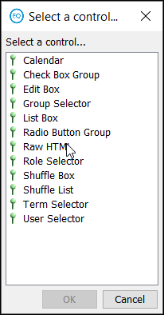

Figure 14 Select a control... dialog

A brief explanation of the available controls is provided below:

-   **Calendar**—allows searching by date.

-   **Check Box Group**—displays a check box group from which one or more
    elements can be selected.

-   **Edit Box**—allows for the entry of basic keywords.

-   **List Box**—features drop-down options to select from.

-   **Radio Button Group**—displays a group of options from which only one can
    be selected.

-   **Raw HTML**—allows the entry of HTML code.

-   **Shuffle Box**—allows for the selection of one or more items by moving them
    from one pane to another using arrow buttons.

-   **Shuffle List**—allows the entry of any number of elements to a list.

-   **Term Selector**—allows for the selection of pre-existing terms.

-   **User Selector**—allows for the search and selection of openEQUELLA users.

Each control must target a specific metadata schema node.

##### Remove button

Click to delete the selected control from the advanced search.

##### Save button

Click to save the current advanced search.

##### Close button

Click to close the advanced search editor.

#### Configure the Editor page

1.  Click **Add** to display the Select a control... dialog.

2.  Select an appropriate control.

3.  Click **OK**. The dialog will close and the selected control is displayed in
    the left-hand pane of the editor, as shown in Figure 15.

    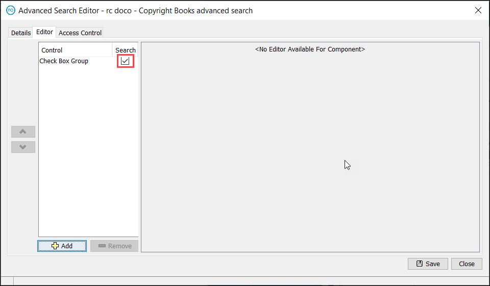

    Figure 15 Advanced Search Editor—control added

The **Search** checkbox controls whether the search control is functional to the
user. If unchecked, the user may select a value but it will have no impact on
the search results.

4.  Select the control. The control configuration pane is displayed on the
    right-hand side, as shown in Figure 16.

    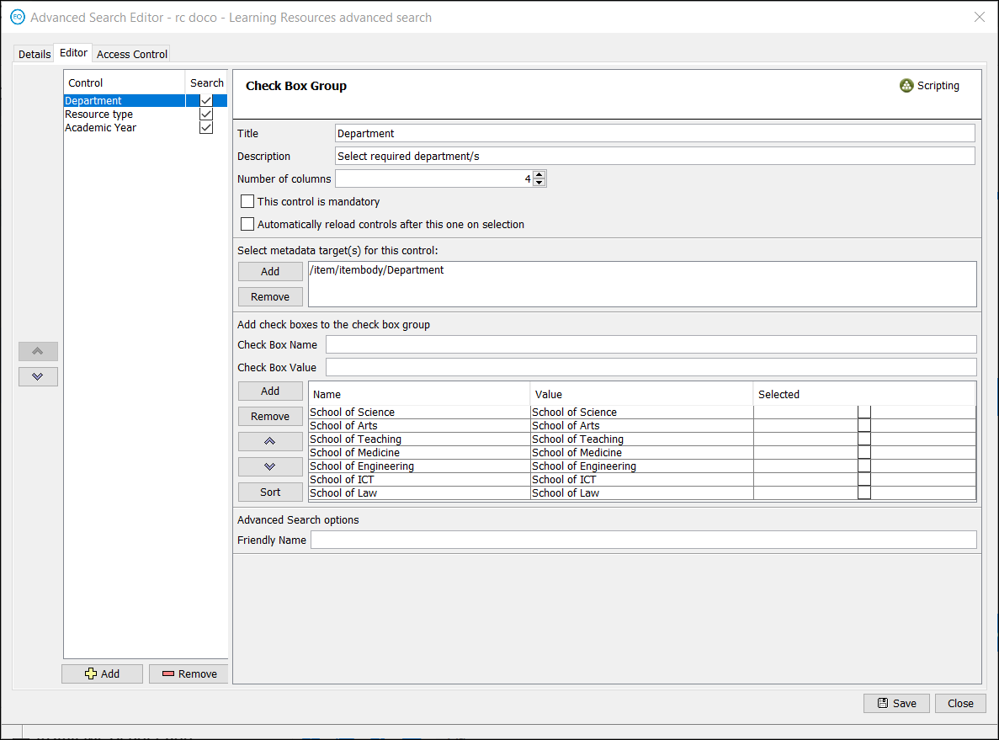

    Figure 16 Advanced Search Editor—control configuration pane

5.  Configure the selected control as required.

6.  Add further controls as necessary

    An example of the user view of the Learning resources advanced search
    criteria page is shown in Figure 18.

    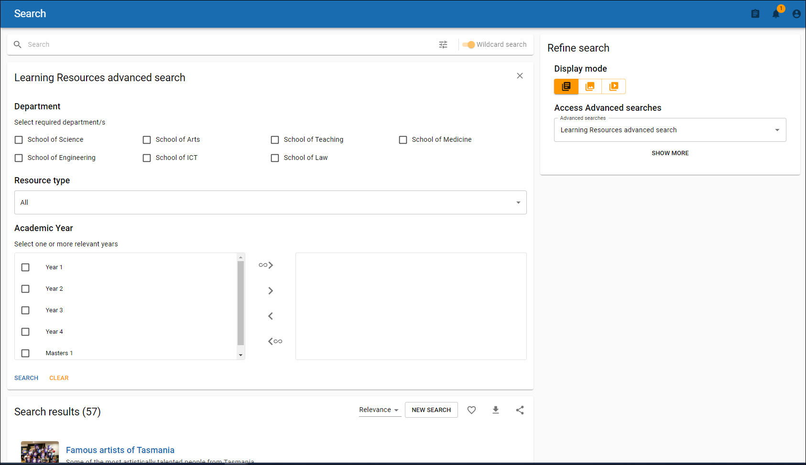

    Figure 18 Learning resources advanced search page

#### Friendly name

**NOTE: Friendly name is used only in the openEQUELLA legacy UI**

Each control in the advanced search editor page except Raw HTML and User
selector has a **Friendly Name** field at the bottom of the control editor page.
An example is shown in Figure 19.

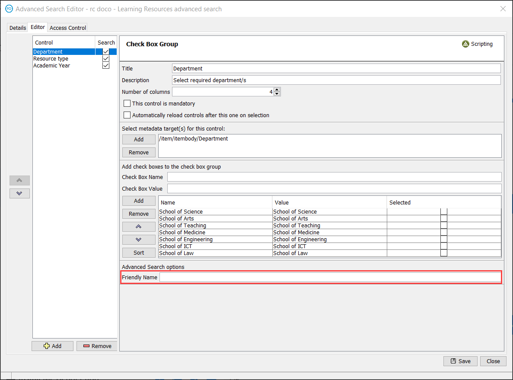

Figure 19 Friendly Name field

The name entered in this field displays on the results page once the advanced
search has been activated, instead of the xml schema path. The text entered in
this field for a control displays when an element from that control is selected
on the search criteria page.

Using the example where the Friendly Name ‘*Resource type’* has been entered,
shown in Figure 19, if the Format of resource ‘*Image’* checkbox is selected
from the search criteria page, the search box displays ‘*Resource type is
Image’.* An example of the results page without a friendly name is shown in
Figure 20 and an example with the friendly name is shown in Figure 21.

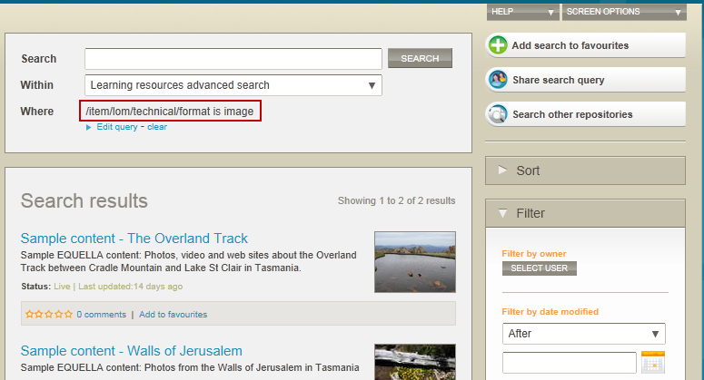

Figure 20 Advanced search results page(legacy UI) with xml path (no Friendly
Name)

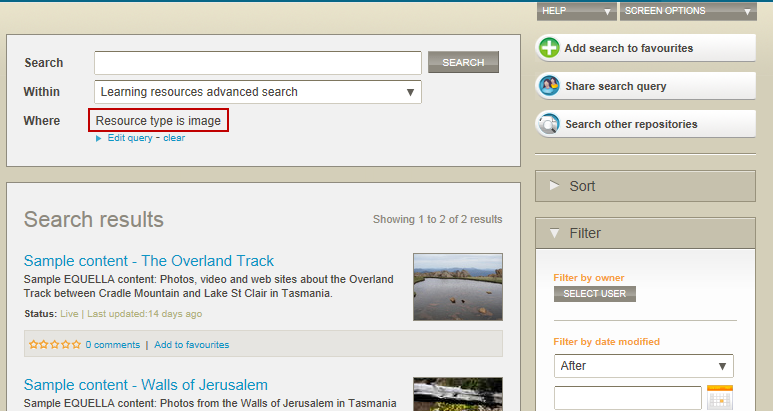

Figure 21 Advanced search results page (legacy UI)with 'Friendly Name'

### Access Control tab

The **Access Control** tab allows the administrator to configure user access to
the selected search. There are three privileges that can be granted: **delete
this advanced search**, **edit this advanced search**, and **search for items
with this advanced search**.

The following is an example of how to configure the Access Control page. Any
user or group can be assigned as owners of a search. This example grants
privileges to the system administrator and viewer roles.

##### To configure this page to restrict access to the system administrator

1.  Select the **Access Control** tab. The Access Control page is displayed, as
    shown in Figure 22.

    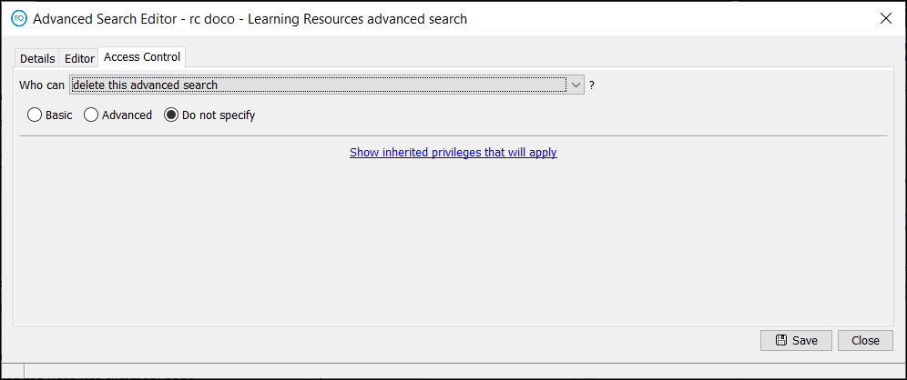

    Figure 22 Advanced Search Editor—Access Control tab

2.  Click the **Who can?** drop-down arrow and select the **delete this advanced
    search** option.

3.  Select the **Advanced** option. The Advanced screen displays, as shown in
    Figure 23.

    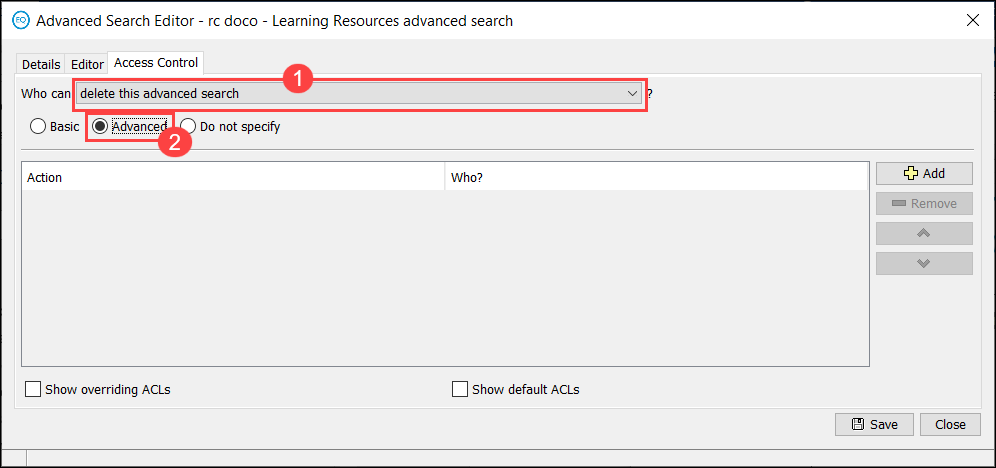

    Figure 23 Access Control—Advanced page

4.  Click **Add**.

5.  In the **Action** field, make sure **Grant** displays. If displaying
    **Revoke**, click on the field and change to **Grant.**

6.  In the **Who?** field, click on **Everyone**. The **Select Recipients...**
    dialog displays, as shown in Figure 24. This dialog allows a search for
    users, groups or roles to grant access to.

    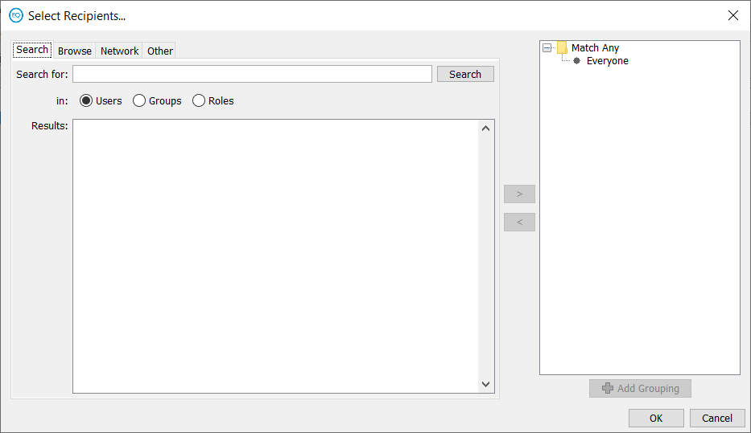

    Figure 24 Select Recipients... dialog

7.  Select the **Roles** radio button.

8.  Click **Search** to display a list of available roles to choose from.
    Alternatively, type the first letter or letters of a search item and click
    **Search**.

9.  Select **Everyone** in the right-hand pane and use the left arrow button to
    move it to the left-hand pane.

10. Highlight **System Administrator Role** in the left-hand pane and move to
    the right-hand pane using the right button, as shown in Figure 25.

    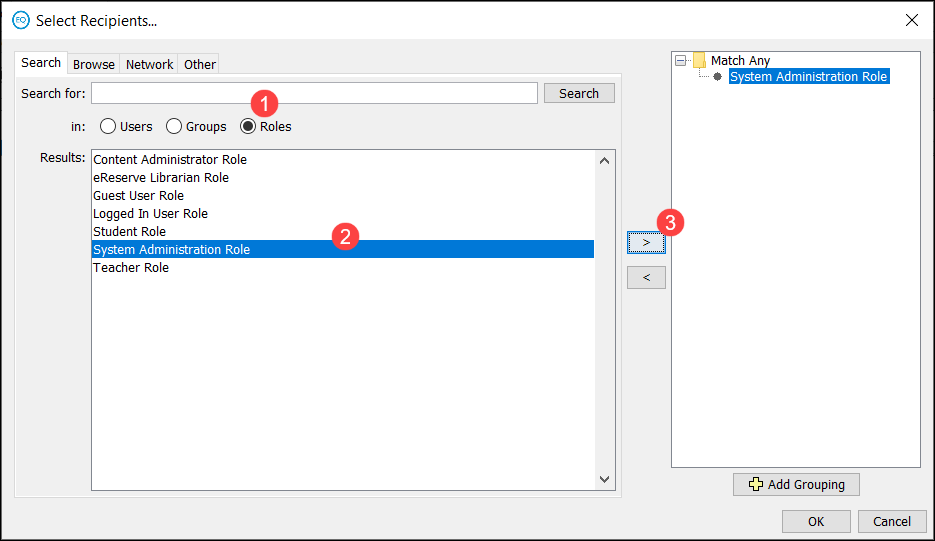

    Figure 25 Selected role added

11. Click **OK** to close the dialog.

The delete privilege has now been granted to the system administrator, as shown
in Figure 26.

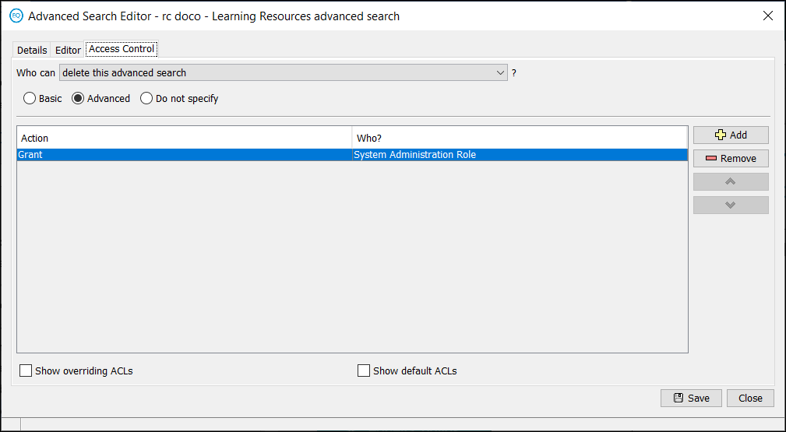
   
Figure 26 Completed access control configuration
    

    
    
12.  Select **edit this advanced search** from the **Who can?** drop-down list
    and configure access to the option by repeating steps 3 to11.

##### To configure this tab to restrict access to the Viewer role

1.  Select **search for items with this advanced search** from the **Who can?**
    drop-down list and grant the **Viewer Role** access to this option by
    repeating steps 3 to 11.

Further security options can be added or deleted using the **Add** or **Remove**
buttons.

### Save a search

When all elements have been configured for a search:

1.  Click **Save** to save the search details.

2.  Click **Close** to close the Advanced Search Editor.

