# openEQUELLA 2020.2 Features Guide

Table of Contents
* [New UI Settings pages](#new-ui-settings-pages)
* [Search settings](#search-settings)
* [New UI Search page](#new-ui-search-page)
* [Major Upgrades to Spring and Hibernate](#major-upgrades-to-spring-and-hibernate)
* [Blackboard LTI And REST Enhancements](#blackboard-lti-and-rest-enhancements)


New UI Settings pages
=====================

A number of pages within Settings have been updated with new Material UI
components. A consistent template has been applied to these pages, which
includes a panel with the configuration settings on the left, and a Save panel
on the right. The Save button is only enabled if a change has been made to at
least one configuration setting.

Settings pages with new UI include:

-   General - Login notice editor

-   Search – Content indexing

-   Search – Faceted search

-   Search – Search filters

-   Search – Search page

-   UI - Theme editor

Eventually all Settings pages will use this template.

An example of the **Content indexing** page with no changes (**SAVE** button
disabled) is shown in Figure 1.

   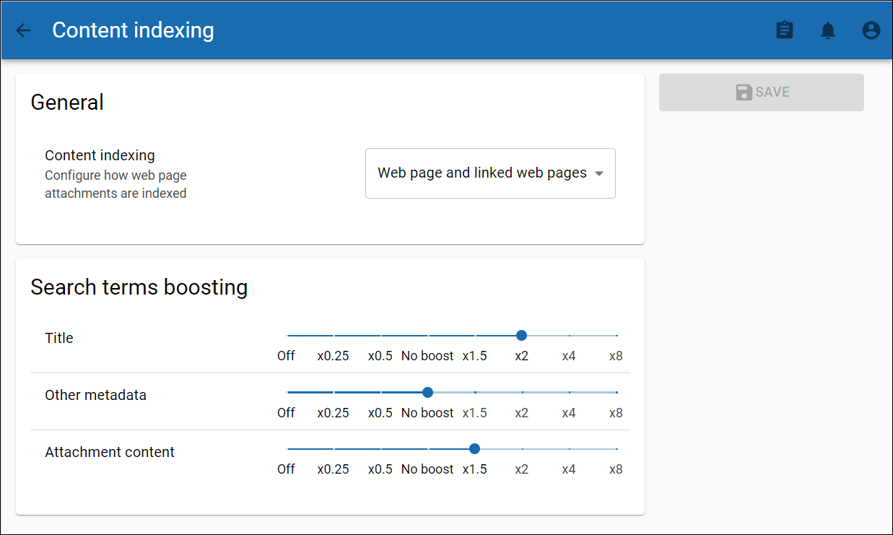

   Figure 1 Content indexing page with SAVE button disabled

An example of Content indexing page with changes (**SAVE** button enabled) is shown
in Figure 2.

   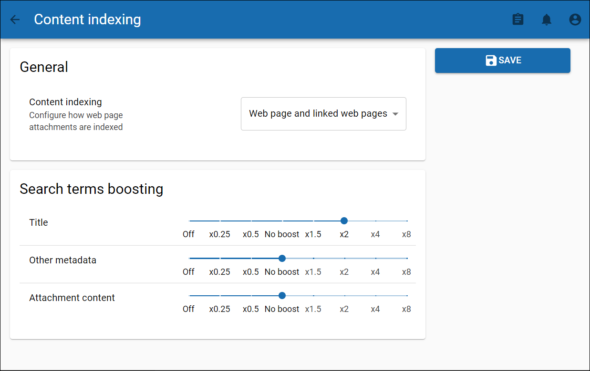

   Figure 2 Content indexing page with SAVE button enabled

If a user navigates away from one of these settings pages without saving
changes, a confirmation dialog displays. An example is shown in Figure 3.

   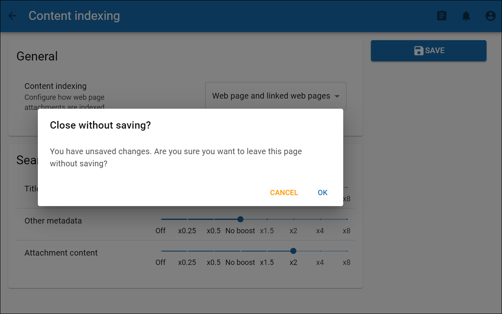

   Figure 3 Confirmation dialog

Search settings
===============

In openEQUELLA 2020.2 a new **Settings** category has been created called
**Search** which is made up of sub-categories containing all existing and new
configuration options relevant to the openEQUELLA Search page.

   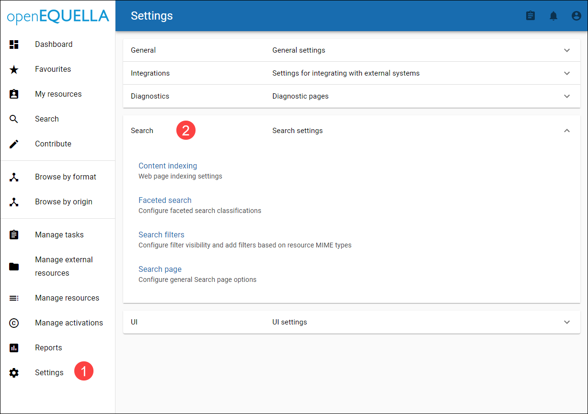

   Figure 4 Settings - Search category

Content indexing
----------------

**Content indexing** contains the existing settings for web-page content
indexing and search term boosting.


Figure 5 Content indexing and Search terms boosting

Faceted search
--------------

Use the **Faceted search settings** to add, edit and delete Faceted search
Classifications based on a metadata schema node (Classification) and its values
(Categories). Configured Classifications display in the Refine search panel on
the Search page, and users can refine their searches by selecting specific
Classification Categories.

An example of a Faceted search Classification and its Categories in the Refine
search panel is shown below.

### Classifications

**Classifications** are configured, edited and deleted from the **Faceted
search** setting page. Multiple classifications can be configured. Note the following:

-   Only relevant classifications display on the Search page based on filters
    selected, such as Collections. For example, if a search is filtered with a
    collection that doesn’t use the schema and node selected for a
    Classification, that Classification will not display in the Refine search
    panel.

-   Classifications show only categories that contain results for the defined
    search criteria. The number of results show for each category.

-   Classifications and their categories will update based on selections made by
    users. If a specific category is selected in one Classification, other
    Classifications and their categories will immediately adjust to reflect the
    selection.

-   When configuring Classifications, the default number of categories to
    display can be defined. If more categories exist, a ‘**SHOW MORE**’ option
    displays at the bottom of the list. Once expanded, a ‘**SHOW LESS**’ option
    displays. An example is shown in Figure 6.

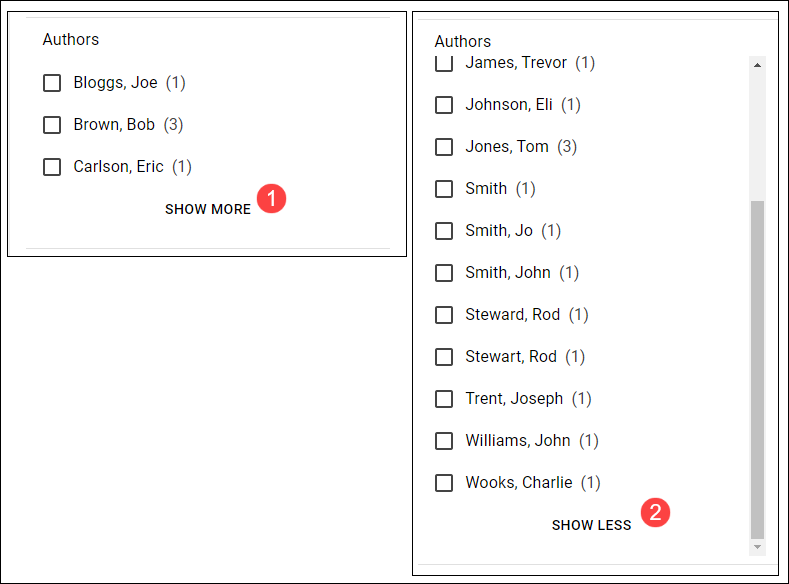

Figure 6 Classification with default and expanded views

##### To configure a Classification

1.  From the Settings, Search category, select **Faceted search**. The **Faceted
    search settings** page displays. An example is shown in Figure 7.

    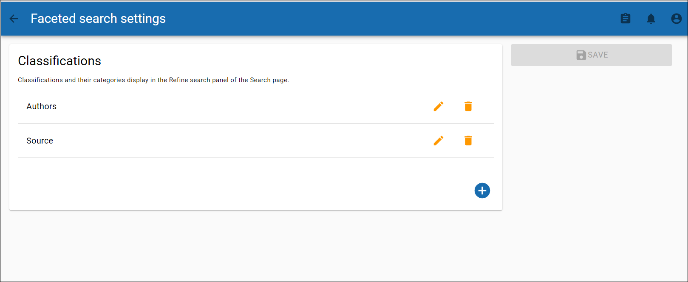

    Figure 7 Faceted search settings page

2.  Select the **Add** button (or the pencil icon to edit an existing
    Classification). The **Create classification** dialog displays. An example
    is shown in Figure 8.

    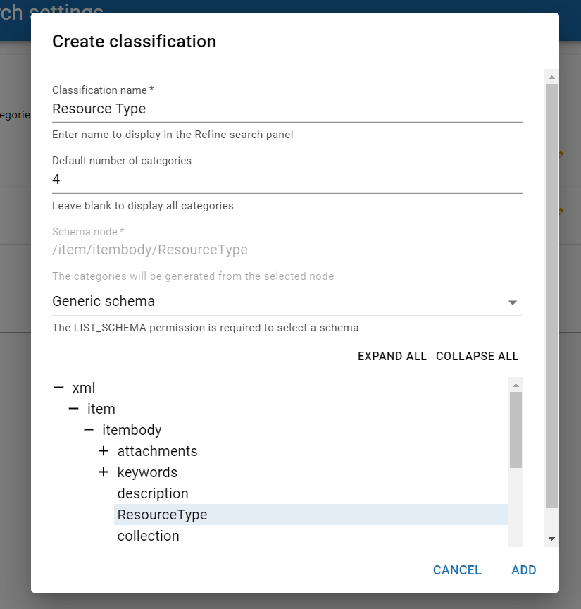

    Figure 8 Create classification with example classification

3.  Enter a **Classification name**. This displays as the Classification title
    in the Refine search panel.

4.  Enter the **Default number of categories** to display in the Refine search
    panel. A SHOW MORE link displays if there are a greater number of categories
    with results. Leave this field blank to display all categories with results.

5.  Select a **Schema node**:

    a.  **Select a schema** from the drop-down list. Note that the user must have
    the LIST_SCHEMA privilege granted for schemas to display in the list.

    b.   Navigate to and select the required schema node by either expanding the tree
    manually or using the EXPAND ALL option.  
    **NOTE: The selected schema node must have Index for Advanced Searches
    enabled in the schema.**

    c.  Select **ADD**.

9.  Click **SAVE**. The Classification now displays in the Refine search panel
    on the Search page. An example is shown in Figure 9.

    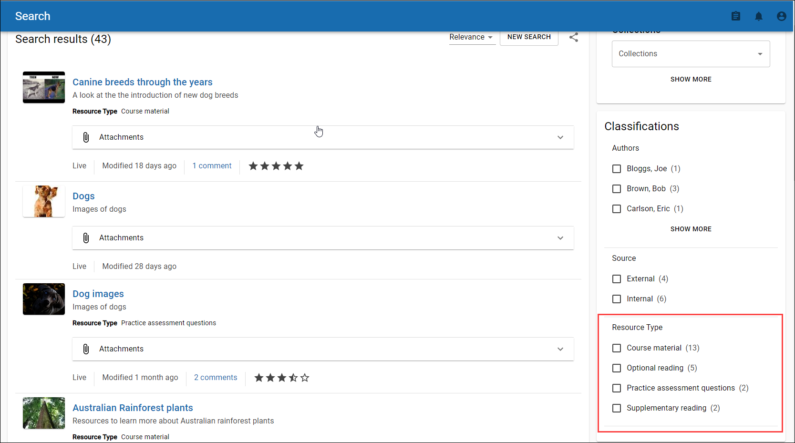

    Figure 9 Search page with new Classification

### Reordering classifications

The order in which classifications display in the Classification panel on the
Search page can be changed.

##### To reorder classifications

1.  From the Settings, Search category, select **Faceted search**. The **Faceted
    search settings** page displays listing existing Classifications. An example
    is shown in Figure 10.

    

    Figure 10 Faceted search settings page

2.  Use drag and drop to organise existing Classifications into the desired
    display order.

3.  Click **SAVE**. The Classifications display in the defined order in the
    Classifications panel on the Search page.

Search filters
--------------

The **Search filters settings** page contains new filter visibility options as
well as the legacy Attachment MIME type filters configuration. An example is
shown in Figure 11.

   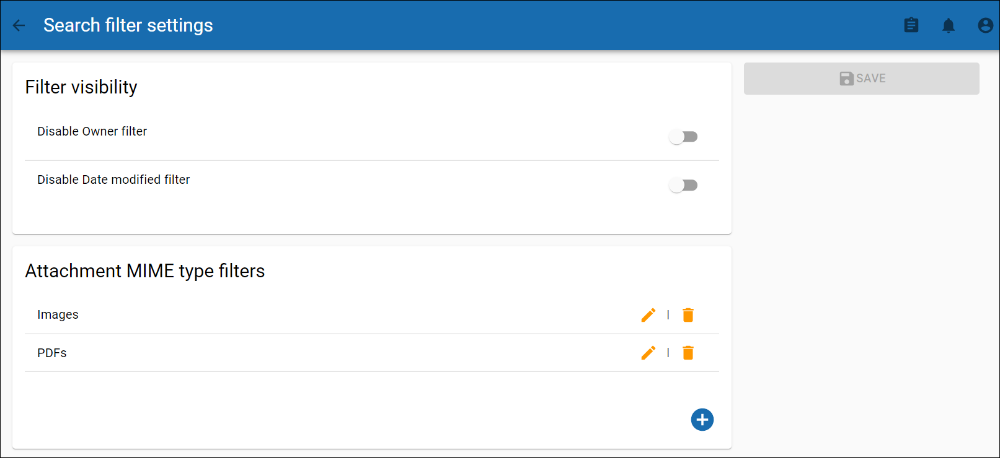

   Figure 11 Search filter settings page

### Filter visibility options

The new **Filter visibility** options allow administrators to hide the **Owner**
and **Date modified** filters from the Refine search panel if required. These
filters show by default on the Search page. An example is shown in Figure 12.

   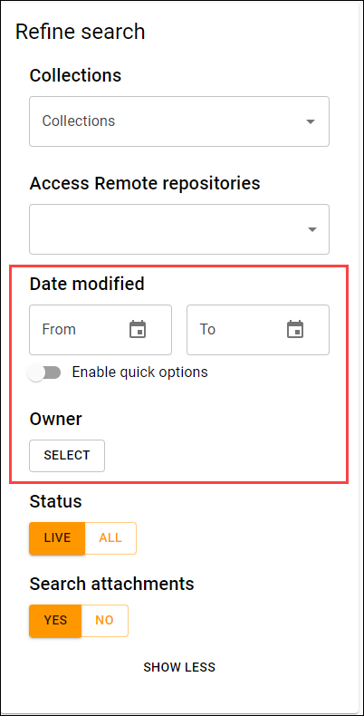

   Figure 12 Refine search panel with Owner and Date modified filters visible

Click on the switch beside the required visibility setting to toggle the switch
to on. When selected, the filter will not display in the Refine search panel. An
example with the Owner filter disabled is shown in Figure 13.

   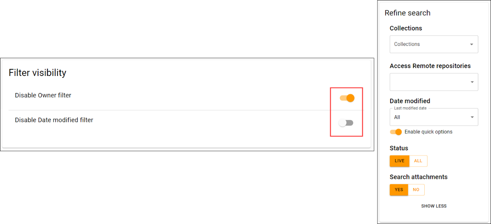

   Figure 13 Refine search panel with Owner filter disabled

### Attachment MIME type filter

**NOTE: Attachment MIME type filters are not included in the new Search UI for
2020.2. They will be added to the Refine search panel in 2021.1.**

Attachment MIME type filter configuration has not changed for 2020.2.

Search page
-----------

The **Search page settings** contain the legacy General and Gallery settings
that existed prior to 2020.2, but display in the new UI template. When you
upgrade to 2020.2, your current configuration for these settings will persist.

NOTE: openEQUELLA 2020.2 new Search UI does not include Gallery views.

An example is shown in Figure 14.

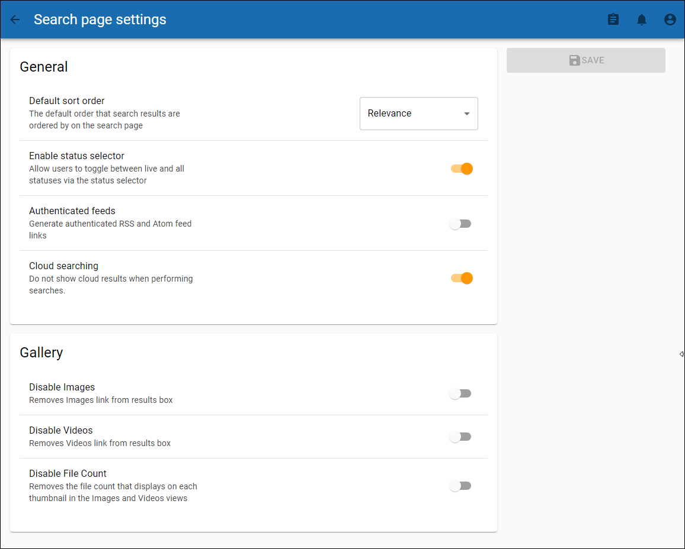

Figure 14 Search page settings

New UI Search page
==================

openEQUELLA 2020.2 sees the introduction of a Material UI-based Search page
featuring a modern, clean new look. It includes most of the existing
functionality from the legacy Search UI, plus some new features. Any legacy UI
features that are not included in this release, such as gallery views and saving
and viewing favourite searches, will be implemented in openEQUELLA 2021.1.

An example of the new Search page is shown in Figure 15.

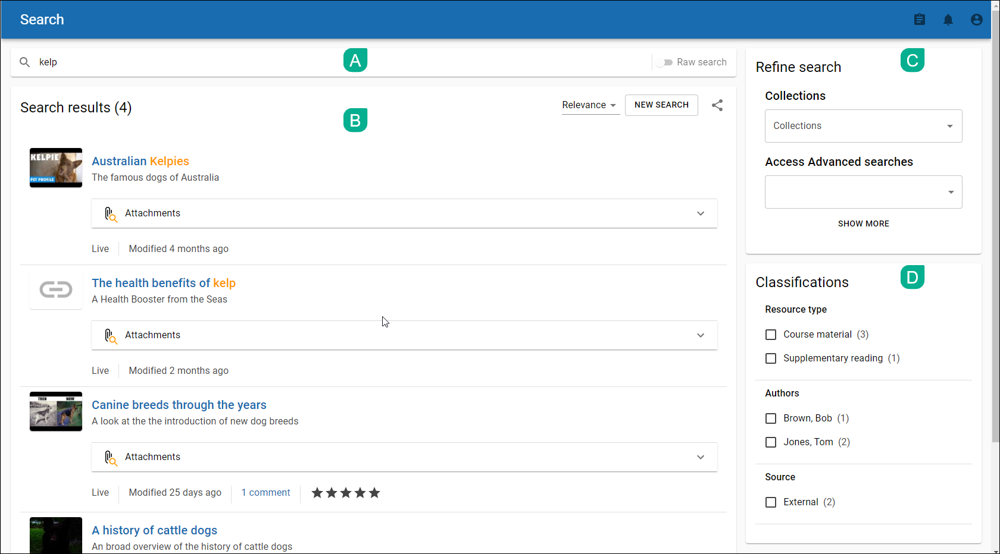

Figure 15 New UI Search page

The new Search page consists of four main panels:

A.  **Search query** – enter search criteria such as key words to display
    matching results

B.  **Search results** – displays results

C.  **Refine search** – allows users to configure filters to refine search
    results

D.  **Classifications** – displays faceted search categories to allow a
    concentrated level of refinement. This panel does not display if no faceted
    search classifications have been configured.

Search criteria panel
---------------------

The **Search criteria** panel enables users to enter search terms.

By default, typed text is appended with a wildcard (\*), so results are based on
anything starting with the entered term. The example below shows a search term
of ‘kelp’ has been typed, which the default search method effectively converts
to ‘kelp\*’ by default. An example is shown in Figure 16.

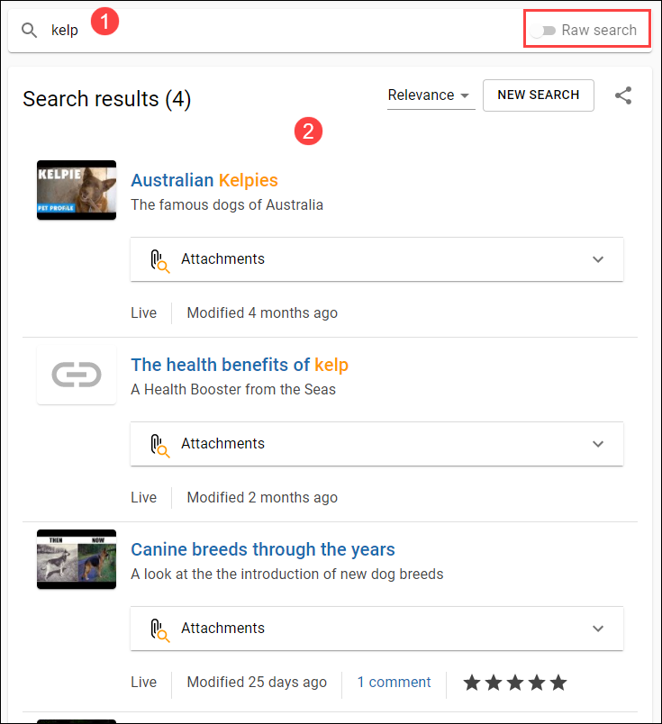

Figure 16 Default 'wildcard' search

Users can switch off the default wildcard search by selecting the Raw search
option, which returns exact matches. Raw search also supports stemming and stop words. An example is shown in Figure 17.

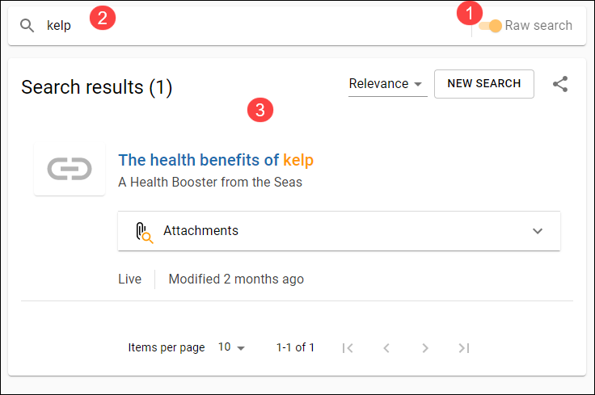

Figure 17 Raw search

Both search types support the use of the Apache Lucene search syntax.

Search results panel
--------------------

The **Search results** panel lists the items that match entered search criteria.
All items are listed in the default Sort order selected in Search settings upon
opening the Search page. If Relevance is selected as the default Sort order,
items are displayed in *Date last modified* order until search criteria is
entered.

The details for each item display in a similar fashion to the legacy UI, with
some notable changes marked in the following example and explained below:

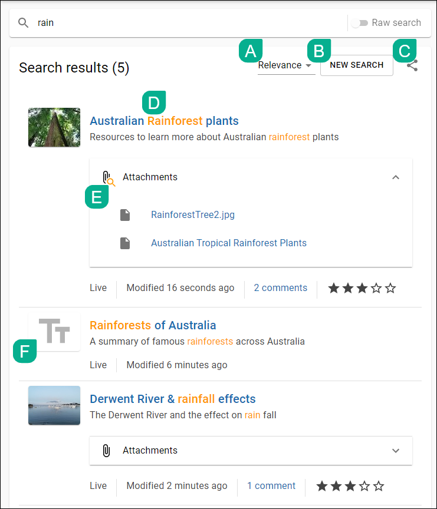

Figure 18 Results panel with notable changes

A.  **Sort order** – can be easily accessed to change to another option in the
    drop-down list.

B.  **New search** – this button clears all existing search criteria text and
    filters ready to start a new search

C.  **Share** – copies the current search URL for the purpose of sharing. Any
    search criteria and filters existing at the time the Share button is
    selected will persist when the URL is used.

D.  **Keyword highlights** – any words containing the typed search criteria are
    highlighted for each item.

E.  **Attachment results indicator** – the magnifying glass icon displayed with
    the attachment icon indicates that matches with the entered search criteria
    have been found within the item’s attachments.

F.  **Thumbnails** – the new Search UI displays the thumbnail of the first
    attachment in the attachment list for an item. If no thumbnail is available,
    a default MIME type thumbnail displays. If there are no attachments, the
    text thumbnail (as shown in the figure above) displays, denoting only
    metadata.

Refine search panel
-------------------

The **Refine search** panel enables users to select various filter options to
more efficiently discover the content they seek.

The Refine search panel defaults to showing the Collections and Advanced search
filters, but selecting the **SHOW MORE** link displays further filtering
options.

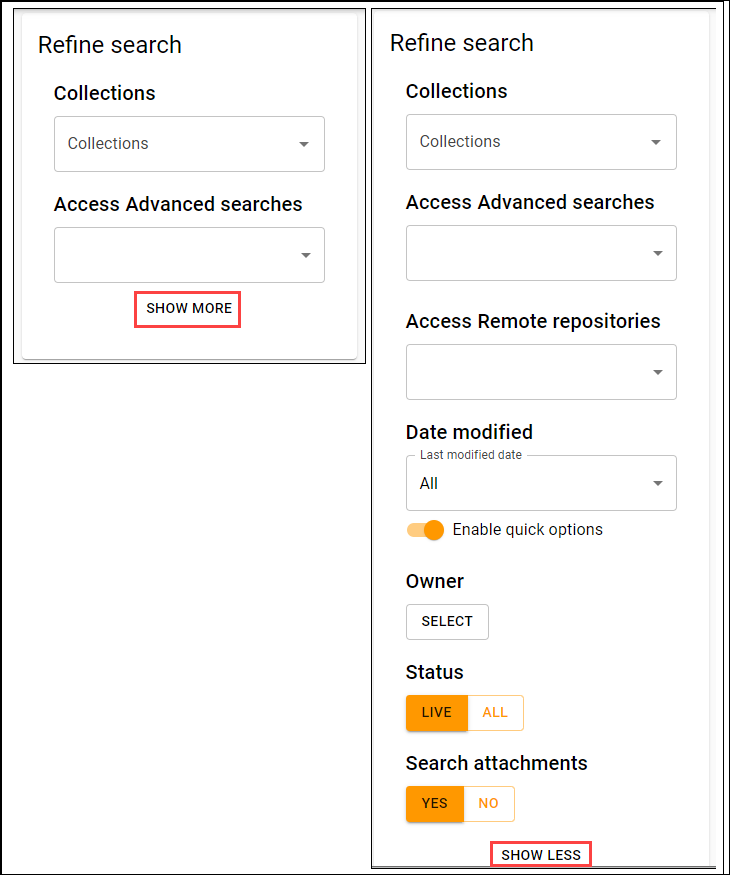

Figure 19 Refine search panel

### Collections filter

Unlike the legacy UI, the new Search UI has a searchable multi-select collection
filter. Collections can be discovered and selected by:

-   Opening the drop-down and selecting one or more from the scrollable list. An
    example is shown in Figure 20.

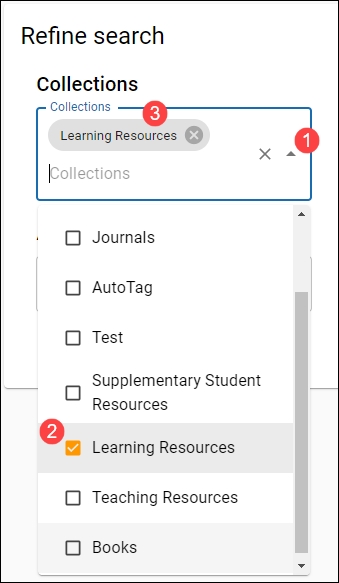

Figure 20 Collection drop-down

Or,

-   enter part of a Collection name in the Collection box to view and select
    matching results. An example is shown in Figure 21.

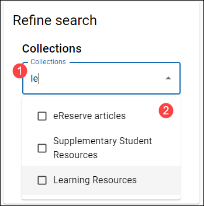

Figure 21 Search for collections

Selected Collections display in the Collections edit box. If there are more than
two selected, **+x** displays, where x equals the number of additional
collections selected, and the down arrow to the right can be used to expand the
view. An example is shown in Figure 22.

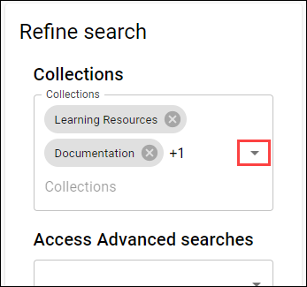

Figure 22 Collections filter with more than two collections selected

A selected collection can be cleared from the filter by clicking the **X**
beside the collection name. To clear all selected collections, click the **X**
to the right of the selected list. An example is shown in Figure 23.

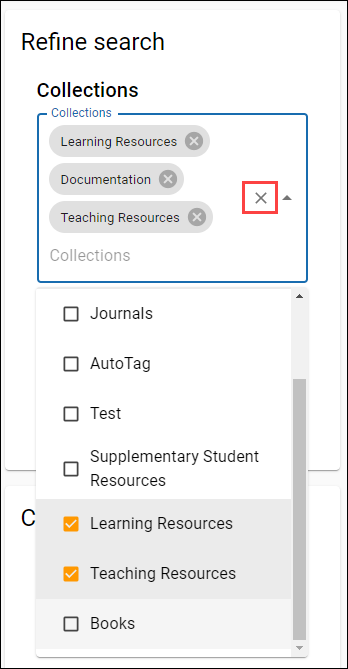

Figure 23 Clear all selected collections

### Access Advanced searches

The **Access Advanced searches** control enables users to select an Advanced
search from a list of Advanced searches they have access to. An example is shown
in Figure 24.

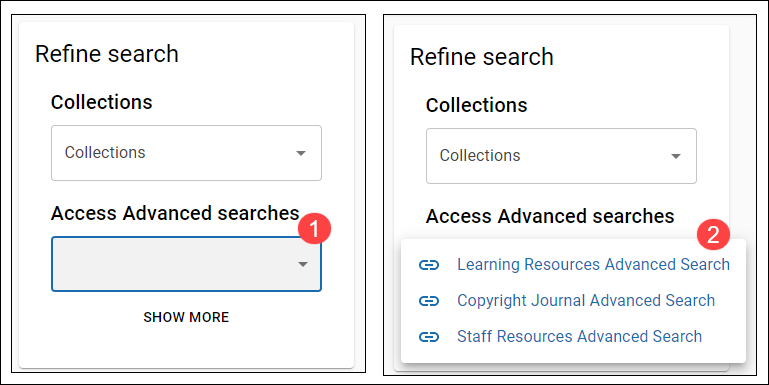

Figure 24 Access Advanced searches drop-down

**NOTE: On selection of an Advanced search in openEQUELLA 2020.2, the user is
taken to the selected Advanced search using the legacy Search UI page.
Application of the new UI technologies to Advanced searches will be included in
a future release.**

An example is shown in Figure 25.

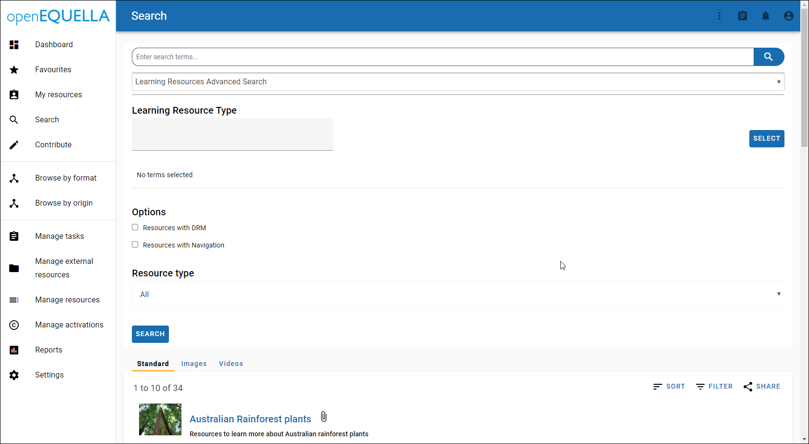

Figure 25 A selected Advanced search displayed in the old Search UI

### Access Remote repositories

The **Access Remote repositories** control enables users to select a Remote
repository from a list of Remote repositories they have access to. An example is
shown in Figure 26.

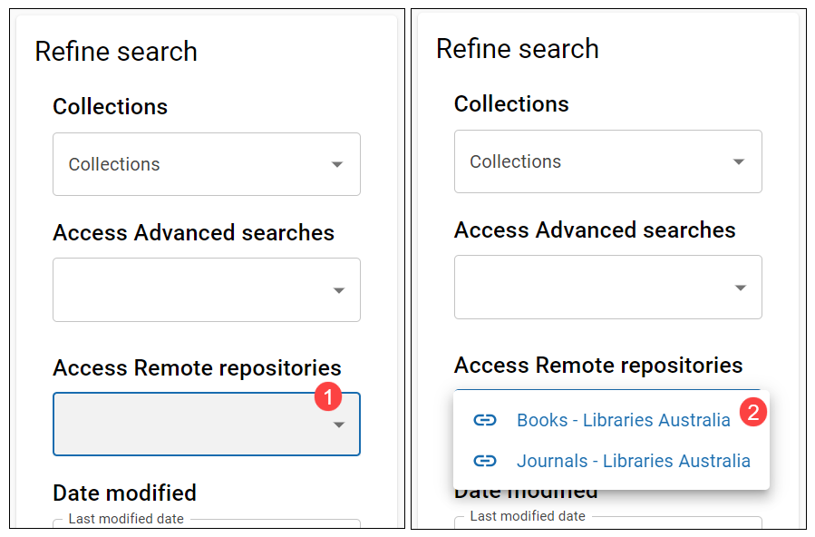

Figure 26 Access Remote repositories drop-down

**NOTE: On selection of a Remote repository in openEQUELLA 2020.2, the user is
taken to the selected Advanced search using the legacy Search UI page.
Application of the new UI technologies to Advanced searches will be included in
a future release.**

An example is shown in Figure 27.

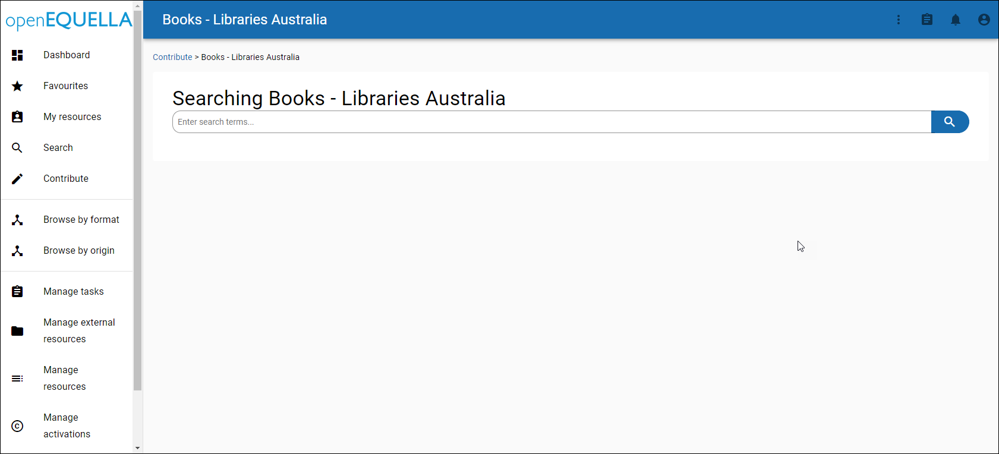

Figure 27 A selected Remote repository search displayed in the old Search UI

### Date modified filter

The **Date modified** filter defaults to All dates, and has been updated to
include **quick options** as well as date ranges. The quick options are enabled
by default, and allow users to select common values from the drop-down list to
discover matching content. An example is shown in Figure 28.

**NOTE: The Date modified filter can be disabled in Search settings. When
disabled, this filter will not appear in the Refine search panel. See [Filter
visibility options](#filter-visibility-options).**

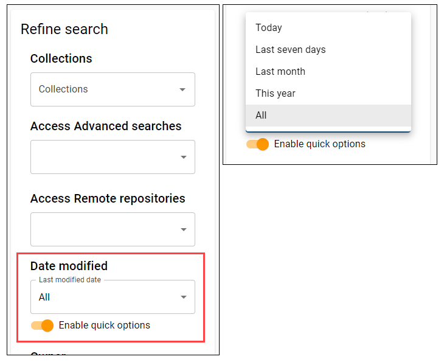

Figure 28 Date modified filter - quick options

The **Enable quick options** switch can be turned off, displaying date range
fields. Clicking in the **From** or **To** fields displays a calendar selector.
A date range can be selected or the **From** date only can be selected, which
will return items that have been modified from the selected date until the
current date. An example is shown in Figure 29.

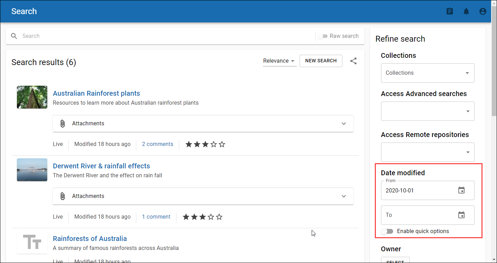

Figure 29 Date modified filter

### Owner filter

The **Owner** filter has been updated with the new UI technology, but the
functionality has not changed. Use the **SELECT** button to open the User
selector and search and select the required Owner. An example is shown in Figure
30.

**NOTE: The Owner filter can be disabled in Search settings. When
disabled, this filter will not appear in the Refine search panel. See [Filter
visibility options](#filter-visibility-options).**

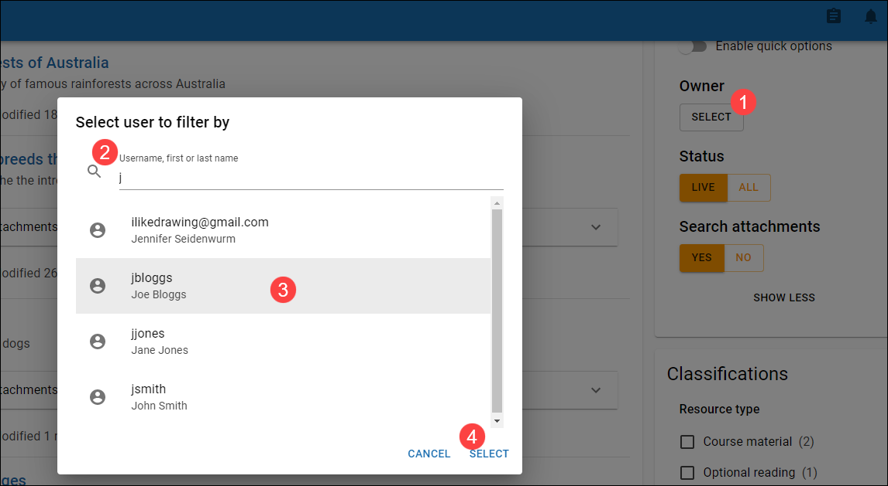

Figure 30 Owner selector

The selected Owner displays in the Owner filter, and can be cleared by clicking
the Delete icon (rubbish bin). An example is shown in Figure 31.

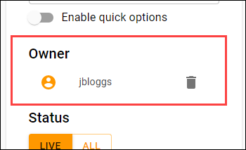

Figure 31 Owner filter with selection

### Status

The **Status** filter displays if the **Enable Status selector** option
(accessed from *Settings, Search, Search page settings*) is enabled. In the old
UI, this option was accessed from the search Page options (*Show items that are
not live* checkbox).

If **ALL** is selected, items with statuses other than Live (e.g. Deleted,
Moderating etc.) will also display in the search results. An example is shown in
Figure 32.

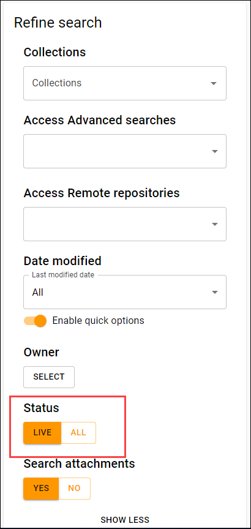

Figure 32 Status filter

### Search attachments

The **Search attachments** filter allows users to toggle between searching in
attachments and searching only item metadata (e.g. Name, Description etc.). In
the old UI, this option was accessed from the search Page options (*Search
attachments* checkbox). An example is shown in Figure 33.

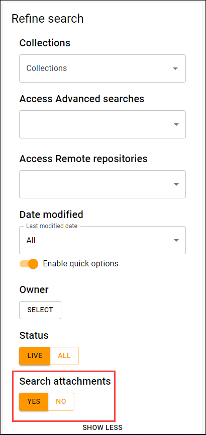

Figure 33 Search attachments filter

Classifications panel
---------------------

The **Classifications** panel displays any Classifications and associated
categories that have been configured and are relevant to the current search
results, based on values stored in a specified schema metadata node. See
[Classifications](#classifications) for further configuration information.

NOTE: The Classifications panel does not display if there are no configured
Classifications or if the search criteria eliminates the relevance of a
configured Classification (e.g. selected Collection does not use the schema node
selected for a Classification).

The Classification displays with its categories and the number of results found
for each category. If there are no results found for categories, they do not
display in the list.

If multiple Classifications have been configured, when one or more categories
are selected in one Classification, the results of the others are recalculated
and redisplayed based on those selections.

When a category is selected, it displays at the top of the category list to make
it easy to see current selections from the list.

SHOW MORE and SHOW LESS links are used to view more or less categories for each
Classification.

Examples are shown in Figure 34 and Figure 35.

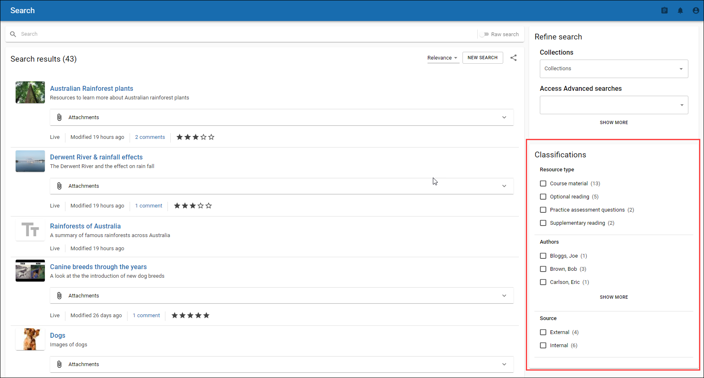

Figure 34 New Search UI Classifications panel

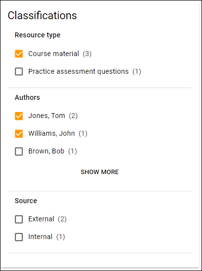

Figure 35 Classifications with selections

New UI Selection session
========================

The new Search UI has been applied to the standard Search results page for
Selection sessions accessed from an integrated LMS.

All the new search UI functionality outlined above applies to the Selection
session page. The Select buttons look a little different but work in the same
way as the legacy UI, as does drag and drop.

Note that when accessing other pages from the Selection session, such as
Advanced and Remote repository searches and Contribution, My resources and
Favourites pages, you will be taken to the legacy UI pages, which use the older
style Select buttons. These pages will be updated with the new UI technologies
in future releases.

An example of a Selection session opened from a Moodle course is shown in Figure
36.

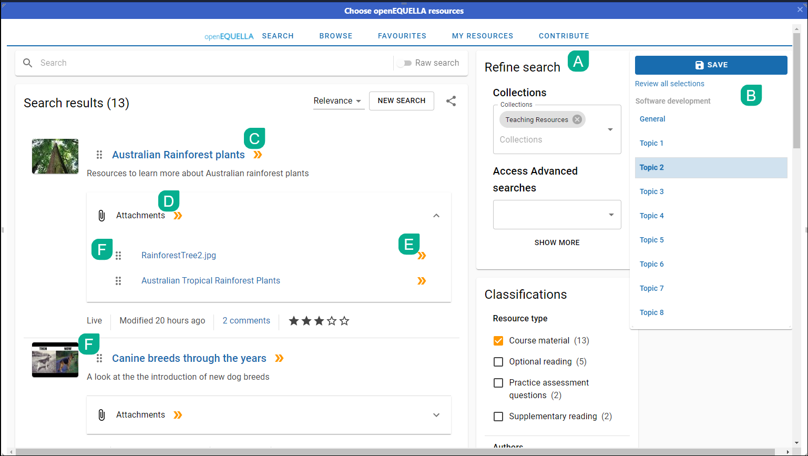

Figure 36 Example Moodle Selection session

1.  **Refine search panel** – allows filtering and accessing of Advanced and
    Remote repository searches.

2.  **LMS** panel – displays as it always has, and stays visible when scrolling.

3.  **Select summary page** - use the select icon beside the item title to add
    the item summary page to the highlighted LMS course section.

4.  **Select all attachments** – click the select icon beside the item’s
    Attachments label to add all attachments to the highlighted LMS course
    section.

5.  **Select attachment** – click the select icon beside a specific attachment
    to add that attachment to the highlighted LMS course section.

6.  **Drag and drop handles**- use these to drag and drop item summary pages or
    specific attachments to any LMS course section.

HikariCP Dependency upgrade (PLACEHOLDER)
===========================

https://github.com/openequella/openEQUELLA/pull/1905
----------------------------------------------------

Need to include doco around this PR (doco can come out of the PR text

Major Upgrades to Spring and Hibernate
======================================
Spring and Hibernate were upgraded to the latest versions of their respective 5.x series.  Both dependencies were years behind their current versions, and especially due to the core nature of the dependencies, were creating security and maintenance concerns.  While these dependency upgrades are largely behind the scenes, some modifications to the configuration files are recommended.

The following configurations will be automatically added to the `Hibernate.properties` file during the upgrade.  These configurations force Hibernate to provide consistent behavior with the previous versions of Hibernate used in openEQUELLA.

```
# Keeps the legacy generator in place. 
hibernate.id.new_generator_mappings=false
# Due to @Inheritance(strategy = InheritanceType.JOINED)
hibernate.query.omit_join_of_superclass_tables=false
```

Likewise, the following configurations will be added to the `learningedge-config.properties` file. Certain legacy configurations and usages of Hibernate are now logged as warnings.  These are known tech-debt issues, so the recommendation is to leave these filters in place, especially in Production environments.
```
# Chatty deprecation warning suppression.
log4j.appender.FILE.filter.1=org.apache.log4j.varia.StringMatchFilter
log4j.appender.FILE.filter.1.StringToMatch=HHH90000022
log4j.appender.FILE.filter.1.AcceptOnMatch=false

log4j.appender.FILE.filter.2=org.apache.log4j.varia.StringMatchFilter
log4j.appender.FILE.filter.2.StringToMatch=HHH90000014
log4j.appender.FILE.filter.2.AcceptOnMatch=false
```

Adopters running openEQUELLA on Oracle may notice a slower startup / migration.  This can be resolved by running the Oracle command found in the comment [here](https://github.com/openequella/openEQUELLA/pull/2344#issuecomment-728432011).


Blackboard LTI And REST Enhancements
====================================
The integration between openEQUELLA and Blackboard has been enhanced to support a subset of functionality of the 'Push to LMS' features, and an enhanced LTI selection session flow.

These changes stem from the deprecation of the openEQUELLA building block and web service integration flows, and a phased effort to replace the deprecated functionality with modern technologies. It is highly recommended to migrate from the building block and web service flows to the LTI and REST flows.

To migrate your building block links, a migration building block has been developed and can be reviewed [here](https://github.com/openequella/openequella.github.io/blob/master/guides/BlackboardLearnIntegrationGuide.md#migration-from-b2-to-lti-links).

The openEQUELLA 'Push to LMS' features for the Blackboard integration, allow users in openEQUELLA to access the Blackboard REST API, enabling a variety of openEQUELLA functions:
* Add to External System
* Find Uses
* Manage External Resources
* BIRT Reporting on External Connectors
* Course folders in selection sessions

For this release, the `Add to External System` and `Course folders in selection sessions` functions have been implemented. The rest of the functions above can be implemented in future releases. 

`Add to External System` allows a user in openEQUELLA, from an item summary page, to 'push' content (summary page and/or attachments) as LTI links, into Blackboard courses / folders.

`Course folders in selection sessions` enables the LTI integration to be configured to display the course's folder structure on the right hand side of the selection session. This enables multiple selections to be specificed in several course folders inside the same selection session.

Details on how to configure the openEQUELLA / Blackboard LTI (include the course folder structure) and REST (Push to LMS) can be found [here](https://github.com/openequella/openequella.github.io/blob/master/guides/BlackboardLearnIntegrationGuide.md).
