# openEQUELLA 2021.1 Features Guide

## Table of Contents
* [Attachment counts](#attachment-counts)
* [Next and Previous Attachment previewing](#next-and-previous-attachment-previewing)
* [Favourite items and searches](favourite-items-and-searches)
  * [Adding and removing items from favourites](#adding-and-removing-items-from-favourites)
  * [Saving searches to favourites](#saving-searches-to-favourites)
* [MIME type filters](#mime-type-filters)
* [Gallery modes](gallery-modes)
  * [Image mode](#image-mode)
  * [Video mode](#video-mode)
* [Download search results to CSV](#download-search-results-to-csv)
  * [EXPORT_SEARCH_RESULTS ACL](export-search-results-acl)
  * [Downloading results to CSV](downloading-results-to-csv)

# Attachment counts

   openEQUELLA 2021.1 sees the introduction of attachment counts on the new
   Search UI page. This enables users to easily see how many attachments are
   available for an item without having to open the attachment list. The count
   includes all attachment types, including files and links. Items with no
   attachments show no count icon. 
   
   **Note: Items with restricted attachments show the count of attachments the user has permission to view.**

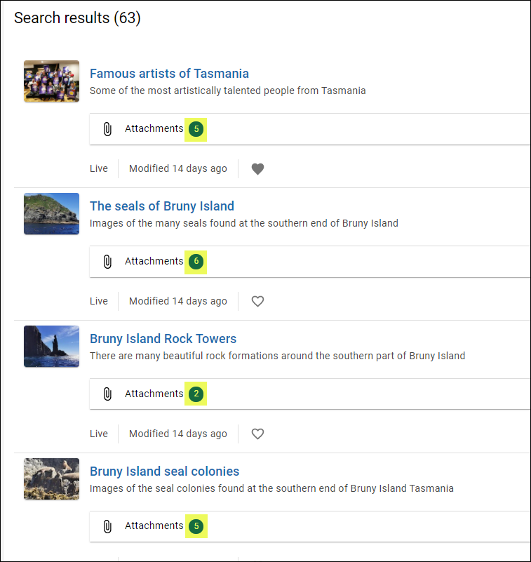

   Figure 1 New Search UI page - attachment counts

# Next and previous attachment previewing

   The new Search UI page now supports the previewing of multiple images and
   videos for an item from the results panel using a Lightbox component which
   includes being able to move through previews using Next and Previous arrows or keyboard left and right arrows.
   The Lightbox displays images and videos by filling
   the screen, and dimming out the rest of the web page. An example is shown
   below.

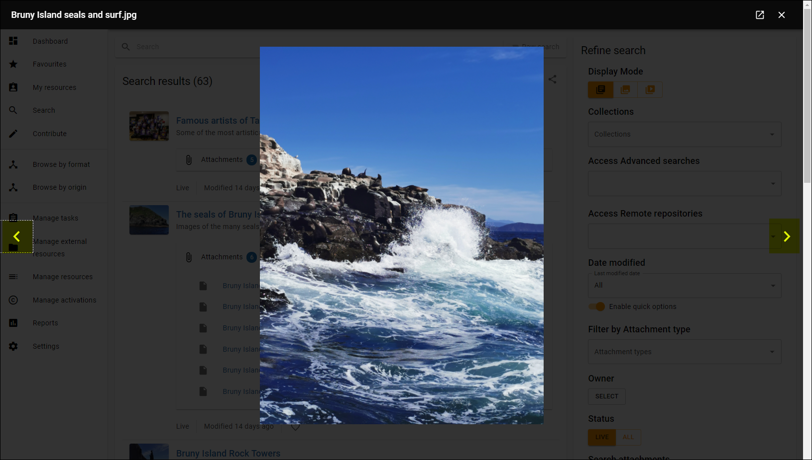

   Figure 2 Image and video previewing with Next and Previous arrows

   The file name displays in the top left of the box, and **Open in new tab**
   and **Close** buttons display in the top right. The Lightbox can also be close by clicking Esc on the keyboard.

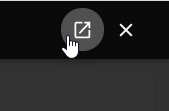

   Figure 3 Open in new tab button

   When an image is opened in a new tab, the cursor displays as a magnifying
   glass with a plus sign, allowing the user to click on an area of the image
   to zoom in. Scroll bars display to navigate the zoomed in image, and the
   magnifying glass cursor displays a minus sign. Clicking again zooms the
   image back out. An example is shown below.

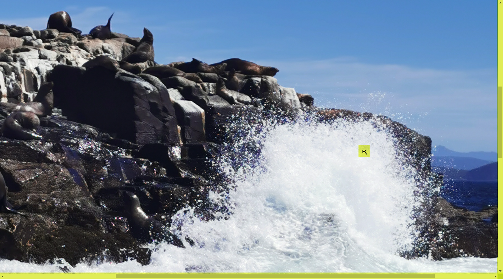

   Figure 4 Image displaying in new tab and zoomed in

# Favourite items and searches 

   The ability to add and remove favourite items from the search results page
   and saving favourite searches has been added to the new Search UI page in
   2021.1.

## Adding and removing items from Favourites

   Items can be added to or removed from a user’s Favourite items list
   (accessed from the Favourites menu item) by clicking the heart icon
   displayed for each item in the search results panel. An outlined heart can
   be clicked to add the item to Favourites, and a solid heart indicates that
   the item is a current favourite. Click on a solid heart to remove from
   Favourites.

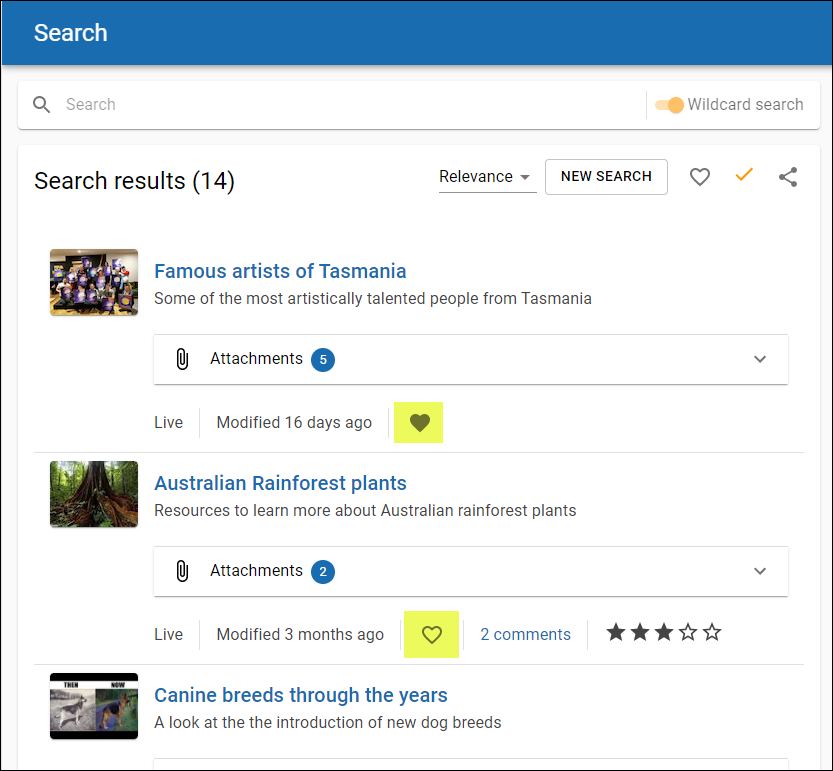

   Figure 5 Search results - Favourites icons

####  To add an item to Favourites

1.  From the Search results panel, click the heart icon for the item to be added
    to Favourites. The **Add to favourites** dialog displays.

    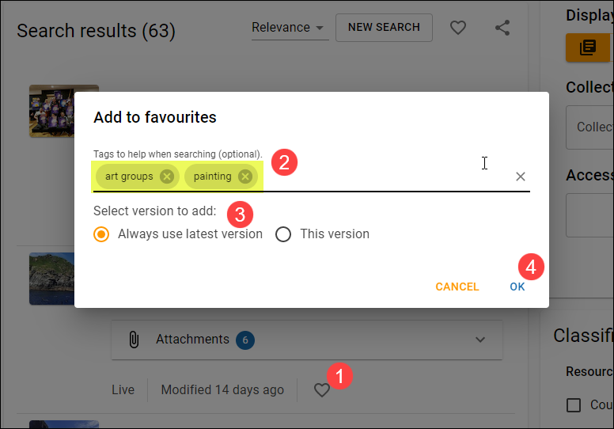

   Figure 6 Add to favourites dialog

2.  Enter any relevant **Tags**, using Enter to separate. Single tags can be
    deleted using the **X** beside that tag or all tags can be removed using the
    **X** to the right of all tags.

3.  Select the required Version option.

    - **Always use latest version** – will always link to the latest version
    available from Favourites

    - **This version** – will always link to this specific version of the item
    from Favourites.

6.  Click **OK**. The item is added to Favourites and the icon displays as a
    solid heart. Click on the solid heart to remove an item from Favourites.

## Saving searches to Favourites

>   openEQUELLA 2021.1 supports saving searches to Favourites in the new Search
>   UI. This includes saving any criteria set with the search, including search terms, search mode and any filters.

#### To save a search to Favourites

1.  Enter the required search criteria, including search terms and filters then
    click the heart icon in the top right of the search results panel. The **Add
    search to favourites** dialog displays.

    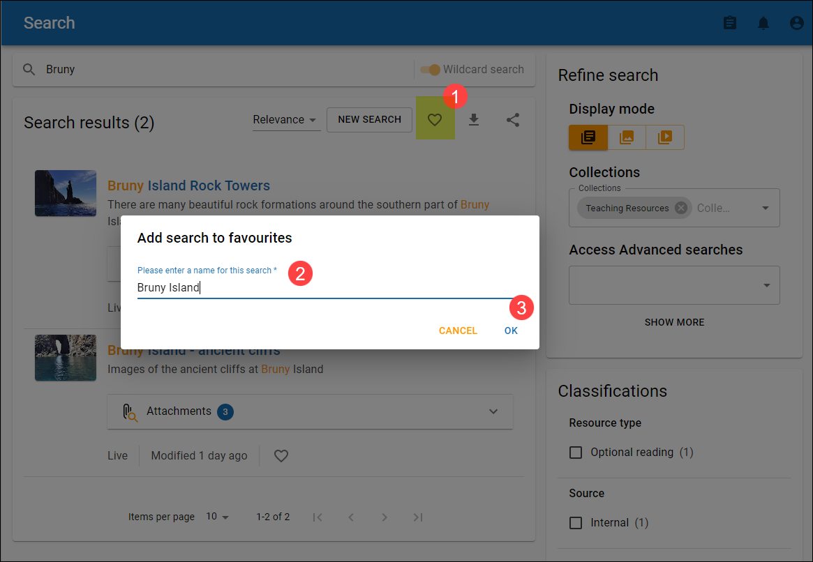

   Figure 7 Add search to favourites dialog

2.  Enter a name for the search. This is the name that displays on the
    Favourites, Searches page.

3.  Click **OK**. The search is saved to the Favourite searches page with all
    search criteria.

    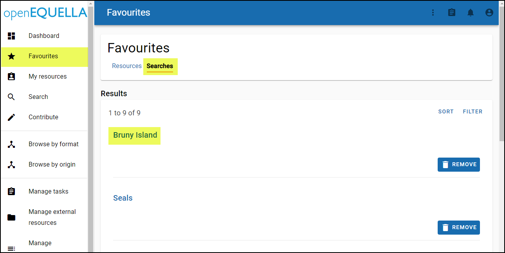

   Figure 8 Favourites - Searches page

# MIME type filters

   The openEQUELLA 2021.1 new Search UI page now supports MIME type filters.
   MIME type filters are configured from **Settings**, **Search**, **Search
   filters.**

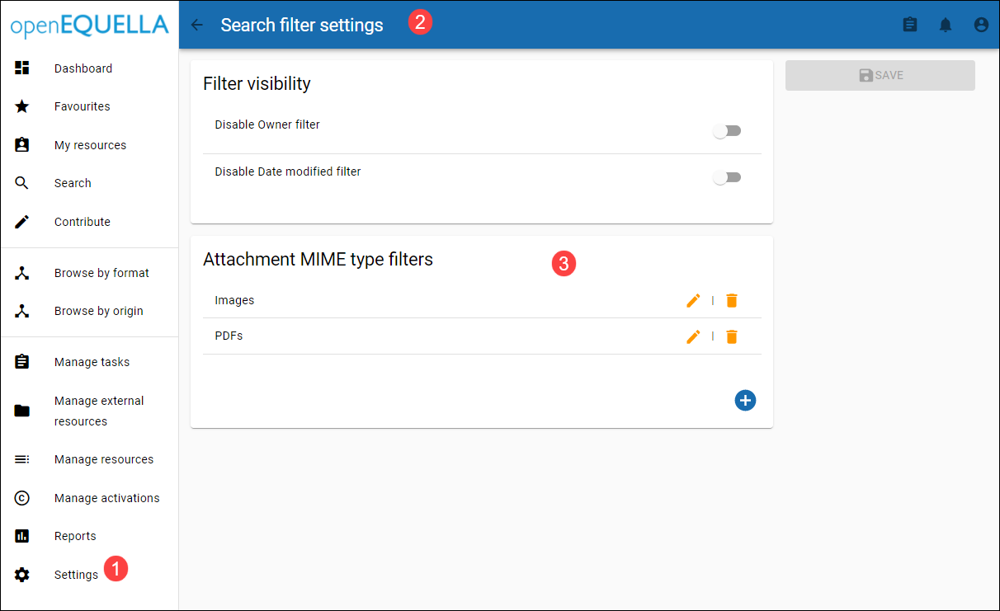

   Figure 9 Settings, Search filters page

   Attachment MIME type filters are accessed by selecting the **Show more**
   option in the Refine search panel on the new search UI page. Any configured
   filters display in the **Filter by Attachment type** drop-down. One or
   multiple values can be selected.

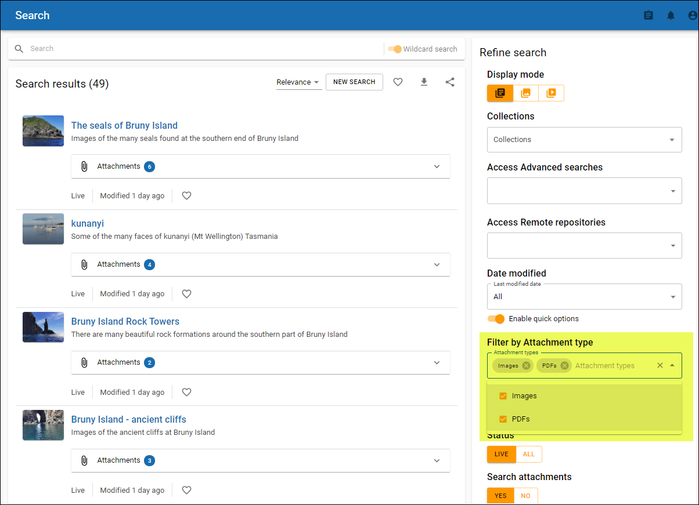

   Figure 10 Search page - Filter by Attachment type filter

# Gallery modes

   openEQUELLA 2021.1 introduces new Image and Video gallery modes to the new
   search UI page. Images and videos are displayed using a lightbox component which fills the screen while dimming out the rest of the web page. 
   
   Search terms, filters and classifications can be used from gallery views and
   the results returned are the images or videos attached to the items matching
   the search criteria.

   The viewing modes (Standard, Image and Video) are selected from the
   **Display mode** control at the top of the Refine search panel.

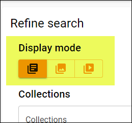

   Figure 11 Display mode control

## Image mode

   The new Image mode displays all image attachments for items in openEQUELLA
   (as opposed to the legacy UI, which displays only the first image attachment
   for each item).

   Select the **Image** option from **Display mode** to display all images in
   the gallery view.

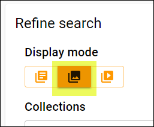

   Figure 12 Display mode - Image

An example is shown below.

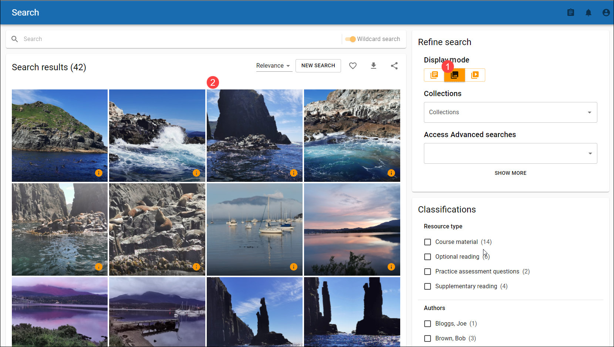

   Figure 13 Search results in image mode

   Clicking the **View item** button opens the Resource summary page.

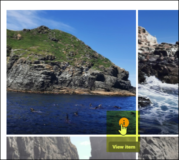

   Figure 14 View item button

   Clicking anywhere on the image opens the image in a lightbox. An example is
   shown below.

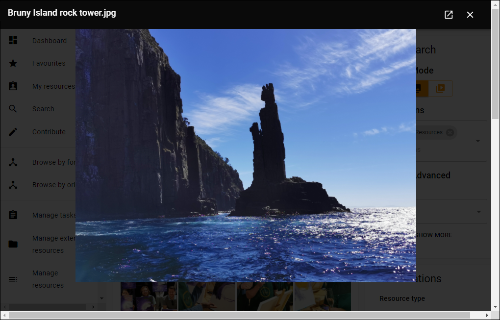

   Figure 15 Image preview in lightbox

   Clicking away from the image window closes the lightbox.

   The file name displays at the top left of the box, and **Open in new tab**
   and **Close** buttons display in the top right.

   Figure 16 Open in new tab button

   When an image is opened in a new tab, the cursor displays as a magnifying
   glass with a plus sign, allowing the user to click on an area of the image
   to zoom in. Scroll bars display to navigate the zoomed in image, and the
   magnifying glass cursor displays a minus sign. Clicking again zooms the
   image back out. An example is shown below.

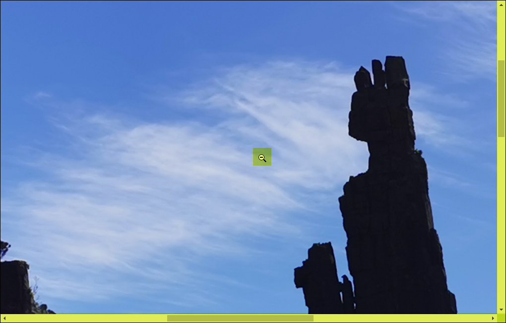

   Figure 17 Image displaying in new tab and zoomed in

## Video mode

   The new Video mode displays all video attachments for items in openEQUELLA
   (as opposed to the legacy UI, which displays only the first video attachment
   for each item).

   Select the **Video** option from **Display mode** to display all videos in
   the gallery view.

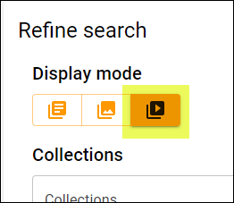

   Figure 18 Display mode - Video

   An example is shown below.

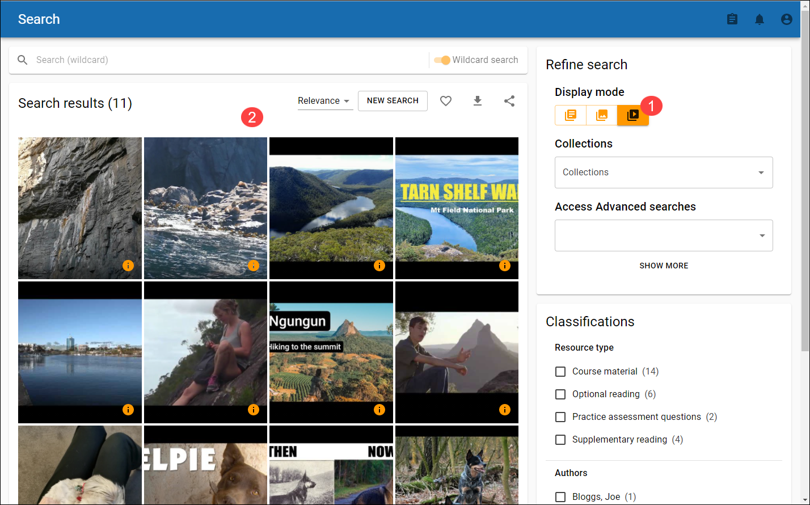

   Figure 19 Search results in video mode

   Clicking the **View item** button opens the Resource summary page.

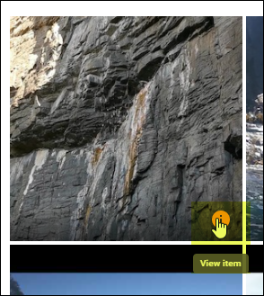

   Figure 20 View item button

### Local videos

   Clicking on a locally stored video opens the video in a lightbox. An example
   is shown below.

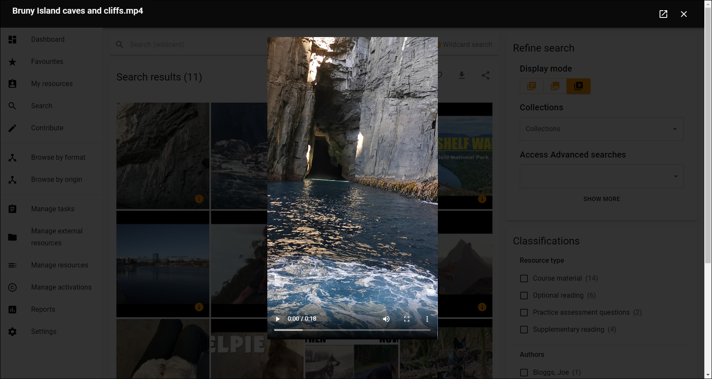

   Figure 21 Video preview in lightbox

   Clicking away from the video window closes the lightbox.

   The file name displays at the top left of the box, and **Open in new tab**
   and **Close** buttons display in the top right.

   Figure 22 Open in new tab button

   Additional controls are browser dependant and may include:
    

-   **Play (and Pause) button** – click to play or pause video.

-   **Time** – Current time in video and total video time.

-   **Volume** – click to change volume or mute.

-   **Full screen** – click to change to full screen mode.

-   **Options** – the options menu includes:

-   **Download** – downloads the video to a local drive

-   **Picture-in-picture** – select to open a video window which persists across
    your computer. This allows for the watching of videos while looking at other
    things, for example, instructional videos on how to carry out a
    configuration task in the operating system etc. 

### YouTube video links

   Clicking on a YouTube video opens the YouTube video in a lightbox. An
   example is shown below.

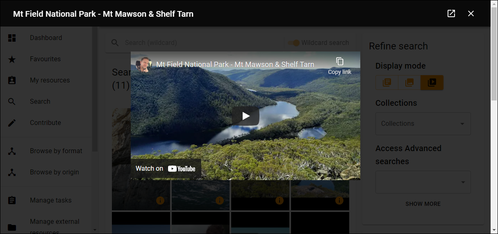

   Figure 25 YouTube video in lightbox

   Clicking away from the video window closes the lightbox.

   The file name displays at the top left of the box, and **Open in new tab**
   and **Close** buttons display in the top right.

   Figure 26 Open in new tab button

   Clicking **Open in new tab** opens the YouTube page for the video.

   Additional controls are browser dependant and may include:

-   **Copy link** – click to copy the YouTube video link.

-   **Play (and Pause) button** – click to play or pause video.

-   **Watch on YouTube** – click to open video in YouTube.

-   **Volume** – click to change volume or mute.

-   **Time** – current time in video and total video time.

-   **Settings** – click to set Playback speed and Quality options.

-   **YouTube** – click to open video in YouTube.

-   **Full screen** – click to change to full screen mode.

# Download search results to CSV

   A new feature has been introduced in the new Search UI for openEQUELLA
   2021.1 enabling suitably privileged users to download search results to a
   CSV file.

   All data stored in the item XML is included in the download, and multiple
   values are separated using a double pipe (\|\|).

## EXPORT_SEARCH_RESULTS ACL

   A new ACL, EXPORT_SEARCH_RESULTS is available to control access to the
   Download to CSV file function. It is available from the Collection level in
   the Security Manager accessed in the Administration Console. Access can be
   granted at the top Collection level allowing users to download results from
   every collection, or at a specific collection level to grant access only to
   the selected collection.

   NOTE: The Download to CSV button displays for all users, but will only work
   for suitably privileged users.

## Downloading results to CSV

   A new **Download to CSV** button displays at the top of the Results panel on
   the new Search UI page.

   **NOTE: Downloading to CSV is limited to ONE collection. One collection must
   be selected in the Collection filter to use this function.**

#### To download search result to a CSV file

1.  Select a Collection from the **Collections** filter.

2.  Complete the search query, including using keywords and/or filters.

3.  Click the **Download to CSV** button.

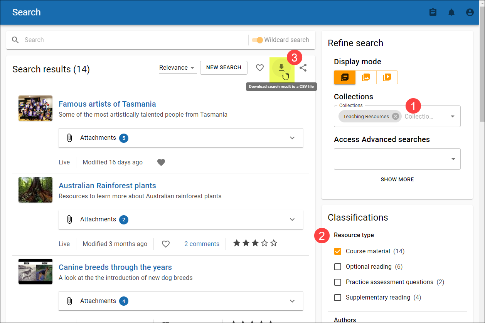

   Figure 29 Download search results to CSV file

   The CSV file is downloaded to your local hard drive, and the Download to CSV
   button displays as an orange tick until the search query has been changed.
   This prevents the same search results being downloaded multiple times while
   the initial file is being downloaded.

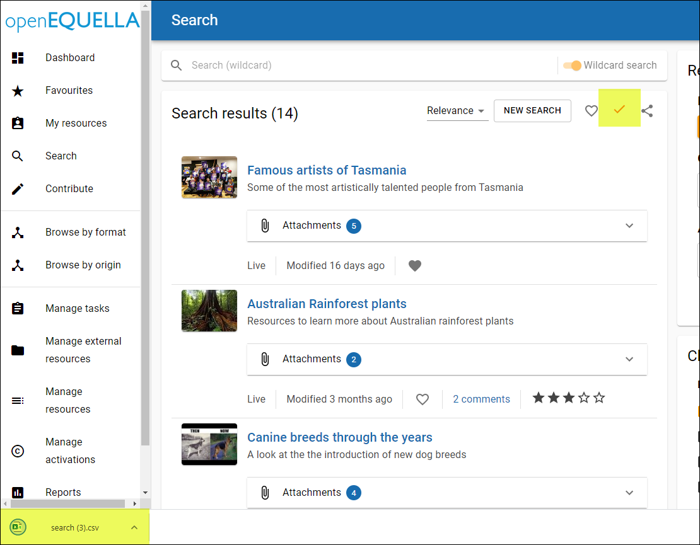

   Figure 30 CSV file download
