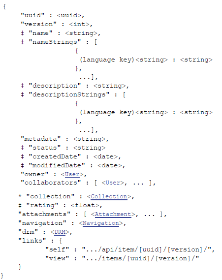

[Home](https://equella.github.io/)

# Open Source EQUELLA® REST API Guide

Table of Contents
* [Introduction](#introduction)
* [Authorization](#authorization)
* [Formats](#formats)
* [Importing](#importing)
* [Institutions](#institutions)
* [OAuth Login](#oauth-login)
* [Obtaining an OAuth Token](#obtaining-an-oauth-token)
* [Entities](#entities)
* [Schemas](#schemas)
* [Collections](#collections)
* [Courses](#courses)
* [Connectors](#connectors)
* [Dynamic Collections](#dynamic-collections)
* [OAuth Clients](#oauth-clients)
* [Taxonomies](#taxonomies)
* [Activations](#activations)
* [Items a.k.a. Resources](#items-aka-resources)
* [Notifications](#notifications)
* [Tasks and Moderation](#tasks-and-moderation)
* [Hierarchies](#hierarchies)
* [Users](#users)
* [Groups](#groups)
* [Miscellaneous](#miscellaneous)
* [Internal REST API Reference](#internal-rest-api-reference)

## Introduction

This guide describes the concepts and some low level specifics of the openEQUELLA REST API.  For a detailed openEQUELLA REST API reference you should refer to the inbuilt API documentation at .../apidocs.do
In this guide your institution URL will be referred to as the text ... , so if your institution base URL is http://my.inst.edu/ then you will find the inbuilt documentation at http://my.inst.edu/apidocs.do
In this document all placeholder variables are shown in square brackets and should not be treated literally. For example,
```
GET .../api/item/[uuid]/[version]
```
would refer to:
```
GET http://my.inst.edu/api/item/5950e6b8-6ce4-11e1-b335-fb4e4824019b/2
```
where 5950e6b8-6ce4-11e1-b335-fb4e4824019b is a UUID of an item and 2 is the version of the item.

Please note that all HTTP requests made to the REST endpoints are not application/x-www-form-urlencoded requests. The content-type of PUT and POST requests must be application/json, except in special cases such as uploading files. Various web browser plug-ins exist which allow you to easily issue HTTP requests to REST endpoints and provide access to the HTTP headers and various HTTP verbs such as DELETE which are not normally available within the browser.

The integration pack (available for download from your institution admin site: http://my.inst.edu/institutions.do?method=admin) contains example code for invoking the openEQUELLA REST services via Java or Python. A document is included with the Java example which gives a explanation of the code.

## Authorization

All REST calls will be made as an anonymous user unless a valid X-Authorization header is sent in the request. Using one of the aforementioned browser plug-ins you can supply the required X-Authorization header when trying out the various endpoints.

For sending obtained OAuth tokens you send an X-Authorization header with a value of access_token=[your token].

For access as the TLE_ADMINISTRATOR user, which is required for importing, you need to use an X-Authorization header with a value of admin_token=[admin password]. Note that this does not use an OAuth token as the administrator user needs to be able to access the system independently of the OAuth system (i.e. in a blank institution before any OAuth clients exist). Generally you should prefer to use OAuth tokens whenever you are able to.

There is also a special token for the system administrator, which is used for creating, editing and deleting institutions. To perform institution operations your X-Authorization header must have a value of system_token=[system password].

## Formats

All types returned by the REST API are in JSON format (<http://www.json.org/>); no other formats are supported.

In the format descriptions within this document the value types are indicated in triangular brackets.

When POSTing or PUTting an object some fields are mandatory. In the format descriptions below mandatory fields are prefixed with *.
Read-only fields are marked as ‡. These fields may be output on a GET request, but will not be read during a PUT or POST. Note that during an import these fields may be read.

All dates fields are in ISO 8601 format (<http://en.wikipedia.org/wiki/ISO_8601>).

NOTE: The formats may be expanded in the future. Not all fields may be present in any given returned object.

## Importing

If the user is using the institution administrator token and has specified import=true as a query string parameter in a POST request, then the user is able to "import" the content rather than performing a creation (on many endpoints). This will maintain the original owner, created date and other fields, as opposed to using the current user details and current date.

Future releases will expand on this by allowing import of read-only properties such as item history when using the import flag. This will ultimately allow a full institution dump and import via the REST API.

## Institutions

Institutions can be viewed and edited on the special institution API endpoint. Note that this endpoint is based on the administration URL as it cannot be tied to any specific institution. E.g. if the openEQUELLA web page that lists institutions can be found at http://equelladev:8080/institutions.do then the REST endpoint for institution management will be found at http://equelladev:8080/api/institution.

Requests that attempt to manipulate institutions require that the system_token be included in the request under the X-Authorization header. i.e.:
```
X-Authorization: system_token=[system password]
```
### Listing and Viewing

To list all institutions you will need to perform a GET on the root institution endpoint, i.e.
```
GET [admin_url]/api/institution
```
This will return a Search Results object with an array of Institutions in the results field.

You can also view information on a specific institution using it's uniqueId value:
```
GET [admin_url]/api/institution/[uniqueId]
```
No special privileges are required to list or view institutions, however the administration URL must be accessible to you.

### Creating
To create an institution you will need to build a JSON representation of the institution and fill in all mandatory fields. You then need to POST this object to the listing endpoint, specifying the system_token in the X-Authorization header.
```
POST [admin_url]/api/institution
```
You will be returned a Location HTTP header where the created institution can be found.

### Editing
To edit an existing institution you should obtain an existing institution JSON object (e.g. via GET), modify the required fields in the JSON and then PUT the modified JSON back into the institution's endpoint. Note that you will need to specify the system_token in your PUT requests. E.g.
1. Get the institution
```
GET [admin_url]/api/institution/12
```
2. Make edits to response of step 1
3. Save the updated institution
```
PUT .../api/institution/12
```
### Deleting
To delete an institution simply issue a DELETE request to the institution's endpoint.
```
DELETE [admin_url]/api/institution/[uniqueId]
```
Again, you will need to send the system_token in the request.

### Format
####  Institution
```
{
  "uniqueId" : <int>,
  "name" : <string>,
  "filestoreId" : <string>,
  "url" : <string>,
  (write only!) "password" : <string>,
  "timeZone" : <string>,
  "enabled" : <boolean>
}
```

## OAuth Login

The openEQUELLA REST API supports OAuth 2.0 login. To use OAuth login, you must first register an OAuth Client within openEQUELLA. This can be done from the OAuth Settings function accessed from the Settings page.

You will need the following privileges to fully administer OAuth Clients:
* CREATE_OAUTH_CLIENT
* EDIT_OAUTH_CLIENT
* DELETE_OAUTH_CLIENT
* ADMINISTER_OAUTH_TOKENS.

The configuration of your client depends on which OAuth flow you intend to use.  
openEQUELLA supports three OAuth flows:
1. Authorization Code Grant (<http://tools.ietf.org/html/rfc6749#section-4.1>)
2. Implicit Grant (<http://tools.ietf.org/html/rfc6749#section-4.2>)
3. Client Credentials Grant (<http://tools.ietf.org/html/rfc6749#section-4.4>)

### OAuth Client Configuration

All registered OAuth Clients need a Name (for use within openEQUELLA only), Client ID and, a Client Secret. Further configuration options depend upon the flow you wish to use.

#### Accessing OAuth settings

OAuth clients are configured via the OAuth settings function accessed from the Settings page. The OAuth settings page also lists Generated tokens.

To access the OAuth settings page
1. Select Settings from the navigation menu, then OAuth. The OAuth settings page displays.Registering OAuth client applications

The Registered client applications section of the OAuth settings page displays any existing registered OAuth clients, and allows new clients to be added.

To register a new OAuth client
1. Click the Register new client application link. The Create new OAuth client page displays.
2. Enter a Descriptive name (only used internally). The Client ID and Client secret are automatically generated, but the Client ID may be replaced with a user-defined value.
3. Select an OAuth flow from the drop-down list, depending on the type of OAuth client being registered. See the following options:

To configure an OAuth Client for Authorization Code Grant
1. To use this OAuth flow, your client application needs to be a web application with a URL that can be redirected to.
2. From the OAuth flow drop-down, select Authorization code grant. The Create new OAuth client page displays some an options.
3. Enter the Redirect URL of the endpoint in your application that will handle the OAuth redirects and responses from openEQUELLA, e.g. <http://mywebapp.com/oauthlogin>
4. Click Save.

To configure an OAuth Client for Client Credentials Grant
1. Use this flow if your client application is not web based in any way, e.g. it is a Python script. When using this flow your client must act as a pre-configured user.
2. From the OAuth flow drop-down, select Client credentials grant. The Create new OAuth client page displays the Fixed user option.
3. Click Select to open the Select User(s) dialog and search for and select the required user. A user MUST be selected. When the client application makes API calls it will do so as this user (since a user is never asked to login)
4. Click Save.

To configure an OAuth Client for Implicit Grant
1. Use this flow if your client is Javascript in a web browser that needs to make secure API calls, or your client application supports an embeddable browser (such as a C# Winforms application) where you can extract the location URL.
2. From the OAuth flow drop-down, select Implicit grant. The Create new OAuth client page displays some extra options.
3. Select 'My application doesn't host a redirect URL, I want to use the default' for the Redirect URL if using an embedded browser, otherwise select 'I want to use a custom redirect URL' and enter the URL of the page where your Javascript is loaded.
4. Click Save.

#### Generated Tokens

The Generated tokens section of the OAuth settings page lists all tokens that have been generated for all registered client applications. Client applications will create tokens using the methods outlined below. To view or remove tokens the ADMINISTER_OAUTH_TOKENS privilege is required.

## Obtaining an OAuth Token

Your client application must obtain an OAuth token to make secure API calls.  Once you have retrieved the token, each API call needs to include an "X-Authorization" HTTP header with a value of "access_token=[token]"

### Obtaining a token via Authorization Code Grant
This is a multi step process: first you must obtain an authorization code using a redirect response or a browser window.location redirect, then the user logs into openEQUELLA, a code is returned to your application via a redirect, your application obtains a token using that code.

1. Your application must redirect to the OAuth authorization endpoint .../oauth/authorise:
```
.../oauth/authorise?response_type=code&client_id=[client id]&redirect_uri=[redirect URL]
```
which could be achieved by:
* 302 redirect

or
* JavaScript to redirect the browser

NOTE: If you prefer, the authorization endpoint can also be accessed at .../oauth/authorize  (z instead of s)

2. User is presented with an openEQUELLA login screen (if they are not already logged in, e.g. in another browser tab)
3.  The openEQUELLA OAuth authorization endpoint redirects to your application (as determined by the redirect_uri) with a code parameter appended:  
```
[redirect URL]?code=[a short lived code]
```
Do not store this code as it has a limited lifespan (2 minutes) and can only be used once, even if the request containing the code fails.  In this case you would need to obtain another code.

4. Your application needs to detect the presence of the code parameter and do a server side request to the openEQUELLA OAuth token endpoint:
```
.../oauth/access_token?grant_type=authorization_code&client_id=[client id]&code=[code from step 3]
```
where a token will be returned in JSON format. For example,
```
{
  "scope" : null,
  "state" : null,
  "access_token" : "1d031eef-185a-4c22-a922-b996391b9f4f",
  "refresh_token" : null,
  "token_type" : "equella_api",
  "expires_in" : 9223372036854775807
}
```
Your application must extract the access_token value.

### Obtaining a token via Implicit Grant

To obtain a token using this flow, simply redirect to the openEQUELLA OAuth authorization endpoint with response_type=token
1. Set the browser location to:
```
.../oauth/authorise?response_type=token&client_id=[client id]&redirect_uri=["default" for embedded browser, or redirect URL for Javascript]
```
2. User is presented with an openEQUELLA login screen (if they are not already logged in, e.g. in another browser tab)
3. The openEQUELLA OAuth authorization endpoint redirects to either the inbuilt redirect URL (if "default" was specified) or the supplied redirect_uri with the token appended to the URL as a URL fragment:
```
[redirect URL]#access_token=[token]
```
Your application must extract the token from the browser URL.

### Obtaining a token via Client Credentials Grant

This is the most straightforward OAuth flow, but requires that the client act as a single, pre-configured, user.
By requesting:
```
.../oauth/access_token?grant_type=client_credentials&client_id=[client id]&client_secret=[client secret]&redirect_uri=default
```
a token will be returned in JSON format. .  E.g.
```
{
  "scope" : null,
  "state" : null,
  "access_token" : "1d031eef-185a-4c22-a922-b996391b9f4f",
  "refresh_token" : null,
  "token_type" : "equella_api",
  "expires_in" : 9223372036854775807
}
```
Your application must extract the access_token value.


## Entities

openEQUELLA uses many objects which inherit from a common "entity" super class. The list of entity types include:
* Schema
* Collection
* Course
* Connector
* Dynamic collection (aka DynaCollection)
* OAuth Client
* Taxonomy

### Listing and viewing entities

All entities follow the same pattern for listing and viewing. Substitute the entity_name below for one of the previously listed entity names (see the table below).

To retrieve a list of a certain type of entity, perform a GET request on the .../api/[entity_name] endpoint. You will need the LIST_[ENTITY_NAME] privilege to be able see results on this endpoint.

Listing endpoints will return a Search Result object, where the results fields will be an array of the specific entity type.

The listing endpoint will only return UUIDs and names of entities; if you wish to retrieve more details on a particular entity you will need to make a GET request to the .../api/[entity_name]/[uuid] endpoint. You will need the VIEW_[ENTITY_NAME] privilege to retrieve a schema from this endpoint.

Most entities will follow the same pattern: LIST_(ENTITY NAME) to see the listing and VIEW_(ENTITY NAME) to see additional details. See the following list for endpoints and the required privileges.

**Listing Endpoint**
* Listing Privilege
* Individual Entity Endpoint
* View Privilege


**.../api/schema**
* LIST_SCHEMA
* .../api/schema/[uuid]
* VIEW_SCHEMA

**.../api/collection**
* LIST_COLLECTION
* .../api/collection/[uuid]
* VIEW_COLLECTION

**.../api/course**
* LIST_COURSE
* .../api/course/[uuid]
* VIEW_COURSE

**.../api/connector**
* LIST_CONNECTOR
* .../api/connector/[uuid]
* VIEW_CONNECTOR

**.../api/dynacollection**
* LIST_DYNA_COLLECTION
* .../api/dynacollection/[uuid]
* VIEW_DYNA_COLLECTION

**.../api/oauth**
* LIST_OAUTH_CLIENT
* .../api/oauth/[uuid]
* VIEW_OAUTH_CLIENT

**.../api/taxonomy**
* LIST_TAXONOMY
* .../api/taxonomy/[uuid]
* VIEW_TAXONOMY

### Editing entities
To edit an existing entity you should obtain an existing entity JSON object (e.g. via GET), modify the required fields in the JSON and then PUT the modified JSON back into the entity's endpoint. E.g.
1. Get the entity
```
GET .../api/schema/ae02e7cd-d81c-4b6e-b867-78c6b1037631
```
2. Make edits to response of step 1
3. Save the updated entity
```
PUT .../api/schema/ae02e7cd-d81c-4b6e-b867-78c6b1037631
```
### Creating entities
To create an entity you will need to build a JSON representation of the entity and fill in all mandatory fields. You then need to POST this object to the listing endpoint.
```
POST .../api/schema
```
You will be returned a Location HTTP header where the created entity can be found. This is usually the case for POSTs to all endpoints, not specifically just for entity types.
### Locking entities
You may lock an entity for editing so that no other user may make changes to the entity. To do so, make a POST request to the lock sub-endpoint and take note of the UUID of the returned lock object.
```POST .../api/schema/ae02e7cd-d81c-4b6e-b867-78c6b1037631/lock
```
You can cancel the lock by issuing a DELETE request to the lock sub-endpoint.
```
DELETE .../api/schema/ae02e7cd-d81c-4b6e-b867-78c6b1037631/lock
```

To determine if the entity is already locked and whom by, issue a GET request on the lock sub-endpoint.
```
GET .../api/schema/ae02e7cd-d81c-4b6e-b867-78c6b1037631/lock
```
When making edits to the locked entity, you can pass in the lock parameter with the value of the lock UUID. You can optionally nominate to keep the entity locked by sending keeplocked=true as a query string parameter.
```
PUT .../api/schema/ae02e7cd-d81c-4b6e-b867-78c6b1037631?lock=e75b2cb7-9f77-4b6f-bd4d-03bca6f9baa9&keeplocked=true
```
### Entity security
For entities, ACLs can be configured at either the individual entity level, or at a level which affects all entities of the same type.

To edit the ACLs for a particular instance of an entity you need to edit the JSON representation of that entity. All entities contain a security property, although some entity types like collections may have a different structure for the security field.

To see the ACLs that affect all entities of the same type issue a GET request to the acl sub-endpoint.
```
GET .../api/schema/acl
```
To edit the ACLs for all entities of the same type you will need to perform a PUT request to the acl sub-endpoint.
```
PUT .../api/schema/acl
```
Viewing and editing of all ACLs is controlled by the EDIT_SECURITY_TREE ACL.

### Format
#### Entity

Many object types are based on upon a common entity and then offer additional fields on top of this. The root entity structure is shown below. Representations that extend this structure will be noted as such.

In a similar fashion the value of the security field may be an instance of an extension to the Entity Security type (see below).
```
{
  * "uuid" : <uuid>,
  "name" : <string>,
  "nameStrings" : [
      {
       (language key)<string> : <string>
      },
       ...],
  "description" : <string>,
  "descriptionStrings" : [
      {
       (language key)<string> : <string>
      },
       ...],
  "modifiedDate" : <date>,
  "createdDate" : <date>
  "owner" : <User>,
  "security" : <Entity Security>,
  "links" : {
    "self" : ".../api/[entity_type]/[uuid]/"
  }
}
```
#### Entity Security
```
{
  "rules" : [
    {
      "granted" : <boolean>,
      "override" : <boolean>,
      "privilege" : <string>,
      "who" : <string>
    },
    ...
  ]
}
```
## Schemas

Schemas are a type of entity. All operations that apply to entities also apply to schemas. Schemas currently have no additional endpoints over generic entities.

### Format
#### Schema
The Schema type extends the Entity type, plus the following:
```
{
  "namePath" : <string>,
  "descriptionPath" : <string>
  "definition" : {
    <string>(node name) : <Schema Node>
  }
}
```
#### Schema Node
```
{
  "_indexed" : <boolean>,
  "_field" : <boolean>,
  "_nested" : <boolean>,
  "_type" : <string>,
  <string>(node name) : <Schema Node>,
  ... (additional node name keys and Schema Node values)
}
```

## Collections
Collections are a type of entity. All operations that apply to entities also apply to collections.

Collections have one additional capability over generic entities in that the listing endpoint enables you to specify a privilege to filter by, appropriately called privilege. For instance, you may want to list all collections that the user can contribute into. The privilege parameter is optional, and if not specified will default to the LIST_COLLECTION privilege.
E.g.:
GET .../api/collection?privilege=CREATE_ITEM
### Format
#### Collection
The Collection type extends the Entity type, plus the following:
```
{
  "schema" : <Schema>,
  "workflow" : <Workflow>,
  "reviewPeriod" : <int>,
  "security" : <Collection Security>
}
```
#### Collection Security
The Collection Security type extends the Entity Security type, plus the following:
```
{
  "metadata" : {
    <string>(xpath) : {
      "name" : <string>,
      "script" : <string>,
      "entries" : [
        {
          "granted" : <boolean>,
          "override" : <boolean>,
          "privilege" : <string>,
          "who" : <string>
        },
        ...
      ]
    },
    ... (additional xpath key/values)
  },
  "statuses" : {
    <string>(status name): [
      {
        "granted" : <boolean>,
        "override" : <boolean>,
        "privilege" : <string>,
        "who" : <string>
      },
      ...
    ]
  },
  "dynamicRules" : [
    {
      "name" : <string>,
      "path" : <string>,
      "type" : <string>,
      "targetList" : [
        {
          "granted" : <boolean>,
          "override" : <boolean>,
          "privilege" : <string>,
          "who" : <string>
        },
        ...
      ]
    },
    ...
  ]
}
```
## Courses

Courses are a type of entity. All operations that apply to entities also apply to courses.
Courses have one additional capability over generic entities in that the listing endpoint enables you to specify a course code to find a specific course using the course code instead of the UUID.
E.g.:
GET .../api/course?code=EQ101
### Format
#### Course
The Course type extends the Entity type, plus the following:
```
{
  "code" : <string>,
  "type" : <string>,
  "citation" : <string>,
  "departmentName" : <string>,
  "from" : <date>,
  "until" : <date>,
  "students" : <int>,
  "versionSelection" : <string>,
  "archived" : <boolean>
}
```

## Connectors
Connectors are a type of entity. Currently no read or write operations can be performed on connectors, they must be created manually using the openEQUELLA web UI.

You can view where openEQUELLA content is used in external systems using the connector endpoint.

To use the connector endpoint you need to have External system connectors configured within openEQUELLA.
### Retrieve a list of connectors for an item
To view the list of connectors available for any item perform a GET on .../api/connector/[item uuid]/[item version]

An array of Connectors is returned.

### Find uses for an item
To view the uses of an item with a particular connector perform a GET on .../api/connector/[item uuid]/[item version]/use/[connector uuid]

The endpoint returns a Search Results object, where the results array contains Connector Content objects.
### Format
#### Connector
The Connector type extends the Entity type, plus the following:
```
{
  "type" : <string>
}
```
#### Connector Content
```
{
  "id" : <string>,
  "course" : <string>,
  "courseCode" : <string>,
  "courseId" : <string>,
  "dateAdded" : <date>,
  "folder" : <string>,
  "externalTitle" : <string>,
  "externalDescription" : <string>
}
```
## Dynamic Collections
Dynamic Collections are a type of entity. Currently no write operations can be performed on dynamic collections, they must be created manually using the openEQUELLA Administration Console.
### Virtual dynamic collections
The listing endpoint for dynamic collections will return not only "real" dynamic collections, but also dynamic collections which represent virtual values. I.e. a dynamic collection with Dynamic Filtering enabled will appear for each virtual value found, either through a manually entered list or discovered items.
Virtual dynamic collections utilize a compound UUID of UUID:value format. You can search with dynamic collections on the item search endpoint using compound dynamic collection UUIDs.
E.g.

GET .../api/search?dynacollection=637314db-75b6-4d8e-81ea-41a1c64a9e9a:giant
### Format
#### Dynamic Collection
The Dynamic Collection type extends the Entity type, plus the following:
```
{
  "freetext" : <string>,
  "usages" : [ <string>, ... ],
  "collectionScripts" : [ <Collection Script>, ... ],
  "schemaScripts" : [ <Schema Script>, ... ],
  "virtualisationValue" : <string>,
  "virtualisationPath" : <string>,
  "virtualisationId" : <string>,
  "compoundId" : <string>
}
```
## OAuth Clients
OAuth Clients are a type of entity. All operations that apply to entities also apply to OAuth clients. OAuth clients currently have no additional endpoints over generic entities.
### Format
#### OAuth Client
The OAuth Client type extends the Entity type, plus the following:
```
{
  "clientId" : <string>,
  "clientSecret" : <string>,
  "redirectUrl" : <string>,
  "userId" : <string>
}
```
## Taxonomies
Taxonomies are a type of entity. The endpoint contains additional sub-endpoints for searching, listing and manipulating terms.

### Searching for terms
To search for a particular term in a taxonomy use the search sub-endpoint, .../api/taxonomy/[taxonomy uuid]/search. Several parameters are supported, only the query parameter is mandatory
* query - The text to search for.
* restriction - One of 'UNRESTRICTED', 'TOP_LEVEL_ONLY' or 'LEAF_ONLY'. 'UNRESTRICTED' is the default value.
* limit - The maximum number of results to retrieve. Default is 20.
* searchfullterm - Search the hierarchy of the term as well. E.g. a query for 'cat' would match \cat\manx and \cat\siamese if searchfullterm is set to 'true'. The default value is 'false'. E.g.:
```
GET .../api/taxonomy/a84909e2-a40d-49eb-921e-fe8355062fe6/search?query=cymric&restriction=LEAF_ONLY&limit=1
```
### Terms
To retrieve a term use the .../api/taxonomy/[taxonomy uuid]/term/[term uuid] endpoint with the UUID of the requested term. E.g.:
```
GET .../api/taxonomy/a84909e2-a40d-49eb-921e-fe8355062fe6/term/980c2ebf-fad5-4dd1-a0a5-58e9b9445b2e
```

You can list all terms at a given path by using the root of the term endpoint and supplying a path parameter. E.g.:
```
GET .../api/taxonomy/a84909e2-a40d-49eb-921e-fe8355062fe6/term?path=cat
```
### Data
You can retrieve all the data key/value pairs as a JSON object from the data sub-endpoint: E.g.:
```
GET .../api/taxonomy/a84909e2-a40d-49eb-921e-fe8355062fe6/term/980c2ebf-fad5-4dd1-a0a5-58e9b9445b2e/data
```
You can create and edit data keys and values by performing a PUT request to the data/[key]/[value] sub-endpoint. E.g.:
```
PUT .../api/taxonomy/a84909e2-a40d-49eb-921e-fe8355062fe6/term/980c2ebf-fad5-4dd1-a0a5-58e9b9445b2e/data/colour/red
```
You can also delete any data key/value by performing a DELETE request on the path to the key.
### Format
#### Taxonomy
The Taxonomy type extends the Entity type, plus the following:
```json
{
  ‡ "readonly" : "<boolean>"
}
```

#### Term
```json
{
  "uuid" : "<string>",
  "parentUuid" : "<string>",
  "term" : "<string>",
  "fullTerm" : "<string>",
  "index" : "<int>",
  "readonly" : "<boolean>",
  "data" : {
    "<string>(key)" : "<string>",
    "... (additional key/value pairs)"
  }
}
```

## Activations
You can view, create and modify copyright activations on the activation endpoint.
To search for activations use the root of the activation endpoint, i.e. .../api/activation. Two query string parameters are supported, both optional:
* course - The UUID of the course that the activation was made against.
* status - The status of the activation. Allowed values are 'active', 'pending', 'expired' and 'any'. Default value is 'any'.

To view the list of activations against an item issue a GET request against .../api/activation/item/[item uuid]/[item version]. An array of Activations will be returned.
### Deactivation
To deactivate an activation (as opposed to deleting one) you should make an edit, i.e. a PUT, to an activation with a disable=true query string parameter. E.g.
```
PUT .../api/activation/[activation uuid]?disable=true
```
Make sure you send the existing JSON representation of the activation as well.
### Format
#### Activation
```json
{
  "uuid" : "<string>",
  "type" : "<string>",
  "item" : "<Item>",
  "attachment" : "<string>",
  "user" : "<User>",
  "status" : "<string>",
  "from" : "<date>",
  "until" : "<date>",
  "course" : "<Course>",
  "citation" : "<string>",
  "description" : "<string>",
  "locationId" : "<string>",
  "locationName" : "<string>"
}
```

## Items (a.k.a. Resources)
### Searching
To search for items you perform a GET request on the .../api/search endpoint.
Several parameters are supported, all of them are optional:
* start - The first record of the search results to return (zero based, i.e. first result is the zeroth result).  Default value is 0.
* length - The number of results to return.  Default value is 10.  Maximum value is 100.
* q - The search query.  Default value is blank.
* collections - A comma separated list of collection UUIDs.  Default behavior is to search all collections.
* order - The order of the search results.  Allowed values are 'relevance', 'modified', 'name' or 'rating'.  Default value is 'modified' if the query parameter is blank, or 'relevance' if a query is supplied.
* reverse - Reverse the order of the search results.  Allowed values are 'true' or 'false'.  Default is 'false'.
* where - You can use a where clause to perform advanced searching over item metadata.

The where clause is designed to be a SQL-like query language.  The specification of the where clause (in Backus–Naur Form http://en.wikipedia.org/wiki/Backus%E2%80%93Naur_Form ) is:
```
      WHERE STATEMENT ::= "where"? BOOLEAN_EXPR
         BOOLEAN_EXPR ::= OR_BOOLEAN_EXPR
      OR_BOOLEAN_EXPR ::= AND_BOOLEAN_EXPR ("or" AND_BOOLEAN_EXPR)*
     AND_BOOLEAN_EXPR ::= CLAUSE ("and" CLAUSE)*
               CLAUSE ::= "not" CLAUSE | BRACKETS | COMPARISON | EXISTS_CLAUSE
             BRACKETS ::= "(" BOOLEAN_EXPR ")"
           COMPARISON ::= XPATH COMPARISON_OP COMPARISON_RHS
        EXISTS_CLAUSE ::= XPATH "exists"
                XPATH ::= "/" (ALPHA | NUMBER | [/._:@])+
        COMPARISON_OP ::= "=" | "is" | "<>" | "is not" | "<" | "<=" | ">" | ">=" |
                          "like" | "not like" | "in" | "not in"
       COMPARISON_RHS ::= "null" | NUMBER_VALUE | STRING_VALUE | GROUP_VALUE
         STRING_VALUE ::= "'" STRING "'"
         NUMBER_VALUE ::= NUMBER+
          GROUP_VALUE ::= "(" STRING_VALUE ("," STRING_VALUE)* ")"
               STRING ::= (ALPHA | [0-9] | ...)*
                ALPHA ::= [a-zA-Z]
               NUMBER ::= [0-9]
```
An example where clause is where /xml/item/category not like 'dog%'. Note that all query string parameters need to be URL encoded, so to use this example where clause:
```
GET .../api/search?where=where%20%2Fxml%2Fitem%2Fcategory%20not%20like%20'dog%25'
```
Any schema node you search on in the where clause must have "Index for Power Searches" selected in the schema editor of the Administration Console.
1. showall - If 'true' then include items that are not live.  Allowed values are 'true' or 'false'.  Default is 'false'.
2. info - How much information to return for each result.  Allowed values are 'basic', 'metadata', 'detail', 'attachment', 'navigation', 'drm' and 'all'.  Multiple values can be specified via comma separation.  Specifying an info parameter with no value will return items containing only uuid, version and links fields only.
* 'basic' returns item names and descriptions.
* 'metadata' will return the item metadata xml.
* 'detail' will return miscellaneous data on each item such as the item owner and date of last modification.
* 'attachment' will return the list of attachments on each item.
* 'navigation' will return the navigation tree of the item (if any).
* 'drm' will return the digital rights management settings on the item (if any).
* 'all' returns all of the above, limited by the user's privileges.

You should specify the minimum information that you need.  Use of 'all' is not recommended as large amounts of data are returned and many database queries are required to be executed by the server.

The format of the results returned by this endpoint is the Search Results type.

#### Searching personal items
There are a number of pre-configured search types available for searching the current user's own content.  The available search types are listed under the .../api/search/myresources endpoint. This endpoint returns an array of Search Definitions.

#### Performing a personal items search
Perform a GET on the .../api/search/myresources/[id] endpoint, where [id] is the ID of a search definition returned from the .../api/search/myresources endpoint.

Several parameters are supported, all of them are optional.

The format of the results returned by this endpoint is the Search Results type.
#### Examples
* Search for first 10 results, with query 'the veronicas' and order by rating
```
GET .../api/search?q=the%20veronicas&order=rating
```
* Search for results 11 to 20, with query 'cats' within two specified collections, showing items that are not live, ordered by date last modified (most recent first).
```
GET .../api/search?start=10&length=10&q=cats&collections=75479a16-cdd4-4aa7-8657-9412d3aec1e1,35d5d0d5-422b-24b2-82b2-0ee6bb8022ab&showall=true&order=modified
```
* Using the 'where' parameter (/xml/item/pagecount in (1,2,3,4)), returning additional information for each item.
```
GET .../api/search?where=%2Fxml%2Fitem%2Fpagecount%20in%20(1%2C2%2C3%2C4)&info=detail,attachment
```
### Obtaining
To view details of a particular item you will need to know its UUID and version:
```
GET .../api/item/[uuid]/[version]
```
Alternatively you can list all versions of an item by omitting the version from the path:
```
GET .../api/item/[uuid]
```
To retrieve the latest 'live' version of an item there is a special 'latestlive' version:
```
GET .../api/item/[uuid]/latestlive
```
To retrieve the latest version of an item, regardless of status, there is a special 'latest' version:
```
GET .../api/item/[uuid]/latest
```
Attempting to perform a GET on .../api/item without a UUID will result in an error.
#### Requesting specific details
By default, all information is returned when retrieving item details (unlike the search endpoint), although you may opt for less information via an 'info' query string parameter.  You would do this for performance reasons; the less information queried and sent back over the network the faster your API calls will be.
An example:
```
GET .../api/item/[uuid]/[version]?info=basic,detail
```
Valid values are the same as the search 'info' parameter.

NOTE: Some information may not be show depending on the privileges of the user, e.g. attachments will not be shown if the user making the API request does not have the VIEW_ITEM privilege.  Having only DISCOVER_ITEM allows the user to see minimal information.

Comments and history on an item can only be retrieved via sub-entity URLs.

#### Comments
To list all comments on an item:
```
GET .../api/item/[uuid]/[version]/comment
```
Currently the comments are read-only and comments cannot be edited or deleted, and no new comments can be added.  The API will be expanded in the future to allow for this.

#### History
To view the history of an item (e.g. edits, submissions to moderators, status changes, etc)
```
GET .../api/item/[uuid]/[version]/history
```
The item history is read-only.

### Contributing
Contribution is performed by posting a JSON representation of a new item to the item API endpoint .../api/item
```
POST .../api/item
```
The minimum requirement is that your JSON representation contains a collection field.  Failure to specify a collection in the POSTed JSON is an error.  All other fields such as metadata are optional (but highly useful).

The new item data will be checked for validity and the system will ensure that the UUID/version combination does not already exist.  If no UUID and version are supplied in the representation then one will be allocated.  The endpoint for the new item will be returned in a Location header in the POST response.

There is an optional 'draft' parameter when posting to the item URL.  Setting draft=true will keep the item in a draft state, if this parameter is omitted, or set to false, the item will enter the 'live' state or be submitted for moderation (whichever applies).  E.g.
```
POST .../api/item?draft=true
```
When contributing an item (or editing an existing item) you can specify an optional 'waitforindex' parameter.  Setting it to true will wait for the item to be indexed for searching before responding.  This ensures that the item is searchable by the time you receive a response.  The default value is false so that the API call can respond as quickly as possible.

#### Files
To attach files to an item you will need to obtain a temporary file area by POSTing to the file endpoint:
```
POST .../api/file
```
which will return a JSON representation of the root folder.  You will need to extract and store the uuid field so that you can supply it when you save the item:
```
POST .../api/item?file=[file area uuid]
```
#### Uploading Files
Files can then be uploaded by PUTting the binary file to a .../api/file/[file area uuid]/content/[filepath] URL.  You can specify the parent directories of the file (if any) in the URL.  E.g.
```
PUT .../api/file/[file area uuid]/content/a%20folder/another%20folder/myimage.jpeg
```
The directory structure will be created as required.

#### Attaching Files
Uploading a file will not make it appear on the resource summary page.  To do so you must create and append an Attachment of type 'file' to the item's 'attachments' field.
```json
{
  "attachments": [
  {
    "type" : "file",
    "description" : "An image",
    "filename" : "a folder/another folder/myimage.jpeg"
  }]
}
```
The filename of the attachment must be relative to the root of the file area.

GET, PUT and DELETE are supported for the .../api/file/[file area uuid]/content endpoint.

#### Directories
You can manipulate directories in the file area using the .../api/file/[file area uuid]/dir endpoint.  GET, PUT and DELETE are supported for this endpoint.

When using GET you can specify a deep=true parameter to get a nested representation  of the folder structure.  E.g.
```
GET .../api/file/[file area uuid]/dir/a%20folder?deep=true
```
**Files on the dir endpoint**

You can also get information on files using GET. E.g.
```
GET .../api/file/[file area uuid]/dir/a%20folder/another%20folder/myimage.jpeg
```
which will return a JSON representation of the file.

Attempting to delete files via the dir endpoint will result in a 400 error: only directories can be deleted via this endpoint (use the content endpoint to delete files).

#### Navigation
You can edit the navigation tree of the item by manipulating the JSON of the item's 'navigation' field.

Note that any new attachments you have added to the item's 'attachment' field will not have a UUID assigned, yet the Navigation Tab has a $ref field which relies on an existing attachment UUID.  You can resolve this issue by assigning your attachment with a UUID of "uuid:[temporary ID]" and set the navigation tab to refer to "uuid:[temporary ID]".  When the item is saved the attachment will be assigned a UUID and the navigation tab reference will be updated accordingly.  This also applies for XML nodes in the item's metadata field, i.e. each temporary attachment UUID will be scanned for and replaced with the attachment's assigned UUID in the XML.
For example:
```json
{
  "..."
  "metadata" : "<xml><mynode>uuid:myfile</mynode></xml>",
  "..."
  "attachments" : [ {
    "type" : "file",
    "filename" : "myfile.jpg",
    "uuid" : "uuid:myfile"
  } ],

  "navigation" : {
    "showUnreferencedAttachments" : false,
    "showSplitOption" : false,
    "nodes" : [ {
      "name" : "Node 1",
      "tabs" : [ {
        "name" : "Tab 1",
        "attachment" : {
          "$ref" : "uuid:myfile"
        }
      } ]
    } ]
  },
  "..."
}
```
When assigning these UUIDs to your attachments make sure you assign a unique ID for each attachment, otherwise an error will be returned.

### New Versions
You can contribute a new version of an item by setting the 'uuid' property of the item to an existing item UUID, and setting the 'version' property to zero (or the next available version number).  When POSTing the new versioned item the NEWVERSION_ITEM privilege will be checked.

New versioning an item is much the same as contributing a new item with the following exception regarding files.

#### Files
If you simply POST the new version JSON then the files from the previous version will be lost unless you specifically copy the files from the previous version.  To do so you need to obtain a temporary file are based on the existing item (you will need one of the following privileges to do so: EDIT_ITEM, NEWVERSION_ITEM, CLONE_ITEM, REDRAFT_ITEM)
```
POST .../api/file/copy?uuid=[existing item uuid]&version=[existing item version]
```
This gives you a file area representation which you will need to supply the UUID of when saving the new versioned item:
```
POST .../api/item?file=[file area uuid]
````
#### Examples
New versioning an item, removing one of the files
1. Get an existing item
GET /api/item/6fe79abc-eeb2-4aad-8ee2-b66ac8b519c5/1/?info=all
2. Modify the version number in the JSON (e.g. set it to zero for automatic new version)
3. Copy the files from the old version
POST /api/file/copy?uuid=6fe79abc-eeb2-4aad-8ee2-b66ac8b519c5&version=1
returns a link to the new files area (e.g. /api/file/90a30333-59e4-45aa-a1de-5d21b4e4e468/dir )
4. List all the files
GET /api/file/90a30333-59e4-45aa-a1de-5d21b4e4e468/dir
5. Remove one of the files
DELETE /api/file/90a30333-59e4-45aa-a1de-5d21b4e4e468/content/image.jpg
6. Remove the associated attachment from the item JSON
7. Submit the new version of the item, tell it what files to use
POST /api/item?file=90a30333-59e4-45aa-a1de-5d21b4e4e468
Body: modified item JSON

### Editing
To edit an existing item you should obtain an existing item JSON representation (e.g. via GET), modify the required fields in the JSON and then PUT the modified JSON to the item's API URL.  E.g.
1. Get the item
GET .../api/item/e25586c8-6d5a-11e1-a751-a4f34824019b/1
2. Make edits to response of step 1
3.Save the updated item
PUT .../api/item/e25586c8-6d5a-11e1-a751-a4f34824019b/1
When using PUT the status of the item will not be changed, e.g. if it is in 'draft' status it will stay in 'draft' status.  To submit an edited item you need to post to the 'submit' sub-entity.

#### Locking
You can see if an item is locked by accessing the /lock sub-entity which will return either a 404 error if the item is not locked, or a Lock.
```
GET .../api/item/[uuid]/[version]/lock
```
You may unlock an item by calling DELETE on the lock.  Note that this means you can delete a lock obtained by another user (i.e. it is a force unlock), so use with caution.
```
DELETE .../api/item/[uuid]/[version]/lock
```
To obtain a lock, POST to the lock URL (the item must not already be locked)
```
POST .../api/item/[uuid]/[version]/lock
```
This will return a JSON representation of the lock.  Once you obtain this lock you will need to extract the lock 'uuid' property.

The item is now locked, any attempt to modify the item will now result in a lock error occurring and a 409 response being returned unless the lock parameter is passed with the edit.  I.e.
```
PUT .../api/item/[uuid]/[version]?lock=[lock uuid]
```
This will commit the edits and then unlock the item. You can specify a keeplocked=true parameter to retain the lock.

Attempting to lock an item that is already locked will result in a 409 (conflict) response.

Attempting to unlock an item that is not locked will result in a 404 (the lock is not found) response.

##### Locking example
1. GET .../api/item/e25586c8-6d5a-11e1-a751-a4f34824019b/1
2. POST .../api/item/e25586c8-6d5a-11e1-a751-a4f34824019b/1/lock
3. Retrieve lock UUID from response of step 2
4. Make edits to response of step 1
5. PUT .../api/item/e25586c8-6d5a-11e1-a751-a4f34824019b/1?lock=[uuid]

#### Files
If you need to edit the files of the item you should use the .../api/file/copy endpoint

If the file parameter is not supplied when POSTing the edited item then the files will remain unchanged.

###  Extended actions
There are a number of edits on an item which can only be performed by POSTing to an action/[action name] sub-entity.  These actions are:
* archive
* redraft
* reset
* reactivate
* restore
* resume
* review
* submit
* suspend
So to archive an item you would:
```
POST .../api/item/[uuid]/[version]/action/archive
```
which will immediately archive the item (permissions and current item status permitting)
#### Format
##### Item
Note that the name and description fields are read-only.  If you post an item object to the server, the name and description will be extracted from the metadata XML, not the name and description fields.




##### Attachment
```json
{
  "uuid" : "<uuid>",
  * "type" : "<string>",
  * "description" : "<string>",
  "viewer" : "<string>",
  "preview" : "<boolean>"
}
```

NOTE: An attachment object may contain additional fields based on the value of the 'type' field.
The most common attachment type is 'file'.

**File Attachment**
```json
{
  "uuid" : "<uuid>",
  * "type" : "file",
  * "description" : "<string>",
  "viewer" : "<string>",
  * "filename" : "<string>",
  "size" : "<int>",
  "md5" : "<string>",
  "thumbFilename" : "<string>",
  "conversion" : "<boolean>",
  "links" : {
    "thumbnail" : ".../thumbs/[uuid]/[version]/[attach uuid]",
    "view" : ".../items/[uuid]/[version]/?attachment.uuid=[attach uuid]"
  }
}
```
**openEQUELLA Resource Attachment**
```json
{
  * "type" : "linked-resource",
  "uuid" : "<uuid>",
  * "description" : "<string>",
  * "itemUuid" : "<uuid>",
  * "itemVersion" : "<int>",
  "resourceType" : "p",
  "resourcePath" : "",
  "links" : {
    "thumbnail" : ".../thumbs/[uuid]/[version]/[attach uuid]",
    "view" : ".../items/[uuid]/[version]/?attachment.uuid=[attach uuid]"
  }
}
```
**Link Attachment**
```json
{
  * "type" : "url",
  "uuid" : "<uuid>",
  * "description" : "<string>",
  * "url" : "<string>",
  "disabled" : "<boolean>",
  "links" : {
    "thumbnail" : ".../thumbs/[uuid]/[version]/[attach uuid]",
    "view" : ".../items/[uuid]/[version]/?attachment.uuid=[attach uuid]"
  }
}
```
**Web Page Attachment**
```json
{
  * "type" : "htmlpage",
  "uuid" : "<uuid>",
  * "description" : "<string>",
  * "filename" : "<string>",
  "size" : "<int>",
  "links" : {
    "thumbnail" : ".../thumbs/[uuid]/[version]/[attach uuid]",
    "view" : ".../items/[uuid]/[version]/?attachment.uuid=[attach uuid]"
  }
}
```
**Google Books Attachment**
```json
{
  * "type" : "googlebook",
  "uuid" : "<uuid>",
  * "description" : "<string>",
  "bookId" : "<string>",
  "viewUrl" : "<string>",
  "thumbUrl" : "<string>",
  "publishedDate" : "<string>",
  "pages" : "<string>",
  "links" : {
    "thumbnail" : ".../thumbs/[uuid]/[version]/[attach uuid]",
    "view" : ".../items/[uuid]/[version]/?attachment.uuid=[attach uuid]"
  }
}
```
**YouTube Attachment**
```json
{
  * "type" : "youtube",
  "uuid" : "<uuid>",
  * "description" : "<string>",
  "videoId" : "<string>",
  "uploader" : "<string>",
  "uploadedDate" : "<date>",
  "viewUrl" : "<string>",
  "thumbUrl" : "<string>",
  "tags" : "<string>",
  "duration" : "<int>",
  "links" : {
    "thumbnail" : ".../thumbs/[uuid]/[version]/[attach uuid]",
    "view" : ".../items/[uuid]/[version]/?attachment.uuid=[attach uuid]"
  }
}
```
**Flickr Attachment**
```json
{
  * "type" : "flickr",
  "uuid" : "<uuid>",
  * "description" : "<string>",
  "author" : "<string>",
  "datePosted" : "<date>",
  "dateTaken" : "<date>",
  "licenseName" : "<string>",
  "viewUrl" : "<string>",
  "thumbUrl" : "<string>",
  "licenseCode" : "<string>",
  "licenseKey" : "<string>",
  "photoId" : "<string>",
  "mediumUrl" : "<string>",
  "links" : {
    "thumbnail" : ".../thumbs/[uuid]/[version]/[attach uuid]",
    "view" : ".../items/[uuid]/[version]/?attachment.uuid=[attach uuid]"
  }
}
```
**iTunesU Attachment**
```json
{
  * "type" : "itunesu",
  "uuid" : "<uuid>",
  * "description" : "<string>",
  * "playUrl" : "<string>",
  "trackName" : "<string>",
  "links" : {
    "thumbnail" : ".../thumbs/[uuid]/[version]/[attach uuid]",
    "view" : ".../items/[uuid]/[version]/?attachment.uuid=[attach uuid]"
  }
}
```
**Package Resource Attachment**
```json
{
  * "type" : "package-res",
  "uuid" : "<uuid>",
  * "description" : "<string>",
  * "filename" : "<string>",
  "size" : "<int>",
  "links" : {
    "thumbnail" : ".../thumbs/[uuid]/[version]/[attach uuid]",
    "view" : ".../items/[uuid]/[version]/?attachment.uuid=[attach uuid]"
  }
}
```
**Content Package Attachment**
```json
{
  * "type" : "package",
  "uuid" : "<uuid>",
  * "description" : "<string>",
  "size" : "<int>",
  * "packageFile" : "<string>",
  "links" : {
    "thumbnail" : ".../thumbs/[uuid]/[version]/[attach uuid]",
    "view" : ".../items/[uuid]/[version]/?attachment.uuid=[attach uuid]"
  }
}
```
**Kaltura Attachment**
```json
{
  * "type" : "kaltura",
  "uuid" : "<uuid>",
  * "description" : "<string>",
  "mediaId" : "<string>",
  "title" : "<string>",
  "uploadedDate" : "<date>",
  "thumbUrl" : "<string>",
  "dataUrl" : "<string>",
  "tags" : "<string>",
  "duration" : "<int>",
  "links" : {
    "thumbnail" : ".../thumbs/[uuid]/[version]/[attach uuid]",
    "view" : ".../items/[uuid]/[version]/?attachment.uuid=[attach uuid]"
  }
}
```
**QTI Attachment**
```json
{
  * "type" : "qtitest",
  "uuid" : "<uuid>",
  * "description" : "<string>",
  * "xmlFullPath" : "<string>",
  "testUuid" : "<string>",
  "toolName" : "<string>",
  "toolVersion" : "<string>",
  "maxTime" : "<long>",
  "questionCount" : "<int>",
  "sectionCount" : "<int>",
  "navigationMode" : "<string>",
  * "manifestPath" : "<string>"
}
```
##### Comment
```json
{
  "uuid" : "<uuid>",
  "rating" : "<int>",
  "anonymous" : "<boolean>",
  "comment" : "<string>",
  "postedBy" : "<User>",
  "postedDate" : "<date>"
}
```
##### History Event
```json
{
  "user" : "<User>",
  "date" : "<date>",
  "step" : "<uuid>",
  "toStep" : "<uuid>",
  "stepName" : "<string>",
  "toStepName" : "<string>",
  "comment" : "<string>",
  "type" : "<string>",
  "state" : "<string>"
}
```
##### File Area
```json
{
  "type" : "root",
  "filename" : "",
  "parent" : "",
  "files" : [ "<File>", "..." ],
  "folders" : [ "<Directory>", "..." ],
  "uuid" : "<uuid>",
  "links" : {
    "content" : ".../api/file/[uuid]/content",
    "dir" : ".../api/file/[uuid]/dir",
    "self" : ".../api/file/[uuid]/dir"
  }
}
```
##### Directory
```json
{
  "type" : "folder",
  "filename" : "<string>",
  "parent" : "<string>",
  "files" : [ "<File>", "..." ],
  "folders" : [ "<Directory>", "..." ],
  "links" : {
    "content" : ".../api/file/[uuid]/content/[path]",
    "dir" : ".../api/file/[uuid]/dir/[path]",
    "self" : ".../api/file/[uuid]/dir/[path]"
  }
}
```
##### File
```json
{
  "type" : "<file>",
  "filename" :" <string>",
  "parent" : "<string>",
  "size" : "<int>",
  "links" : {
    "content" : ".../api/file/[uuid]/content/[path]",
    "dir" : ".../api/file/[uuid]/dir/[path]",
    "self" : ".../api/file/[uuid]/dir/[path]"
  }
}
```
##### Item Lock
```json
{
  "uuid": "<uuid>",
  "user": "<User>",
  "links": [{
    "self": ".../api/item/[uuid]/[version]/lock/"
  }]
}
```
##### Navigation
NOTE: showUnreferencedAttachments is deprecated due to faulty reverse Boolean logic being applied, and is maintained for compatibility only. The new field is hideUnreferencedAttachments
```json
{
  "showUnreferencedAttachments" : "<boolean>",
  "hideUnreferencedAttachments" : "<boolean>",
  "showSplitOption" : "<boolean>",
  "nodes" : [ "<Navigation Node>", "..." ]
}
```
**Navigation Node**
```json
{
  "uuid" : "<uuid>",
  "name" : "<string>",
  "icon" : "<string>",
  "imsId" : "<string>",
  "tabs" : [ "<Navigation Tab>", "..." ],
  "nodes" : [ "<Navigation Node>", "..." ]
}
```
**Navigation Tab**
```json
{
  "name" : "<string>",
  "viewer" : "<string>",
  "$ref" : "<UUID Reference>"
}
```
**UUID Reference**
```json
{
  "$ref" : "<uuid>"
}
```
##### DRM
```json
{
  "options" : "<DRM Options>"
}
```
**DRM Options**
```json
{
  "drmPageUuid" : "<string>",
  "hideLicencesFromOwner" : "<boolean>",
  "showLicenceCount" : "<boolean>",
  "allowSummary" : "<boolean>",
  "ownerMustAccept" : "<boolean>",
  "studentsMustAcceptIfInCompilation" : "<boolean>",
  "previewAllowed" : "<boolean>",
  "attributionOfOwnership" : "<boolean>",
  "enforceAttribution" : "<boolean>",
  "contentOwners" : [ "<DRM Party>", "..." ],
  "usages" : [ "<string>", "..." ],
  "termsOfAgreement" : "<string>",
  "requireAcceptanceFrom" : "<string>",
  "restriction" : "<DRM Restrictions>"
}
```
**DRM Party**
```json
{
  "userId" : "<string>",
  "name" : "<string>",
  "email" : "<string>",
  "owner" : "<boolean>"
}
```
**DRM Restrictions**
```json
{
  "network" : "<DRM Network>",
  "startDate" : "<date>",
  "endDate" : "<date>",
  "usersExpression" : [ "<string>", "..." ],
  "educationalSector" : "<boolean>",
  "maximumUsage" : "<int>"
}
```
**DRM Network**
```json
{
  "name" : "<string>",
  "startAddress" : "<string>",
  "endAddress" : "<string>"
}
```
## Notifications
You can search for and clear user notifications using the .../api/notification endpoint.
Please note that notifications currently use integer IDs. Notifications will be converted to use UUIDs in the future.

### Retrieving notifications
To retrieve user notifications you perform a GET request on the .../api/notification endpoint.

Several parameters are supported, all of them are optional:
* start - The first record of the search results to return (zero based, i.e. first result is the zeroth result). Default value is 0.
* length - The number of results to return.  Default value is 10. Maximum value is 100.
* q - The search query. Default value is blank.
* collections - A comma separated list of collection UUIDs. Default behavior is to search all collections.
* type - Filter results by notification type. Allowed values are 'all', 'wentlive', 'rejected', 'badurl', 'watchedwentlive' and 'overdue'. Default value is 'all'

The endpoint returns a Search Results object, where the results array contains Notifications.

### Clearing notifications
To clear a notification send a DELETE request to the .../api/notification/[id] endpoint, where [id] is the id of a notification.
### Format

#### Notification
```json
{
  "id" : "<int>",
  "reason" : "<string>",
  "userTo" : "<string>",
  "date" : "<date>",
  "item" : "<Item>"
}
```

## Tasks and Moderation
You can search for tasks using the .../api/task endpoint.

### Retrieving tasks
To retrieve user tasks you perform a GET request on the .../api/task endpoint.

Several parameters are supported, all of them are optional:
* start - The first record of the search results to return (zero based, i.e. first result is the zeroth result). Default value is 0.
* length - The number of results to return. Default value is 0. Maximum value is 100.
* q - The search query. Default value is blank.
* collections - A comma separated list of collection UUIDs. Default behavior is to search all collections.
* type - Filter results by notification type.  Allowed values are 'all', 'wentlive', 'rejected', 'badurl', 'watchedwentlive' and 'overdue'.  Default value is 'all'

The endpoint returns a Search Results object, where the results array contains Task Statuses.
### Item tasks
Using a task UUID from above, you can accept, reject or comment on a particular item related task via the .../api/item/[item uuid]/[item version]/task/[task uuid]/[operation] endpoint, where operation is one of accept, reject or comment. To perform any of these operations on a task, issue a POST request to the endpoint with a query string parameter of message. When rejecting a task, you should supply the UUID of the workflow step to reject back to via a to parameter, otherwise the item will be rejected back to the original contributor and the item will no longer be in moderation.
E.g. reject back to a particular workflow step:
```
POST .../api/item/e48edefa-e1fc-4ebe-946f-ff65938c9fae/1/task/723d03cf-deb9-4033-b66d-32dac9260dac/reject?to=a709e023-4f4c-480e-be2b-8d4811310745&message=Not%20happy%20Jan
```
### Format
#### Task Status
```json
{
  "task" : "<Task>",
  "item" : "<Item>",
  "assignedTo" : "<User>",
  "acceptedUsers" : [ "<User>", "..." ],
  "dueDate" : "<date>",
  "startDate" : "<date>",
  "overdue" : "<boolean>"
}
```
#### Task
```json
{
  "uuid" : "<uuid>",
  "name" : "<string>",
  "description" : "<string>",
  "priority" : "<int>",
  "unanimous" : "<boolean>",
  "workflow" : "<Workflow>"
}
```
#### Workflow
The Workflow type extends the Entity type. Currently it contains no additional fields and is merely used to reference a workflow UUID.


## Hierarchies

The hierarchy endpoint is split into two main areas of functionality: browsing and editing. Browsing hierarchies is accomplished on the .../api/browsehierarchy endpoint, whilst editing is accomplished on the .../api/hierarchy endpoint.

### Editing
You can list all top level nodes at the root hierarchy editing endpoint, .../api/hierarchy. This returns a Search Result of Hierarchy Topic objects. Note that you must have EDIT_HIERARCHY_TOPIC privilege to see topics on this endpoint.

Creating, editing and deleting hierarchy topics is handled via the usual HTTP verbs POST, PUT and DELETE. Creation of hierarchy topics is done at the root hierarchy endpoint, whilst editing and deletion is performed on a specific topic at .../api/hierarchy/[topic uuid].

Note that the editing endpoint is not hierarchical. For example, you do not POST to an existing topic to add a child topic to it. All POST requests go to the root URL, hierarchical information is extracted from the JSON object you POST, i.e. the parent field will be used to place the hierarchy topic under the relevant parent topic.

A move sub-endpoint exists for lightweight moving of hierarchy topics without performing an edit on the hierarchy topic object. Issue a PUT request to .../api/hierarchy/move/[topic uuid]?parent=[new parent topic uuid]&index=[position amongst existing children].

The index parameter is zero based, i.e. 0 is the first child, 1 is the second child etc.
### Browsing
To browse hierarchies you use the .../api/browsehierarchy endpoint. You will be returned a Search Result of Hierarchy Browse Topics. Note that you must have VIEW_HIERARCHY_TOPIC privilege to see topics on this endpoint.

The browse endpoint differs from the edit endpoint in that any topics with virtualization will be returned as multiple topics. In much the same way as virtual dynamic collections, virtual hierarchy topics utilize a compound ID of [topic uuid]:[virtualised value] format.

In addition the browse endpoint will include item search results when browsing a particular topic.

The browse endpoints take most of the standard search parameters, which affect the searchResults field of the topic being browsed:
* start - The first record of the search results to return (zero based, i.e. first result is the zeroth result). Default value is 0.
* length - The number of results to return. Default value is 10.  Maximum value is 100.
* order - The order of the search results. Allowed values are 'relevance', 'modified', 'name' or 'rating'. Default value is 'modified'.
* reverse - Reverse the order of the search results. Allowed values are 'true' or 'false'. Default is 'false'.
* info - How much information to return for each result.  Allowed values are 'basic', 'metadata', 'detail', 'attachment', 'navigation', 'drm' and 'all'.  Multiple values can be specified via comma separation.  Specifying an info parameter with no value will return items containing only uuid, version and links fields only.

-- 'basic' returns item names and descriptions.

-- 'metadata' will return the item metadata xml.

-- 'detail' will return miscellaneous data on each item such as the item owner and date of last modification.

-- 'attachment' will return the list of attachments on each item.

-- 'navigation' will return the navigation tree of the item (if any).

-- 'drm' will return the digital rights management settings on the item (if any).
--'all' returns all of the above, limited by the user's privileges.

You should specify the minimum information that you need.  Use of 'all' is not recommended as large amounts of data are returned and many database queries are required to be executed by the server.

### Format
#### Hierarchy Topic
```json
{
  "uuid" : "<string>",
  "name" : "<string>",
  "description" : "<string>",
  "shortDescription" : "<string>",
  "longDescription" : "<string>",
  "subTopicsSectionName" : "<string>",
  "resultsSectionName" : "<string>",
  "powerSearchUuid" : "<string>",
  "freetext" : "<string>",
  "parent" : "<Hierarchy Topic>",
  "showResults" : "<boolean>",
  "inheritFreetext" : "<boolean>",
  "hideSubtopicsWithNoResults" : "<boolean>",
  "virtualisationPath" : "<string>",
  "virtualisationId" : "<string>",
  "subTopics" : [ "<Hierarchy Topic>", "..." ],
  "keyResources" : [ "<Item>", "..." ],
  "inheritedSchemaScripts" : [ "<Schema Script>", "..." ],
  "additionalSchemaScripts" : [ "<Schema Script>", "..." ],
  "eligibleSchemaScripts" : [ "<Schema Script>", "..." ],
  "inheritedCollectionScripts" : [ "<Collection Script>", "..." ],
  "additionalCollectionScripts" : [ "<Collection Script>", "..." ],
  "eligibleCollectionScripts" : [ "<Collection Script>", "..." ],
  "links" : {
    "self" : "<string>"
  }
}
```
#### Hierarchy Browse Topic
Hierarchy Browse Topics are entirely read-only.
```json
{
  "uuid" : "<string>",
  "name" : "<string>",
  "shortDescription" : "<string>",
  "longDescription" : "<string>",
  "subTopicsSectionName" : "<string>",
  "resultsSectionName" : "<string>",
  "powerSearchUuid" : "<string>",
  "parent" : "<Hierarchy Browse Topic>",
  "keyResources" : [ "<Item>", "..." ],
  "searchResults" : "<Search Results> (of <Item>)",
  "subTopics" : [ "<Hierarchy Browse Topic>", "..." ]
}
```

## Users
### Searching
The user API endpoint is found at .../api/usermanagement/local/user. It will only search for local openEQUELLA users, hence the 'local', but additional usermanagement endpoints will be added in the future. The endpoint will list all local users by default, but additional query string parameters may be supplied:
* q - A text query, which will match on username, first name or last name.
* group - An ID of a group to search within.
* recursive - If a group parameter is supplied, search through all subgroups of this group as well.
E.g.:
```
GET .../api/usermanagement/local/user?group=33faa43a-fd68-4145-a022-7162215c70a2&q=origliasso
```
### Editing
To perform actions on an individual user you use the .../api/usermanagement/local/user/[user id] endpoint. The usual GET, PUT, and DELETE verbs behave as you would expect. To create a new user issue a POST request to the root user endpoint.

You can retrieve a specific user via their username by using the special .../api/usermanagement/local/user/username/[username] endpoint. This is a read-only endpoint, all edits must be made via the endpoint which uses the user ID.
### Reassign the ID of existing users
This function changes all references of a user ID to another ID assigned by you. This can be useful when a user will no longer be using openEQUELLA and existing workflow, item ownership, ACL expressions and a multitude of other objects can be assigned to another user.

To change a user ID you need to POST an empty request to .../api/user/[user id]/action/changeid/[new user id]

E.g.

```
POST .../api/user/0eaaa6af-dc45-4a58-a21f-ba9089edfcb2/action/changeid/82ccc7ad-4ecd-4893-aead-b615074c8270
```
NOTE: A 200 (success) response can be returned even in the event of failure, since the task is run in the background.
### Format
Many types contain references to User objects, typically as an owner or an assignee.
#### User
```json
{
  * "id" : "<string>",
  "username" : "<string>",
  "firstName" : "<string>",
  "lastName" : "<string>",
  "emailAddress" : "<string>"
}
```

## Groups
### Searching
The user API endpoint is found at .../api/usermanagement/local/group. It will only search for local openEQUELLA groups, hence the 'local', but additional usermanagement endpoints will be added in the future. The endpoint will list all local groups by default, but additional query string parameters may be supplied:
* q - A text query, which will match on the group name.
* user - An ID of a user to find all the groups for.
* allParents - .Works in conjunction with the user parameter. Specify allParents=true to include parent groups in the results for any group that the user is a direct member of.
name - If the name parameter is supplied it will exclude all other parameters from being used. The name parameter is used to perform an exact search on a group name.
E.g.:
```
GET .../ api/usermanagement/local/group?user=fc9629b0-8bb7-5099-edd3-cf7a42c350fa&allParents=true
```
### Listing users
You can find all users that belong to a given group by using the .../api/usermanagement/local/group/[group id]/user endpoint.

### Editing
To perform actions on an individual group you use the .../api/usermanagement/local/group/[group id] endpoint. The usual GET and PUT verbs behave as you would expect.

When issuing a DELETE request you can specify an additional cascade parameter. Setting this to true will delete all child groups of the group being deleted. If the cascade parameter is false, or not supplied, all the child groups will move to the same level in the group hierarchy as the group being deleted.

To create a new group issue a POST request to the root group endpoint.
### Re-assign the ID of existing groups
Similarly you can change all references of a group ID to another ID assigned by you.  To do so you will need to POST an empty request to .../group/[group id]/action/changeid/[new group id]

NOTE: A 200 (success) response can be returned even in the event of failure, since the task is run in the background.
### Format
#### Group
```json
{
  "id" : "<string>",
  "name" : "<string>",
  "parentId" : "<string>",
  "users" : [ "<string>", "..." ]
}
```

## Miscellaneous

### Server Status
A lightweight server status endpoint exists for load balancing software or hardware to contact to determine if the openEQUELLA instance is running. This has benefits over using a web page in that it won't create a guest user session or run unnecessary database queries.

Use .../api/status as the health check URL for your load balancer. Currently an empty JSON object is returned from the GET request. If the openEQUELLA server returns a 200 status code then it is at least in a state to receive HTTP requests.
### Formats
#### Search Results
Note that the Search Results type is used on several endpoints and the results array may not contain Items, but the type relevant to the endpoint. E.g. the results field is an array of Notifications on the .../api/notification endpoint.
```json
{
  "start": "<int>",
  "length": "<int>",
  "available": "<int>",
  "results": [ "<Item>", "..."  ]
}
```
#### Search Definition
```json
{
  "id" : "<string>",
  "name" : "<string>"
}
```
#### Schema Script
```json
{
  "schema" : "<Schema>",
  "script" : "<string>"
}
```
#### Collection Script
```json
{
  "collection" : "<Collection>",
  "script" : "<string>"
}
```
### Examples
#### Item Example
```json
{
  "uuid" : "2f6e9be8-897d-45f1-98ea-7aa31b449c0e",
  "version" : 1,
  "name" : "ItemApiViewTest - All attachments",
  "metadata" : "<xml><item><attachments><attachment1>63862d54-1b6d-4dce-9a79-44b3a8c9e107</attachment1><attachment1>32f45d7c-6df7-44d8-926a-3d6f841c2009</attachment1><attachment1>32a79ea6-8b67-4b38-af85-341b2d512f09</attachment1><attachment1>78a2de74-96de-48de-8865-22856c22ae49</attachment1><attachment1>b24aa5fa-de50-4021-b7c4-ac4d3a918129</attachment1><attachment1>dd26b4ac-9592-4062-bd15-cb9691bfe9a3</attachment1><attachment1>221b8a48-3a35-4d29-ad3a-0f04a1536b3b</attachment1><attachment1>20196bbc-7f5f-44a4-980d-55dab4e6eec9</attachment1><attachment1>034dfcb7-b66a-45bf-98c8-03da9011c74d</attachment1></attachments><name>ItemApiViewTest - All attachments</name></item></xml>",
  "status" : "live",
  "createdDate" : "2012-02-23T17:57:25.615-06:00",
  "modifiedDate" : "2012-02-23T23:27:53.107-06:00",
  "owner" : {
    "id" : "adfcaf58-241b-4eca-9740-6a26d1c3dd58"
  },
  "collaborators" : [ {
    "id" : "c4c9471b-d3e1-4157-9847-2e6d1e8b9b4e"
  } ],
  "collection" : {
    "uuid" : "9a1ddb24-6bf5-db3d-d8fe-4fca20ecf69c"
  },
  "rating" : 5.0,
  "attachments" : [ {
    "type" : "file",
    "uuid" : "63862d54-1b6d-4dce-9a79-44b3a8c9e107",
    "description" : "avatar.png",
    "viewer" : "livNavTreeViewer",
    "filename" : "avatar.png",
    "size" : 12627,
    "md5" : "5a4e69eeae86aa557c4a27d52257b757",
    "thumbFilename" : "_THUMBS/avatar.png.jpeg",
    "conversion" : false,
    "links" : {
      "thumbnail" : "http://institution.edu/thumbs/2f6e9be8-897d-45f1-98ea-7aa31b449c0e/1/63862d54-1b6d-4dce-9a79-44b3a8c9e107",
      "view" : "http://institution.edu/items/2f6e9be8-897d-45f1-98ea-7aa31b449c0e/1/?attachment.uuid=63862d54-1b6d-4dce-9a79-44b3a8c9e107"
    }
  }, {
    "type" : "linked-resource",
    "uuid" : "32f45d7c-6df7-44d8-926a-3d6f841c2009",
    "description" : "SearchStemming - Walking",
    "itemUuid" : "072c40d8-c8a8-412d-8ad2-3ef188ea016d",
    "itemVersion" : 1,
    "resourceType" : "p",
    "resourcePath" : "",
    "links" : {
      "thumbnail" : "http://institution.edu/thumbs/2f6e9be8-897d-45f1-98ea-7aa31b449c0e/1/32f45d7c-6df7-44d8-926a-3d6f841c2009",
      "view" : "http://institution.edu/items/2f6e9be8-897d-45f1-98ea-7aa31b449c0e/1/?attachment.uuid=32f45d7c-6df7-44d8-926a-3d6f841c2009"
    }
  }, {
    "type" : "url",
    "uuid" : "32a79ea6-8b67-4b38-af85-341b2d512f09",
    "description" : "Google",
    "url" : "http://google.com.au/",
    "disabled" : false,
    "links" : {
      "thumbnail" : "http://institution.edu/thumbs/2f6e9be8-897d-45f1-98ea-7aa31b449c0e/1/32a79ea6-8b67-4b38-af85-341b2d512f09",
      "view" : "http://institution.edu/items/2f6e9be8-897d-45f1-98ea-7aa31b449c0e/1/?attachment.uuid=32a79ea6-8b67-4b38-af85-341b2d512f09"
    }
  }, {
    "type" : "htmlpage",
    "uuid" : "78a2de74-96de-48de-8865-22856c22ae49",
    "description" : "Web Page",
    "filename" : "_mypages/78a2de74-96de-48de-8865-22856c22ae49/page.html",
    "size" : 24,
    "links" : {
      "thumbnail" : "http://institution.edu/thumbs/2f6e9be8-897d-45f1-98ea-7aa31b449c0e/1/78a2de74-96de-48de-8865-22856c22ae49",
      "view" : "http://institution.edu/items/2f6e9be8-897d-45f1-98ea-7aa31b449c0e/1/?attachment.uuid=78a2de74-96de-48de-8865-22856c22ae49"
    }
  }, {
    "type" : "googlebook",
    "uuid" : "b24aa5fa-de50-4021-b7c4-ac4d3a918129",
    "description" : "Book!",
    "bookId" : "http://www.google.com/books/feeds/volumes/NBMDtWq1MnUC",
    "viewUrl" : "http://books.google.com/books?id=NBMDtWq1MnUC&ie=ISO-8859-1&source=gbs_gdata",
    "thumbUrl" : "http://bks6.books.google.com/books?id=NBMDtWq1MnUC&printsec=frontcover&img=1&zoom=5&edge=curl&source=gbs_gdata",
    "publishedDate" : "2001-09-17",
    "pages" : "44",
    "links" : {
      "thumbnail" : "http://institution.edu/thumbs/2f6e9be8-897d-45f1-98ea-7aa31b449c0e/1/b24aa5fa-de50-4021-b7c4-ac4d3a918129",
      "view" : "http://institution.edu/items/2f6e9be8-897d-45f1-98ea-7aa31b449c0e/1/?attachment.uuid=b24aa5fa-de50-4021-b7c4-ac4d3a918129"
    }
  }, {
    "type" : "youtube",
    "uuid" : "dd26b4ac-9592-4062-bd15-cb9691bfe9a3",
    "description" : "Test Your Awareness: Do The Test",
    "videoId" : "Ahg6qcgoay4",
    "uploader" : "dothetest",
    "uploadedDate" : "2008-03-10T12:30:17.000-05:00",
    "viewUrl" : "http://www.youtube.com/v/Ahg6qcgoay4?version=3&f=videos&c=EQUELLA&app=youtube_gdata",
    "thumbUrl" : "http://i.ytimg.com/vi/Ahg6qcgoay4/default.jpg",
    "tags" : "test, awareness, basketball, visual, do, the, attention, span, bike, ad, cycling, TFL, safety, moonwalking, bear",
    "duration" : 69,
    "links" : {
      "thumbnail" : "http://institution.edu/thumbs/2f6e9be8-897d-45f1-98ea-7aa31b449c0e/1/dd26b4ac-9592-4062-bd15-cb9691bfe9a3",
      "view" : "http://institution.edu/items/2f6e9be8-897d-45f1-98ea-7aa31b449c0e/1/?attachment.uuid=dd26b4ac-9592-4062-bd15-cb9691bfe9a3"
    }
  }, {
    "type" : "flickr",
    "uuid" : "221b8a48-3a35-4d29-ad3a-0f04a1536b3b",
    "description" : "Gold C64",
    "author" : "FRaNKy--",
    "datePosted" : "2006-10-23T14:46:16.000-05:00",
    "dateTaken" : "2006-10-20T21:50:12.000-05:00",
    "licenseName" : "All Rights Reserved",
    "viewUrl" : "http://flickr.com/photos/19017538@N00/277527331",
    "thumbUrl" : "http://farm1.staticflickr.com/88/277527331_ab0fa4348e_t.jpg",
    "licenseCode" : "not-for-display",
    "licenseKey" : "0",
    "photoId" : "277527331",
    "mediumUrl" : "http://farm1.staticflickr.com/88/277527331_ab0fa4348e.jpg",
    "links" : {
      "thumbnail" : "http://institution.edu/thumbs/2f6e9be8-897d-45f1-98ea-7aa31b449c0e/1/221b8a48-3a35-4d29-ad3a-0f04a1536b3b",
      "view" : "http://institution.edu/items/2f6e9be8-897d-45f1-98ea-7aa31b449c0e/1/?attachment.uuid=221b8a48-3a35-4d29-ad3a-0f04a1536b3b"
    }
  }, {
    "type" : "itunesu",
    "uuid" : "20196bbc-7f5f-44a4-980d-55dab4e6eec9",
    "description" : "SGA Roundup 01-31-11",
    "playUrl" : "http://deimos.apple.com/WebObjects/Core.woa/Browsev2/utm.edu.6530144102",
    "trackName" : "SGA Roundup 01-31-11",
    "links" : {
      "thumbnail" : "http://institution.edu/thumbs/2f6e9be8-897d-45f1-98ea-7aa31b449c0e/1/20196bbc-7f5f-44a4-980d-55dab4e6eec9",
      "view" : "http://institution.edu/items/2f6e9be8-897d-45f1-98ea-7aa31b449c0e/1/?attachment.uuid=20196bbc-7f5f-44a4-980d-55dab4e6eec9"
    }
  }, {
    "type" : "package-res",
    "uuid" : "bb4f8b1d-8760-4082-a4bc-c3cea9ad0ce7",
    "description" : "index.html",
    "filename" : "The vile vendor go figure.zip/index.html",
    "size" : 0,
    "links" : {
      "thumbnail" : "http://institution.edu/thumbs/2f6e9be8-897d-45f1-98ea-7aa31b449c0e/1/bb4f8b1d-8760-4082-a4bc-c3cea9ad0ce7",
      "view" : "http://institution.edu/items/2f6e9be8-897d-45f1-98ea-7aa31b449c0e/1/?attachment.uuid=bb4f8b1d-8760-4082-a4bc-c3cea9ad0ce7"
    }
  }, {
    "type" : "package",
    "uuid" : "034dfcb7-b66a-45bf-98c8-03da9011c74d",
    "description" : "The vile vendor: go figure",
    "size" : 21718,
    "packageFile" : "The vile vendor go figure.zip",
    "links" : {
      "thumbnail" : "http://institution.edu/thumbs/2f6e9be8-897d-45f1-98ea-7aa31b449c0e/1/034dfcb7-b66a-45bf-98c8-03da9011c74d",
      "view" : "http://institution.edu/items/2f6e9be8-897d-45f1-98ea-7aa31b449c0e/1/?attachment.uuid=034dfcb7-b66a-45bf-98c8-03da9011c74d"
    }
  }, {
    "type" : "package-res",
    "uuid" : "6553c4bf-38f1-43f5-a58a-91ddfa4ff30f",
    "description" : "index.html",
    "filename" : "The vile vendor go figure.zip/index.html",
    "size" : 0,
    "links" : {
      "thumbnail" : "http://institution.edu/thumbs/2f6e9be8-897d-45f1-98ea-7aa31b449c0e/1/6553c4bf-38f1-43f5-a58a-91ddfa4ff30f",
      "view" : "http://institution.edu/items/2f6e9be8-897d-45f1-98ea-7aa31b449c0e/1/?attachment.uuid=6553c4bf-38f1-43f5-a58a-91ddfa4ff30f"
    }
  } ],
  "navigation" : {
    "showUnreferencedAttachments" : false,
    "showSplitOption" : false,
    "nodes" : [ {
      "uuid" : "49ffd9d1-cc47-4fce-ae49-897ca0a54024",
      "name" : "avatar.png",
      "tabs" : [ {
        "name" : "Tab 1",
        "attachment" : {
          "$ref" : "63862d54-1b6d-4dce-9a79-44b3a8c9e107"
        },
        "viewer" : ""
      } ],
      "nodes" : [ {
        "uuid" : "44d6eaa6-1a1a-4cff-94d9-31e8bb871d73",
        "name" : "Book!",
        "tabs" : [ {
          "name" : "Tab 1",
          "attachment" : {
            "$ref" : "b24aa5fa-de50-4021-b7c4-ac4d3a918129"
          },
          "viewer" : ""
        } ],
        "nodes" : [ {
          "uuid" : "fadf767b-9715-4e33-80fb-ac49bce869ae",
          "name" : "Web Page",
          "tabs" : [ {
            "name" : "Tab 1",
            "attachment" : {
              "$ref" : "78a2de74-96de-48de-8865-22856c22ae49"
            },
            "viewer" : ""
          } ],
          "nodes" : [ ]
        } ]
      } ]
    }, {
      "uuid" : "0cc07c84-fba7-491f-970b-2abb623ac962",
      "name" : "Gold C64",
      "tabs" : [ {
        "name" : "Tab 1",
        "attachment" : {
          "$ref" : "221b8a48-3a35-4d29-ad3a-0f04a1536b3b"
        },
        "viewer" : ""
      } ],
      "nodes" : [ {
        "uuid" : "4961186a-7bb1-46ca-a0b9-a92ec7cd5777",
        "name" : "Google",
        "tabs" : [ {
          "name" : "Tab 1",
          "attachment" : {
            "$ref" : "32a79ea6-8b67-4b38-af85-341b2d512f09"
          },
          "viewer" : ""
        } ],
        "nodes" : [ ]
      } ]
    }, {
      "uuid" : "f074109b-e0fa-4404-9296-848a12034ff5",
      "name" : "SearchStemming - Walking",
      "tabs" : [ {
        "name" : "Tab 1",
        "attachment" : {
          "$ref" : "32f45d7c-6df7-44d8-926a-3d6f841c2009"
        },
        "viewer" : ""
      }, {
        "name" : "Tab 2",
        "attachment" : {
          "$ref" : "63862d54-1b6d-4dce-9a79-44b3a8c9e107"
        },
        "viewer" : ""
      } ],
      "nodes" : [ {
        "uuid" : "4ef8419a-1d76-478e-b58c-80022fedf4ce",
        "name" : "Test Your Awareness: Do The Test",
        "tabs" : [ {
          "name" : "Tab 1",
          "attachment" : {
            "$ref" : "dd26b4ac-9592-4062-bd15-cb9691bfe9a3"
          },
          "viewer" : ""
        } ],
        "nodes" : [ {
          "uuid" : "529882e2-16ce-46c3-bd87-b66f4365c49f",
          "name" : "SGA Roundup 01-31-11",
          "tabs" : [ {
            "name" : "Tab 1",
            "attachment" : {
              "$ref" : "20196bbc-7f5f-44a4-980d-55dab4e6eec9"
            },
            "viewer" : ""
          } ],
          "nodes" : [ ]
        } ]
      } ]
    }, {
      "uuid" : "89b8bbd5-8d67-4ae5-a531-b4b8e2957cf2",
      "name" : "The vile vendor: go figure",
      "tabs" : [ ],
      "nodes" : [ {
        "uuid" : "6f5a50eb-3c28-4dcb-bf99-615b6715ea37",
        "name" : "Start: The vile vendor: go figure",
        "imsId" : "O41860I0",
        "tabs" : [ {
          "name" : "Auto Created By IMS Viewer",
          "attachment" : {
            "$ref" : "6553c4bf-38f1-43f5-a58a-91ddfa4ff30f"
          },
          "viewer" : ""
        } ],
        "nodes" : [ ]
      } ]
    }, {
      "uuid" : "4441d5fe-9941-412f-9674-3f860a44fb5b",
      "name" : "index.html",
      "tabs" : [ {
        "name" : "Tab 1",
        "attachment" : {
          "$ref" : "bb4f8b1d-8760-4082-a4bc-c3cea9ad0ce7"
        },
        "viewer" : ""
      } ],
      "nodes" : [ ]
    } ]
  },
  "links" : {
    "self" : "http://institution.edu/api/item/2f6e9be8-897d-45f1-98ea-7aa31b449c0e/1/",
    "view" : "http://institution.edu/items/2f6e9be8-897d-45f1-98ea-7aa31b449c0e/1/"
  }
}
```


## Internal REST API Reference

An internal REST API reference page displays information about all available REST endpoints and the operations and parameters supported for each endpoint. It also displays a link to the openEQUELLA REST API Guide.
### Open the REST API reference
1. Open a browser and enter the openEQUELLA address of the hosting server including the institution name with ‘/apidocs.do’ appended to the URL. (e.g. ‘http://equella.myinstitution.edu/institution/logon.do’ would become ‘http://equella.myinstitute.edu/institution/apidocs.do’). The openEQUELLA REST API page displays.
2. If you wish to try out the GET methods, you will need to login to openEQUELLA as a user with appropriate item discovery privileges.

The openEQUELLA REST API reference lists Endpoints (search, item-lock, item-action, item, file and item-relation). Each endpoint has the following links:
* Show/Hide – toggles the operations list for each endpoint.
* List Operations – lists the available operations for each endpoint.
* Expand Operations – lists the available operations for each endpoint with a parameter dialog.

An example of the search endpoint operation ‘search’ parameter dialog is shown.

Enter parameters and click Try It Out to display the result of the operation.
