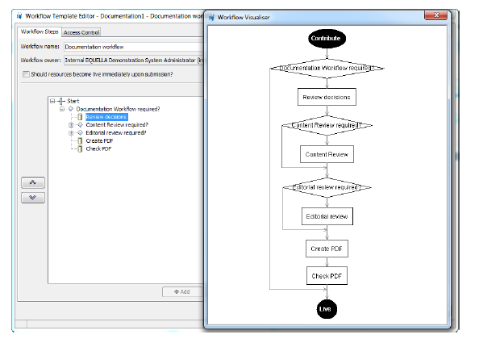
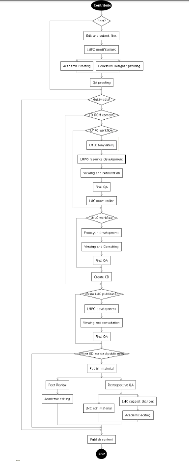
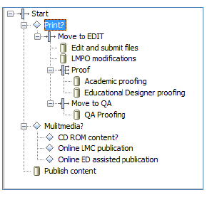

# Workflow Configuration Guide

Table of Contents

[Workflow overview](#workflow-overview)

[Workflow template procedure](#workflow-template-procedure)

[Workflow Template Editor](#workflow-template-editor)

[The Workflow Template Editor tree](#the-workflow-template-editor-tree)

[Workflow step types](#workflow-step-types)

[Workflow examples](#workflow-examples)

## Workflow overview
An EQUELLA workflow is a process whereby a new resource must pass through one or more stages of review or moderation before becoming fully available (live). The process automatically notifies users when they must moderate the resource. A workflow is associated with a collection and can be a simple one-step review or complex multi-step editorial and technical review comprising multiple publication paths.

The workflow is typically created by a content administrator from workflow steps that comprise an ordered process for passing from one node to the next. Scripts can be attached to workflow steps to determine whether a resource can skip the step. This allows very complex and flexible workflows to be created. On passing the last of the workflow steps the resource becomes ‘live’. Resources can also be made live during moderation, if required.

The content administrator designates users, groups or roles to a workflow step to create workflow step moderators. Workflow step moderators can be allocated to multiple workflow steps with moderator options being determined by the workflow creator and can include: rejection, modification, acceptance by one group member or acceptance by all group members.

Once the moderators have completed their review the next step in the workflow is determined by the moderator’s responses. The workflow history displays the resource’s workflow progress and can be used to view all review events and moderators.

Resources may enter a workflow when:
* contributed—the contributor chooses to submit the resource for moderation and the resource enters the workflow associated with the contributed collection;
* versioned—a new version enters the workflow and on completion archives all other ‘live’ versions;
* reviewed—a resource that has been ‘live’ for a period is checked for currency using its associated workflow. This process can be triggered manually by the resource owner or automatically by the collection definition. The resource remains ‘live’ during this review.

Please note that this guide has been developed to best reflect the full capabilities of EQUELLA and as such may differ in appearance to your own installation.

## Workflow template procedure
A typical workflow template is created using the following broad steps:
* Establish the required business process for the workflow. This is typically modelled on an existing process.
* Determine the users who will moderate each task.
* Create a workflow template using the Workflow Template Editor that applies the business process established in the preceding step:
  * Integrate with a metadata schema—creation of the workflow frequently requires the addition of nodes to the metadata schema for workflow node scripting.
  * Integrate the workflow template with a collection—create any data entry controls for data required for workflow node scripting.
* Test the workflow from contribution to going live—modify the workflow template, metadata schema or collection if required, and repeat the test.
* Make the collection available for general use.

There are no restrictions to the number of collections or metadata schemas associated with a workflow, however the number of collections and schemas that use an individual workflow template is restricted by the schema nodes required by the workflow and the controls provided by the collection.

## Workflow Template Editor
Workflow templates are created in the EQUELLA Administration Console using the Workflow Template Editor. The editor simplifies the creation of templates by modelling the workflow as a series of flow chart nodes. The flow and branches of the template can be previewed as a flow chart diagram to allow a complete view of the workflow.

#### To access the Workflow Template Editor
1. Log in to EQUELLA as an administrator, select Settings then Administration console.The Administration console displays. 
2. Select Workflow Templates. 

### Administration console elements
When a workflow template has been selected the Add, Edit, Remove, Clone, Import and Export buttons are enabled. (Providing the correct privileges have been granted.)
* Add—click to display the Workflow Template Editor page, where a new workflow template can be created.
* Edit—select a workflow template then click , or double-click on a workflow template, to display the Workflow Template Editor to modify the selected workflow template. If the selected template is being edited by another user, a Locked dialog is displayed providing the following options:
  * Open as read-only—disables the Save button so that no changes can be committed.
  * Forcefully unlock—unlocks the entity from the previous editor. Editing is possible but changes by other users may be lost.
  * Do not open—the Workflow Template Editor will not be opened.
* Remove—click Remove to delete the selected workflow template.
* Clone—click Clone to copy an existing workflow template. The cloned template can then be modified by selecting the Edit button.
* Import—click Import to import a workflow template that has previously been exported from the Administration Console. A warning dialog displays, as shown in Figure 4. (NOTE: Only ZIP files that have been exported from the Administration Console should be imported—other ZIP files may adversely affect the stability of the system.)
* Export—click to export a workflow template as a ZIP file.

#### To create a new workflow template
1. Click Add to display the Workflow Template Editor.

### Workflow Steps tab
The Workflow Steps page elements are:
* Workflow name—enter the template name. The name of the workflow exists for the benefit of the administrator and does not affect the workflow operation.
* Workflow owner—the owner of the template. By default this is the template’s creator; use the Search button to select another user or group as the workflow owner.
* Should resources become live immediately upon submission?—check this box when resources are required to be ‘live’ while in the workflow.
* Up Arrow—click to move the selected step above its neighbouring element.
* Down Arrow—click to move the selected step below its neighbouring element.
* Add—click to display the Select a step type… dialog where a new step can be added as a child to the selected node.
* Edit—click to display the relevant Editor dialog where the step configuration details can be entered or modified.
* Remove —click to remove the selected step.
* Preview—displays the Workflow Visualiser with a flow chart diagram of the workflow template.
* Save—click to save the workflow template.
* Close —click to exit the Workflow Template Editor.

## The Workflow Template Editor tree
Workflow templates are constructed using steps to build a hierarchical workflow tree. This structure provides flexibility and simplicity and allows the construction of simple or complex workflows.

### Workflow steps
The building blocks for a workflow template are workflow steps. Steps provide various structures and control mechanisms to implement a workflow. 

Each workflow step type provides specific functionality:
* Decision Point—allows a workflow to be branched. Decision points require a predicate script for differentiating between the branches. A decision point can have the following child nodes: decision points, parallel steps, sequential steps or workflow tasks.
* Parallel Steps—allows a workflow to be branched so multiple branches can be completed concurrently. All branches must be completed for the workflow to leave a parallel step. A parallel step can have the following child nodes: decision points, parallel steps, sequential steps or workflow tasks.
* Sequential step—allows a sequence of workflow steps to be chained together for completion. A sequential step can have the following child nodes: decision points, parallel steps, sequential steps or workflow tasks.
* Workflow task—the step where moderation is performed. Moderators must be allocated to workflow tasks before it can be saved in the workflow template. A workflow task has no child nodes but may have sibling nodes when used in conjunction with a sequential or parallel step.

### Create a workflow template
In the Workflow Template Editor, workflow templates are modelled as tree structures. The Workflow Template Editor provides a root node called ‘Start’ that is the parent to all other nodes in the workflow.

The Workflow Template Editor enforces the following constraints on steps added to a workflow template:
* Workflow tasks:
  * can have no child nodes; and
  * must have a user, group or role designated as a moderator.
* Decision points:
* must have a predicate script to differentiate resources for branching; and
* can only have one child node (if more are required the child node must be a sequential or parallel step).
Workflow templates cannot be saved or previewed if these conditions are not met.

### Add steps to a workflow
All workflows are created one step at a time by adding child nodes to the selected parent node. Typically a parent node will remain selected after adding a child so further children can be added.

#### To add child nodes
1. Select the parent node then click Add to display the Select a step type... dialog.
2. Select a step then click OK.

#### To configure or edit existing nodes
1. Double-click the node; or
2. Select the node then click Edit to display the relevant workflow editor.

Configuration of particular step types is provided in the Workflow step types section,

### Workflow template display
To assist understanding of how the tree structure maps to a flow chart, the workflow template can be previewed using the Workflow Visualiser. The workflow visualiser is accessed by clicking the button. 

Many of the attributes of the workflow tree are directly analogous to flow chart elements such as decision points. The parallel steps type cannot be easily depicted in a flow chart as they allow branching for performing concurrent workflow steps rather than unconditional branching. Concurrency has no flow chart representation so currently the parallel step is depicted as a branched flow without showing the dependency on completion of all branches.

To assist in understanding the translation between the tree and flow chart view:
* Flow chart view:
  * serial nodes are converted to unnamed lines;
  * workflow steps are represented as rectangles; and
  * decision points are represented as diamonds in both views.
* Workflow Template Editor view:
  * Decision points cause the workflow to move to the child node if the predicate script returns ‘true’ or move to the next sibling node if the predicate script returns ‘false’.
  * Branch ends cause the workflow to search back up the branch until a node to continue along can be found. If no nodes can be found the workflow ends. So for example once a resource has entered the ‘Editorial review required?’ branch and reaches the ‘Editorial Review’ step it will move back up the branch looking for a path. The only path it can follow is found by returning to the ‘Editorial review required’ node and continuing along the serial node to the ‘Create PDF’ workflow step.

### Access Control tab
The Access Control tab is used to control user access to the workflow template. There are three privileges associated with workflow templates:
* delete this workflow template—users granted this privilege are able to delete the selected workflow template, if required.
* edit this workflow template—users granted this privilege are able to edit the selected workflow template.
* manage this workflow template—users granted this privilege can see tasks associated with this workflow from the Manage Tasks navigation menu item.

## Workflow step types
### Decision points
Decision points allow a workflow to be branched. They require a predicate script to decide which of the branches to move to next.

When Decision Point is selected from the Select a step type... dialog, or when an existing Decision Point node is edited, the Decision Point Editor displays. 

The Decision Point Editor comprises the following:
* Name—the name that will be displayed in the Workflow Template Editor and in the workflow diagrams.
* Reject Point—select to allow resources that enter this decision point and are then rejected in subsequent steps to re-enter the workflow at this decision point.
* Open Script Editor—click to open the Script Editor for entry of the predicate script. Scripting is used to provide a flexible method for creating decisions based on any or all of the following entities:
  * Resource status—comprises all the available status options.
  * Role of User—comprises any of the roles created for the institution.
  * Schema Item—comprises all the nodes of the metadata schema associated with the selected collection.

#### To add a predicate script
1. Click Open Script Editor.
2. Enter the required script. 
3. Click OK to save the decision point script.
4. Click Save to save the decision point.

### Sequential steps
Sequential steps allow workflow template steps to be linked together so each step must be completed in sequence.

When Sequential Steps is selected from the Select a step type... dialog, or when an existing Sequential Steps node is edited, the Sequential Steps—Workflow Step Editor displays. 

The Workflow Step Editor comprises the following fields:
* Name—enter the name that is to be displayed in the Workflow Template Editor and in the workflow diagrams.
* Reject Point—select to allow resources that enter these sequential steps and are then rejected in subsequent steps to re-enter the workflow at this point.
* Save—saves the current workflow step configuration.
* Close—closes the workflow step editor.

### Parallel steps
Parallel steps enable the creation of workflows with multiple branches by allowing multiple child nodes. Workflow branches created by parallel steps are entered without any conditional test (to distinguish these nodes from a decision node), all steps can be performed concurrently and all branches must be completed for the workflow to proceed to the next workflow step.

When Parallel Steps is selected from the Select a step type... dialog, or when an existing Parallel Steps node is edited, the Parallel Steps—Workflow Step Editor is displayed. 

The Parallel Steps—Workflow Step Editor comprises the following fields:
* Name—enter the name that is to be displayed in the Workflow Template Editor and in the workflow diagrams.
* Reject Point—select to allow resources that enter these parallel steps and are then rejected in subsequent steps to re-enter the workflow at this point.
* Save—saves the current workflow step configuration.
* Close—closes the workflow step editor.

### Workflow tasks
Workflow tasks are where the moderation work is actually performed. Task details and configuration options as well as moderator selection can be set for workflow tasks.

When Workflow Task is selected from the Select a step type... dialog, or when an existing Workflow Task node is edited, the Workflow Task—Workflow Step Editor is displayed. 

The Workflow Task—Workflow Task Editor comprises the following tabbed pages:

### Details tab
The Details page configures the workflow task attributes:
* Task Name—enter the name that will be displayed in the Workflow Template Editor and workflow diagrams.
* Description—enter a description of the workflow task.
* Priority—select the priority of the task from the drop-down list. Choices are LOW, NORMAL or HIGH.
* Remind users if not moderated within (x) day(s) from the start of this task—select to send a reminder to the selected moderators for this task if the moderation has not been completed within the number of days selected in the days field.
  * Unless a date is selected within the contribution wizard—select if the contribution wizard to be associated with the workflow has a calendar control, allowing the contributor to select a date that the moderation task should be completed by. Select the associated schema from the drop-down list and use the Remove button to find and select the required schema target node that the date is stored in. This will override the reminder set above.
  * If not moderated within (x) days(s) of the reminder, automatically:—select to choose an action if the moderator has not performed the task within the set number of days after being sent a reminder. Choices are Reject this task, which sends the resource back to the last rejection point, or Accept this task, which sends the resource on to the next step in the workflow.
* Make this resource live automatically—select to choose to make the resource ‘live’ either ‘on arrival at this task’ (before task moderation has occurred), or ‘on acceptance of this task’ (once the moderator has accepted the task).
* Allow moderators to reject resources back to this task—select to allow resources that enter this workflow task and are then rejected in subsequent steps to re-enter the workflow at this point.
* Save—saves the current workflow task configuration.
* Close—closes the workflow task editor.

### Moderators tab
The Moderators tab enables the configuration of users, groups and roles to be allocated as moderators for the selected workflow task. 

The Moderators tab page comprises the following:
* Search tab—enables discovery and selection of Users, Groups and Roles to perform this workflow task by directly searching for entities and selecting from the returned results.
* Browse tab—enables discovery and selection of users by groups then the users within those groups, typically reducing the number of results returned on systems with large user bases. 

To select users, groups or roles as moderators for the task, use the following buttons:
  * Right Arrow —adds selected users, groups or roles to the list of selected moderators.
  * Left Arrow—removes the selected users, groups or roles from the list of selected moderators.
  * Double Left Arrow—removes all users, groups or roles from the list of selected moderators.
* Choose moderators based on a list of users stored in resource metadata—select when the required moderators are stored as a list of user names in the resource metadata. Choose the schema and schema target where the list of user names is stored.
* All moderators must unanimously accept this resource to continue escalation—select when the moderation task cannot be completed until all moderators have accepted the task. This includes all moderators associated with a group. This option is disabled when a ‘Role’ is selected as a moderator.
* Allow moderators to edit the metadata of resources for this task—select to allow resources to be edited by moderators during moderation. This functionality allows addition and correction of metadata.
* Save—saves the current workflow task configuration.
* Close—closes the workflow task editor.

### Workflow examples

This section provides examples for creating a simple workflow and editing a complex workflow.
Create a simple workflow

The example ‘Documentation Workflow’ workflow template shown below, created in this section is a simple workflow intended to be used for reviewing documents.

The business process for the workflow is as follows:
* Does the resource require reviewing or can it be made available to users?
* Does the resource content require reviewing? (If yes, a choice of reviewer needs to be made.)
  * Is an editorial review required? (If yes, it is to be completed by the editor.)
  * A PDF is to be created by the contributor or the editorial reviewer. (The selection of the user is to depend on the last completed task.)
  * The PDF is to be checked. (This task is to be allocated to the administrator or the documenter.)
* Resource becomes available to users.

The example ‘Documentation Workflow’ workflow has an associated ‘Document Workflow Collection’ collection with a User Selector wizard control integrated with a ‘Documentation’ metadata schema that has additional workflow nodes for workflow scripting. 

The moderators used in this example belong to the ‘INT – Documentation Administrators’ group and are:
* Internal EQUELLA Documentation User [int.documentation]
* Internal EQUELLA Document Administrator [int.docsadmin]
* Internal EQUELLA Content reviewer [int.contentreviewer]
* Internal EQUELLA Editor [int.editor]

#### To create a workflow from the EQUELLA Administration Console
1. Select Workflow Templates to display the Workflow Templates pane.
2. Click Add to display the Workflow Template Editor.
3. Enter a Workflow name (e.g. Documentation workflow).
4. Select the Start parent node.
5. 
The first workflow step (Documentation Workflow required?) requires a decision to determine whether a resource can skip the node, and has a predicate script attached.

#### To add a child decision point
1. Click Add to display the Select a step type...dialog.
2. Select Decision Point and click OK to display the Decision Point Editor. 
3. In the name field, enter ‘Documentation Workflow required?’.
4. Click Open Script Editor to display the Script Editor.
5. Select the associated ’Documentation’ from the Select Collection drop-down list.
6. Enter the script. 
7. Click OK to close the Script Editor.
8. Click Save to close the Decision Point Editor.

When the resource reaches the ‘Documentation Workflow required?’ step in the workflow it will either become ‘live’ or continue to the ‘Review decisions’ task, depending on the decision made by the resource contributor.

The ‘Review decisions’ workflow node is a task that is to be completed by the selected moderator and requires the selection of a content reviewer and an editorial review, if they are relevant to the resource in the workflow.

#### To add a child workflow step
1. Select the parent ‘Documentation Workflow required?’ node and click to display the Select a step type... dialog.
2. Select Workflow Task. The Workflow Task Editor displays. 
3. In the Task Name field, enter ‘Review decisions’.
4. In the Description field, enter explanatory information.
5. Leave the Priority field at the default of ‘NORMAL’.
6. Check the Remind users if not moderated within ‘7’ day(s) from the start of this task checkbox (change to 7 days).
7. Check the Allow moderators to reject resources back to this task checkbox.

#### To select a moderator
1. Select the Moderators tab.
2. With the Users option selected, click Search. A list of all users displays. Alternatively, type the first letter or letters of the search item and click Search.
3. Select the ‘Document Administrator [int.docsadmin]’ user to moderate this step.
4. Move it to the list of selected moderators (right-hand) pane using the button. 
5. Check the Allow moderators to edit the metadata of resources for this task checkbox.
6. Click Save to close the Workflow Task Editor.

At the completion of the ‘Review decisions’ task the resource will move to the ‘Content Review required?’ step in the workflow.

The ‘Content Review required?’ workflow node requires a decision to determine whether a resource can skip the step, and has a predicate script attached.

#### To add a sibling decision point
1. Select the ‘Documentation Workflow required?’ node and add a ‘Content Review required?’ Decision Point.
2. Add the associated script (e.g. if /workflow/contentReviewRequired = ‘Yes’). 
3. Click OK to close the Script Editor.
4. Click Save to close the Decision Point Editor.

When the resource reaches the ‘Content Review required?’ step in the workflow it will either continue to the ‘Content Review’ or ‘Editorial Review required?’ step, depending on the decisions made by the moderator of the ‘Review decisions’ task.

The ‘Content Review’ workflow task requires the content to be reviewed. It is to be completed by the moderator selected at the ‘Review decisions’ task from the group selected at this task.

#### To add a child workflow step
1. Select the ‘Content Review required?’ parent node and add a workflow task with the example configuration information:
* Task Name: Content Review.
* Description: Review to ensure the content is accurate and the structure of the document provides a logical flow.
* Priority: NORMAL
* Remind users if not moderated within 2 day(s) from the start of this task.
2. Select the ‘INT - Documentation Administrators‘ group on the Moderators tab.
3. Check the Allow moderators to edit the metadata of resources for this task checkbox.
4. Click Save to close the Workflow Task Editor.

At the completion of the ‘Content Review’ task the resource will move to the ‘Editorial Review required?’ step if it is accepted or back to the ‘Review decisions’ task if it is rejected.

The ‘Editorial Review required?’ workflow node requires a decision to determine whether a resource can skip the node and has a predicate script attached.

#### To add a sibling decision point
1. Select the ‘Documentation Workflow required?’ node and add an ‘Editorial Review required?’ Decision Point.
2. Add the associated script (e.g. if /workflow/editorialReviewRequired = ‘Yes’).
3. Click Save to close the Decision Point Editor.

When the resource reaches the ‘Editorial Review required?’ node in the workflow it will either continue to the ‘Editorial Review’ or ‘Create PDF’ task depending on the selections made in the ‘Review decisions’ task.

The ‘Editorial Review’ workflow task is to be completed by the moderator selected at this workflow step and requires the content to be edited.

#### To add a child workflow task
1. Select the ‘Editorial Review required?’ parent node and add a workflow task with the example configuration information:
* Task Name: Editorial review.
* Description: Review document style.
* Priority: NORMAL
* Remind users if not moderated within 2 day(s) from the start of this task.
2. Select the ‘Editor [int.editor]’ user for the moderator on the Moderators tab.
3. Check the Allow moderators to edit the metadata of resources for this task checkbox.
4. Click Save to close the Workflow Task Editor.

At the completion of the ‘Editorial Review’ task the resource will move to the ‘Create PDF’ task if it is accepted, or back to the ‘Review decisions’ task if it is rejected.

The ‘Create PDF’ workflow task requires that a PDF version of the document is created. It is to be assigned to the INT – Documentation Administrators group for moderation.

To add a sibling workflow step
1. Select the ‘Documentation Workflow required?’ node and add a workflow task with the example configuration information:
* Task Name: Create PDF.
* Description: Finalise document metadata then create a PDF.
* Priority: NORMAL
* Remind users if not moderated within 2 day(s) from the start of this task.
* Allow moderators to reject resources back to this task
2. Select the ‘INT – Documentation Administrators’ group on the Moderators tab.
3. Check the Allow moderators to edit the metadata of items for this task checkbox.
4. Click Save to close the Workflow Task Editor.

At the completion of the ‘Create PDF’ task the resource will move to the ‘Check PDF’ task if it is accepted or back to the ‘Review decisions’ task if it is rejected.

The ‘Check PDF’ workflow task is to be completed by the selected moderators and requires that the PDF is checked.

##### To add a sibling workflow task
1. Select the ‘Documentation Workflow required?’ sibling node and add a workflow task with the example configuration information:
* Task Name: Check PDF.
* Description: Ensure PDF is viewable on all supported platforms and no conversion artefacts have been added.
* Priority:NORMAL
* Remind users if not moderated within 2 day(s) from the start of this task.
2. Select the ‘Document Administrator [int.docsadmin]’ and ‘Documentation User [int.documentation]’ moderators on the Moderators tab.
3. Check the Allow moderators to edit the metadata of items for this task checkbox.
4. Click Save to close the Workflow Task Editor.

At the completion of the ‘Check PDF’ task the resource in the workflow will become ‘Live’ if it is accepted, or move back to the ‘Create PDF’ task if it is rejected.

## Restructure an existing workflow
Complex workflow templates will inevitably require reworking either because the workflow has changed or the workflow template has to integrate with a schema. As a rule of thumb, complex workflows require complex schemas. This section provides information on restructuring a workflow.

The complex example workflow template used in this section is intended to be used for reviewing documents/media created for publication by a university. The workflow branches according to publication media and publisher.

### Remove a parent without losing child nodes
During the early stages of workflow template creation, it is common to want to move or remove nodes that have child nodes. Removing a node directly causes all the child nodes to be removed, resulting in a lot of rework if only the parent node required deletion.

Moving nodes causes all child nodes to be moved, a property that allows child nodes to be shifted to a new parent before the node is removed.

In the sample workflow, the ‘Move to LMPO’ serial node shown in Figure 28 is unnecessary as it is a child of a serial node. The removal of this node will occur in the following stages:
1. Move the children to a new parent.
2. Delete the unnecessary node.

To move the selected node:

3. Select the ‘LMPO modifications’ child workflow task.
4. Select the button to move the task to a new ‘Move to ED’ parent sequential steps node.

To delete the unnecessary node:

5. Select the unnecessary ‘Move to LMPO’ sequential steps node.
6. Click Remove. The Removing a Step dialog displays.
7. Click Remove Step.
