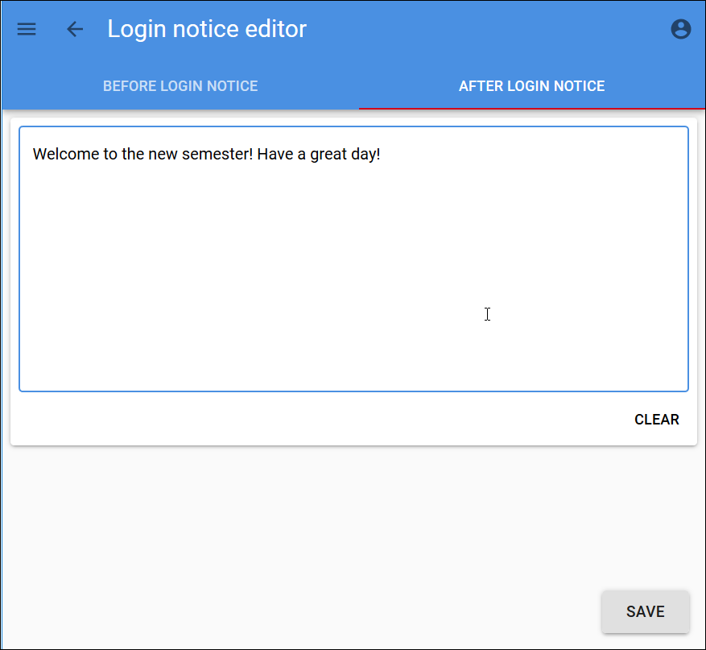
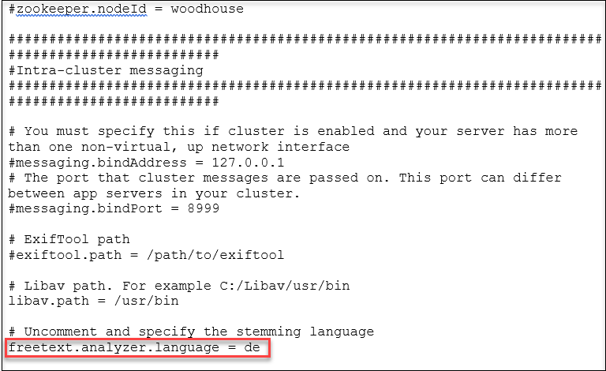
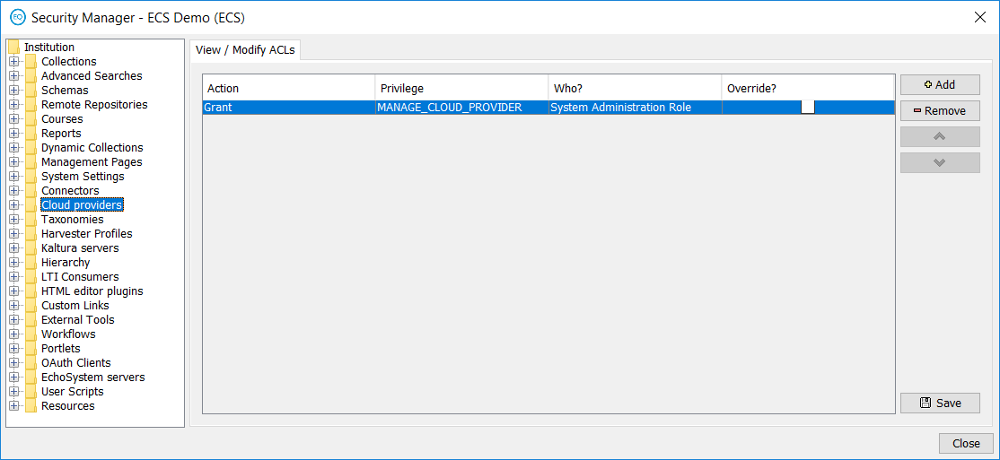
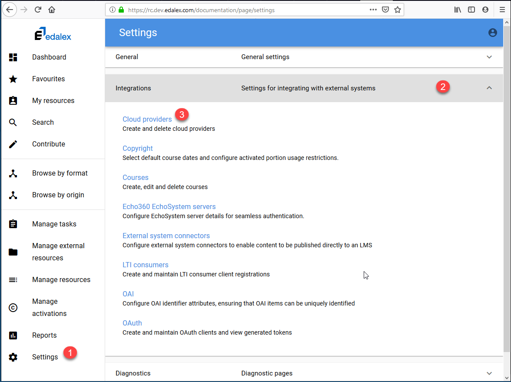
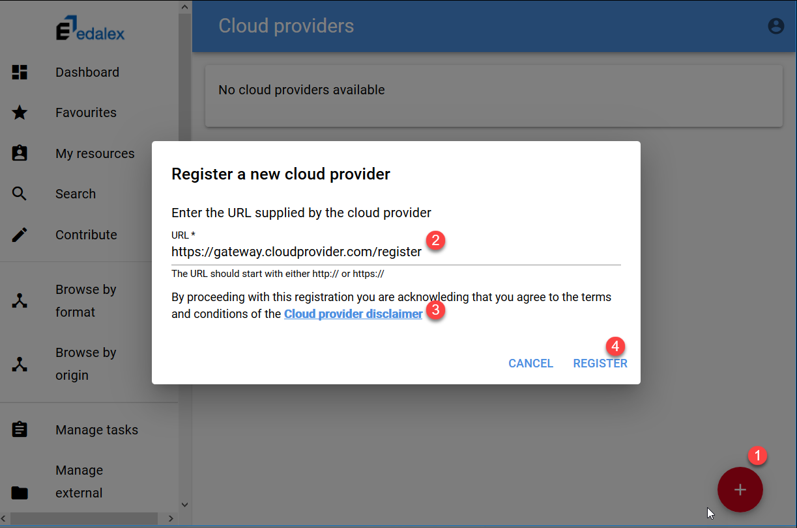
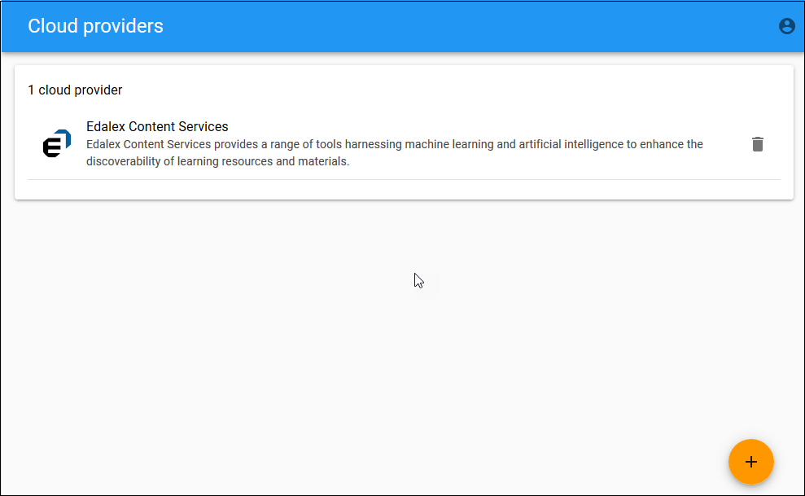

# openEQUELLA 2019.1 Features Guide

Table of Contents
* [Administration Console Package](#administration-console-package)
* [Login Notice Editor](#login-notice-editor)
* [Support for Languages other than English](#support-for-languages-other-than-english)
* [REST API Enhancements](#rest-api-enhancements)
* [Cloud Providers](#cloud-providers)
* [Enhanced Blackboard Integration](#enhanced-blackboard-integration)

# Administration Console Package

In openEQUELLA versions prior to 2019.1, the Administration Console was launched
from the openEQUELLA Settings page using Java Web Start. As time progresses, there are an
increasing number of organisations who would prefer not to have Java installed
on the client side as part of the Standard Operating Environment (SOE).

Until the Administration Console functionality can be transferred to the web, an
interim solution in the form of an Administration Console ‘package’ is available
to use with openEQUELLA 2019.1 and future releases. This package bundles the
Java Runtime Environment (JRE) with the Administration Console and allows users
to access the Administration Console on local systems. This will remove the
requirement to install Java locally and this package will be the access point to
the Administration Console from openEQUELLA 2019.1 forward.

### Downloading the package

There are three Administration Console Packages available on GitHub, one each
for Windows, Mac, and Linux operating systems.

##### To download the package

1.  Go to https://github.com/apereo/openEQUELLA-admin-console-package/releases
    and download the latest package for your operating system.

2.  Extract the package files to your preferred location on your local drive.

### Opening the Launcher 

The Launcher enables the configuration of openEQUELLA servers and the launching
of their respective Administration Consoles, as well as various other functions.

To open the Launcher, double-click the relevant launcher file
(`Windows-launcher.bat`, `Mac-launcher.sh`, or `Linux-launcher.sh`). You may wish
to create a shortcut for this file as you will use it each time to access an
Administration Console. The **openEQUELLA Administration Console Launcher**
displays. An example is shown in Figure 8.


Figure 8 openEQUELLA Administration Console Launcher

#### openEQUELLA Administration Console Launcher components

The **openEQUELLA Administration Console Launcher** has the following functions:

-   **Add Server** – enables the openEQUELLA servers and their institutions to
    be configured so that their Administration Consoles can be launched. See
    [Adding servers](#adding-servers).

-   **Proxy Settings –** enables the details of a Proxy Host to be configured to
    allow access to the Administration Console.

-   **Server** – a drop-down list of configured openEQUELLA servers and their
    institutions.

-   **Edit** – enables the details of the currently selected Server to be
    modified.

-   **Remove** – removes the currently selected Server.

-   **Make Default** – click to make the currently selected Server display as
    the default when the Launcher app is opened.

-   **Launch** – launches the Administration Console for the selected Server.

### Adding servers

Once the package is installed, each openEQUELLA server and institution must be
configured to access their respective Administration Consoles. For example, if
your organisation has a production environment and a test environment and you
have access to the Administration Console for both instances, you are required
to add both servers. Additionally, if there are multiple institutions on each
server, a server record must be added for each institution.

##### To add a server

1.  Open the Launcher using the relevant launcher file (`Windows-launcher.bat`,
    `Mac-launcher.sh`, or `Linux-launcher.sh`).

2.  Select **Add Server.** The **Server Editor** dialog displays, as shown in
    Figure 9.


Figure 9 Server Editor

1.  Enter a **Server Name** - a descriptive name for the openEQUELLA
    institution.

2.  Enter the **Server URL -** the full openEQUELLA domain, including the
    institution name. For example,
    `https://myorganisation.openequella.com/institution1`.

3.  Click **Save.**

### Cloning servers

Once one server has been configured, on selection of the **Add Server** button,
the user is presented with the option to clone the currently selected server.
Selecting **Yes** to this option will prefill the **Server Name** and **Server
URL** fields with the currently selected server details, and the user can adjust
them to the required values.

Selecting **No** to this option will leave the **Server Name** and **Server
URL** fields blank.

### Launching the package

Once a server record has been added for an institution, the Administration
Console for that institution can be opened.

##### To launch the Administration Console

1.  From the **openEQUELLA Administration Console Launcher**, select the
    required Server.

2.  Select **Launch** to open the Admin Console for the selected
    server/institution. An example is shown in Figure 10.


Figure 10 Launch the Admin Console

The **Enter login credentials** dialog displays. An example is shown in Figure 11


Figure 11 Enter login credential dialog

3.  Enter your login credentials

NOTE: Login credentials will be requested each time an Administration Console is
launched.

The Administration Console for the selected Server/Institution opens.

# Login Notice Editor

The ability to create and display a notice on the Login page is included as
part of the openEQUELLA 2019.1 release, and is now ready for beta testing. This
feature enables administrators to create a notice to display on the Login page
using a rich text editor (TinyMCE 5.0.2), including images, links,
embedded videos, and more; as well as being able to schedule the notice to
display within configured date and time parameters.

Please note that the Login page notice is in addition to the existing
functionality which allows a simple text message to display in a popup after a
user has logged in. This functionality has not changed, however access to the
configuration setting for this function has been incorporated with the new functionality into
the one **Login notice editor** setting.

An example of the new **Before login notice** is shown in Figure 1 and the
existing **After login notice** is shown in Figure 2.


**Figure 1 New ‘Before login’ notice**


**Figure 2 Existing 'After login’ notice**

### Accessing the Login notice editor

The Login notice editor is accessed from **Settings > General settings > Login
notice editor**. An example is shown in Figure 3.


**Figure 3 Accessing the Login notice editor**

### Login notice editor page 

The Login notice editor page displays two tabs, **BEFORE LOGIN NOTICE** and
**AFTER LOGIN NOTICE**. It also displays a **Back** arrow beside the page
heading in the top left (*Login notice editor*) that is used to return to the
Settings page without saving any changes made in the Login notice editor. An
example is shown in Figure 4.


**Figure 4 Login notice editor page**

### Before login notice tab

The **BEFORE LOGIN NOTICE** tab allows a notice to be created and formatted to
display to users on the openEQUELLA Login page. It can be displayed based on the
scheduling options selected. The tab includes:

-   **Rich text editor** – allows administrators to add and format text, images,
    videos, links and more. Images can be based on a URL or simply pasted into
    the editor.

-   **Schedule settings** – select from **On** (display on the login page),
    **Scheduled** (display for the time period configured) and **Off** (do not
    display).

-   **SAVE button** – saves changes.

An example showing content added using the rich text editor is shown in Figure
5.


**Figure 5 BEFORE LOGIN NOTICE tab**

#### Schedule settings

The **Schedule settings** section enables the Before login notice to be set to:

-   **On** – the notice always displays on the login page.

-   **Off** – the notice will not display on the login page.

-   **Scheduled** – the notice displays on the login page only between the
    configured dates and times. Clicking in the **Start date** and **End date**
    fields displays a date and time picker. Once the end date and time is
    reached, the notice no longer displays.

An example is shown in Figure 6.


**Figure 6 Schedule settings with Date/Time picker**

### After Login Notice tab

The **AFTER LOGIN NOTICE** tab allows a simple text notice to be entered to
display to users in a popup dialog box once they’ve logged in. The tab includes:

-   **Text box** – to enter notice message.

-   **CLEAR button** – clears the current message.

-   **SAVE button** – saves changes.

An example is shown in Figure 7.


**Figure 7 AFTER LOGIN NOTICE tab**


# Support for Languages other than English

In openEQUELLA, language packs can be used to control the language within
display areas of the system. openEQUELLA 2019.1 expands its support for
languages other than English in its search capabilities (such as recognising the
specified language’s stop words, stemming, etc.)

The default openEQUELLA search language is English, but this can be changed by
editing the `optional-config.properties` file to specify the required default
search language (using the [Alpha-2 country
code](https://www.iban.com/country-codes)).

##### To edit the default search language

1.  Go to the openEQUELLA directory on your system and open the
    `learningedge-config` folder.

2.  Open the `optional-config.properties` file using your text editor of
    choice.

3.  At the bottom of this file, uncomment (remove the `\#` in front of) the
    `freetext.analyzer.language` property and add `= xx` (where **xx** is the Alpha-2 country code) (see example in Figure 8).

Note that the Alpha-2 country code must be entered in lower case.

4.  Restart the openEQUELLA server.

An example where the required search language is German is shown below.



**Figure 8 optional-config.properties file – ‘freetext.analyzer.language’ property**

# REST API Enhancements

See 

* [Search API documentation updates](https://github.com/apereo/openEQUELLA/issues/730)

* [Editing of attachments and metadata](https://github.com/apereo/openEQUELLA/issues/873)


# Cloud Providers


openEQUELLA introduces the ability to add a Cloud provider. Cloud providers can
be developed by third parties in order to deliver cloud services to openEQUELLA.

The process of signing up for a Cloud provider service (for example, [ECS
AutoTag](https://www.edalex.com/autotag)) takes place outside of openEQUELLA, and as part of that process the
Cloud provider supplies a service URL and possibly credentials for the
registration process. During registration, openEQUELLA and the Cloud provider
authenticate using these credentials resulting in a bi-directional communication
channel.

Once openEQUELLA is successfully registered, the Cloud provider has the means to
automatically add and update wizard controls in the Collection Definition Editor
(e.g. the ECS AutoTag control), which enables the service to be incorporated in
contribution wizards.

### Cloud provider permissions

The `MANAGE_CLOUD_PROVIDER` ACL needs to be granted to the relevant
administrators before they can register a new Cloud provider. This is done
through the Security Manager, accessed via the Administration Console. An
example is shown in Figure 9.



Figure 9 Security Manager - Cloud providers

### Registering a Cloud provider

##### To register a Cloud provider

1.  From the openEQUELLA **Settings** page, select **Integrations > Cloud providers**.



Figure 10 Settings, Integrations, Cloud providers

The **Cloud providers** page displays. An example is shown in Figure 11.



Figure 11 Cloud provider registration page

1.  Click the Add (Plus) button to open the **Register a new cloud provider**
    dialog.

2.  Enter the registration **URL** supplied by your Cloud provider, view the
    **Cloud provider disclaimer** then click **REGISTER**.

3.  A registration form requiring you to enter credentials or displaying other
    information may display, depending on the Cloud provider’s process. An
    example of the Edalex Content Services registration form is shown below:


Figure 12 Example registration form

1.  Enter the required information (e.g. username and password provided to you
    by the Cloud provider) then click **REGISTER**.

The registration and authentication process occurs in the background and once
completed successfully, the Cloud provider information displays on the **Cloud
providers** page. An example is shown in Figure 13.



Figure 13 Cloud providers page with registered Cloud provider


# Enhanced Blackboard Integration

The openEQUELLA / Blackboard integration has historically been achieved with a building block and web service that was uploaded into the Blackboard site.  This has historically presented some difficulties and Blackboard is retiring their SOAP Web Services in Q2 2020 which will effectively break the openEQUELLA web service.  Due to this upcoming loss of functionality, and the complexity of maintaining the building block and web service, a pure LTI / REST integration is being developed.  This integration is available in this release as a 'beta' feature with a minimal set of functionality, and will be enhanced for 2019.2.

As part of migrating from the building block and web service integration to the LTI / REST integration, adopters will have access to the following Blackboard abilities:
* Course Content Deep Linking Tool (works in 2019.1)
* Course Tool (on the roadmap)
* System Tool (on the roadmap)

Adopters will no longer be able to use the 'My Institution' integration that was part of the building block and web service integration.

## Enable Using Blackboard REST APIs
In order to make REST calls into a Blackboard site, adopters will need to obtain a REST Application ID via https://developer.blackboard.com/ .  This REST Application ID will then be used (via the same site), to create a REST Application key and secret that is tied to your Blackboard site URL.  You will need this key and secret when configuring the integration in Blackboard.  Please read this [post](https://community.blackboard.com/docs/DOC-4258-developer-groups-site-quotas-and-rate-limits) for more information on how Blackboard handles REST Application IDs.

## Configure openEQUELLA

### Configure a new LTI Consumer

This is a standard LTI Consumer in openEQUELLA, so only a high level review is provided.

1. Under **Settings > Integrations > LTI Consumers**, click on **Create new LTI consumer**.
2. You can leave the 'Consumer key' and 'Consumer secret' with the system-generated values, or specify your own.
3. Choose your SSO configuration and role mappings.  For testing, leave **Useable by** as **Everyone**, and set **Unknown user handling** to **Create local user and add them to the following groups...**.  Then choose a group for all 'new' Blackboard users crossing over to openEQUELLA to be added to.

### Configure a new External System Connector

1. Under **Settings > External system connectors**, click on **Add new connector**.
2. Select **Blackboard REST**.
3. Configure a **Connector name**, and provide a **Blackboard REST URL**.
4. Click on **Test URL**.  Ignore the **Test web service** button.  This will be removed in 2019.2.
5. Specify the **REST API Key** and **REST API Secret** from https://developer.blackboard.com/ .
6. The rest of the configuration is standard External System Connector details.  

## Configure Blackboard

### Register the Provider Domain

1. Under **System Admin > LTI Tool Providers**, select **Register Provider Domain**.
2. Configure the Provider domain.  So for `https://my.learning.center/oeq`, you would put `my.learning.center`.
3. Set **Provider Domain Status** to `Approved`.
4. Under **Default Configuration**, set **Default Configuration** to **Set globally**.
5. Configure the **Tool Provider Key** and **Tool Provider Secret** with the values you configured in the `openEQUELLA LTI Consumer`.
6. Configure the **Tool Provider Custom Parameters** with the following.  Note, omitting the `bb_user_login_id` line will result in the LTI crossover (SSO into openEQUELLA) using the Blackboard user's `externalId` instead of the `userName`.
```properties
bb_user_login_id=@X@user.id@X@
bb_user_id=@X@user.batch_uid@X@
```
7. Under **Institution Policies**, set **Send User Data** to **Send user data only over SSL**.
  * Note:  You can select **Send user data over any connection**, but it is not recommended for a Production install.
8. Set **User Fields to Send** to **Role in Course, Name, and Email Address**.
9. Set **Allow Membership Service Access** to **Yes**.

### Configure Course Content Tool Placement

1. Under the newly registered provider domain, select **Manage Placements**.
2. Select **Create Placement**.
3. Configure the label and description.
4. Configure the handle (this cannot change after the placement is created).
5. Leave **Availability** set to **Yes**.
6. Set **Type** to **Course content tool**, and then select **Supports deep linking**.
7. Under **Tool Provider Information**, set the **Tool Provider URL** to `{https://your.oE.domain.xyz/demo/}blackboardltisignon.do`.
8. The **Tool Provider Key** and **Tool Provider Secret** will be preconfigured (and readonly).

### Configure the REST Application in Blackboard

1. Under **System Admin > REST API Integrations**, select **Create Integration**.
2. Configure the Application ID from your registration on https://developer.blackboard.com/ .
3. Select a 'Learn User' that has sufficient permissions.
4. Leave **End User Access** as the default **Yes**.
5. Leave the **Authorized To Act As User** as the default **Service Default (No)**.

## Usage

### Permissions
Grant the following to your openEQUELLA users
  * `EXPORT_VIA_CONNECTOR`, `EXPORT_TO_LMS_ITEM`, `VIEWCONTENT_VIA_CONNECTOR`, `FIND_USES_ITEM` - Push to LMS / Find Uses / Manage External Resources.
  * `INTEGRATION_SELECTION_SESSION` - LTI launch from Blackboard to openEQUELLA to the selection session page
  * `DISCOVER_ITEM` - Discover openEQUELLA items in a search (such as from the selection session).  Allows some of the metadata to show.
  * `VIEW_ITEM` - View attachments from an LTI launch, view attachments from a selection session.

### Add an openEQUELLA content link with the Course Content Tool Placement

In an original Blackboard course, navigate into **{your course} > Information > Build Content > your-oEQ-CTT-placement** .  This is known as 'Pull to LMS'.  Currently only works for original Blackboard courses.  Ultra courses are planned for 2019.2.

### Other integration abilities

The rest of the integration abilities are similar to the building block and web service flows:
* 'Push to LMS'
  * From openEQUELLA, select courses / folders to integrate content links from a given openEQUELLA resource.
  * Currently only works for original Blackboard course.  Ultra courses are planned for 2019.2.
* Manage External Resources 
  * Not working in 2019.1.
* Find Uses
  * Not working in 2019.1.

## Notes

* The default REST Application ID adopters obtain is at the 'developer' level - there is a 7 Blackboard site limit, and API call rate limits.  It is recommended openEQUELLA / Blackboard adopters reach out to their Blackboard Support contacts to discuss the appropriate REST Application ID level for their institution.
* The Blackboard REST integration can be enabled / disabled with the **Available** flag in Blackboard.
* A good write up of the configuration options for Blackboard REST applications is [here](https://community.blackboard.com/community/developers/learn/blog/2019/02/12/end-user-access-authorized-to-act-as-user).
* Since this feature is in 'beta', adopters that plan to switch from the building block and web service integration to the LTI / REST integration by Q2 2020 are encouraged to try out the new functionality, and along with the functionality mentioned in the 2019.2 Milestone, ensure it will be sufficient for their openEQUELLA / Blackboard integration user scenarios. 
* If you get an error in openEQUELLA `CacheLoader returned null for key TOKEN.`, confirm your Blackboard REST Application is configured and available.

## Blackboard integration tickets
[2019.1 Enhancements](https://github.com/apereo/openEQUELLA/issues/598)

[All Identified Possible Enhancements](https://github.com/apereo/openEQUELLA/issues?q=is%3Aopen+is%3Aissue+label%3A%22Integration+-+Bb+LTI%2FREST%22)

[Enhancements Currently on the 2019.2 Roadmap](https://github.com/apereo/openEQUELLA/issues?q=is%3Aopen+is%3Aissue+label%3A%22Integration+-+Bb+LTI%2FREST%22+milestone%3A2019.2)
