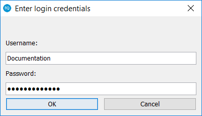
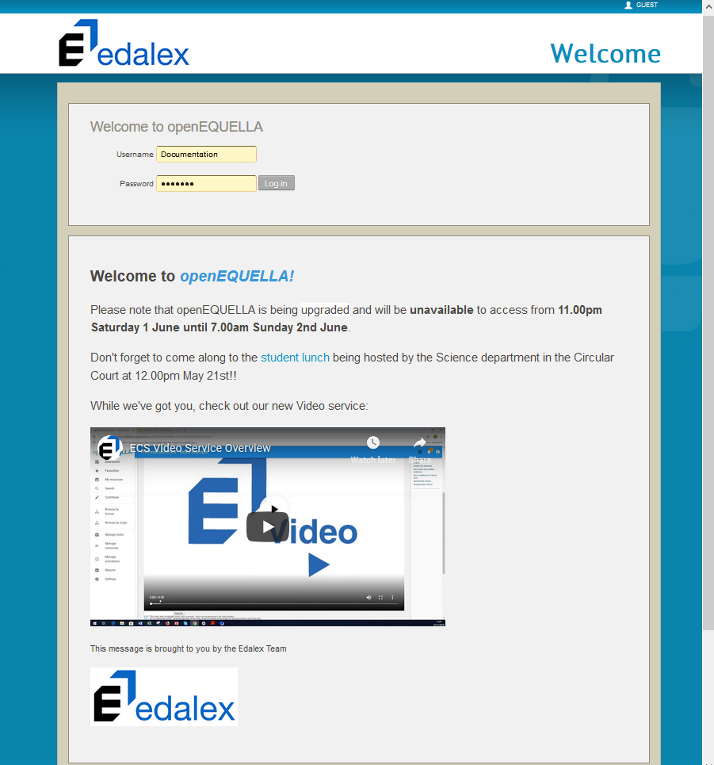
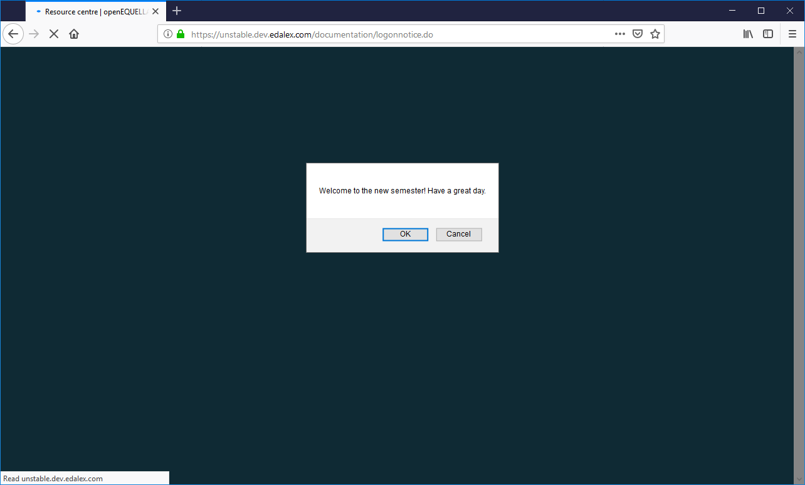
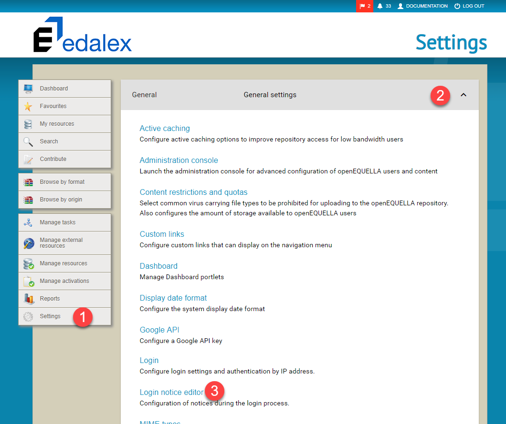
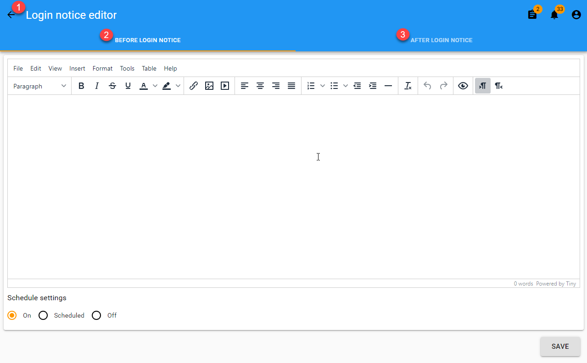
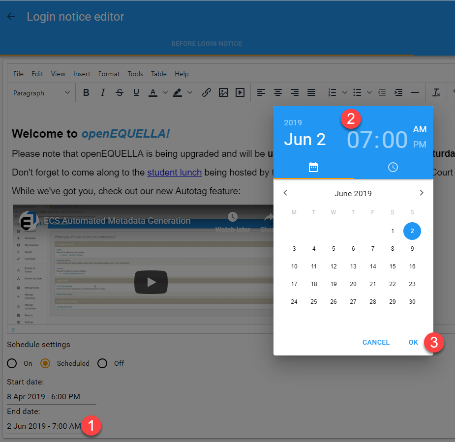
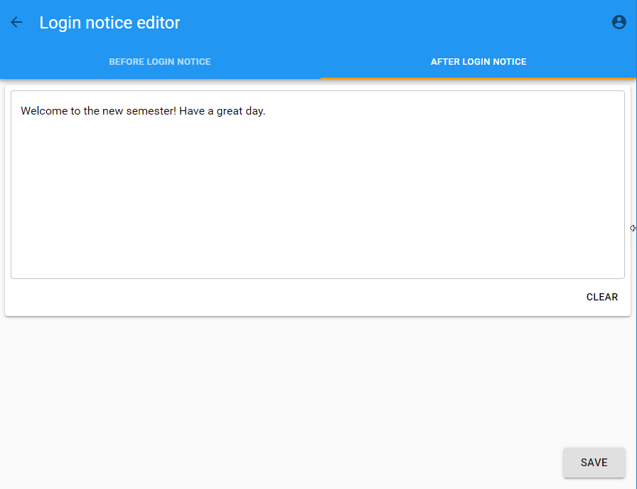
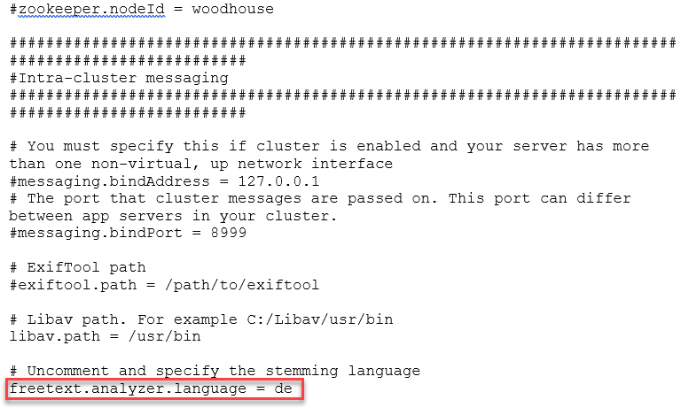

# openEQUELLA 2019.1 Features Guide

Table of Contents
* [Administration Console Package](#administration-console-package)
* [Login Notice Editor](#login-notice-editor)
* [Support for Languages other than English](#support-for-languages-other-than-english)

Administration Console Package
------------------------------

In openEQUELLA versions prior to 2019.1, the Administration Console was launched
from the openEQUELLA Settings page using a mechanism that is planned to be
removed in the latest version of Java. As time progresses, there are an
increasing number of organisations who would prefer not to have Java installed
on the client side as part of the Standard Operating Environment (SOE).

Until the Administration Console functionality can be transferred to the web, an
interim solution in the form of an Administration Console ‘package’ is available
to use with openEQUELLA 2019.1 and future releases. This package bundles the
Java Runtime Environment (JRE) with the Administration Console and allows users
to access the Administration Console on local systems. This will remove the
requirement to install Java locally and this package will be the access point to
the Administration Console from openEQUELLA 2019.1 forward.

### Downloading the package

There are three Administration Console Packages available on GitHub, one each
for Windows, MAC and Linux operating systems.

##### To download the package

1.  Go to https://github.com/apereo/openEQUELLA-admin-console-package/releases
    and download the required operating system package.

2.  Extract the package files to your preferred location on your local drive.

### Opening the Launcher 

The Launcher enables the configuration of openEQUELLA servers and the launching
of their respective Administration Consoles, as well as various other functions.

To open the Launcher, double-click the relevant launcher file
(*Windows-launcher.bat, Mac-launcher.sh* or *Linux-launcher.sh*). You may wish
to create a shortcut for this file as you will use it each time to access an
Administration Console. The **openEQUELLA Administration Console Launcher**
displays. An example is shown in Figure 8.

Figure 8 openEQUELLA Administration Console Launcher

#### openEQUELLA Administration Console Launcher components

The **openEQUELLA Administration Console Launcher** has the following functions:

-   **Add Server** – enables the openEQUELLA servers and their institutions to
    be configured so that their Administration Consoles can be launched. See
    [Adding servers](#adding-servers).

-   **Proxy Settings –** enables the details of a Proxy Host to be configured to
    allow access to the Administration Console.

-   **Server** – a drop-down list of configured openEQUELLA servers and their
    institutions.

-   **Edit** – enables the details of the currently selected Server to be
    modified.

-   **Remove** – removes the currently selected Server.

-   **Make Default** – click to make the currently selected Server display as
    the default when the Launcher app is opened.

-   **Launch** – launches the Administration Console for the selected Server.

### Adding servers

Once the package is installed, each openEQUELLA server and institution must be
configured to access their respective Administration Consoles. For example, if
your organisation has a production environment and a test environment and you
have access to the Administration Console for both instances, you are required
to add both servers. Additionally, if there are multiple institutions on each
server, a server record must be added for each institution.

##### To add a server

1.  Open the Launcher using the relevant launcher file (W*indows-launcher.bat,
    Mac-launcher.sh* or *Linux-launcher.sh*).

2.  Select **Add Server.** The **Server Editor** dialog displays, as shown in
    Figure 9.

Figure 9 Server Editor

1.  Enter a **Server Name** - a descriptive name for the openEQUELLA
    institution.

2.  Enter the **Server URL -** the full openEQUELLA domain, including the
    institution name. For example,
    *https://myorganisation.openequella.com/institution1*.

3.  Click **Save.**

### Cloning servers

Once one server has been configured, on selection of the **Add Server** button,
the user is presented with the option to clone the currently selected server.
Selecting **Yes** to this option will prefill the **Server Name** and **Server
URL** fields with the currently selected server details, and the user can adjust
them to the required values.

Selecting **No** to this option will leave the **Server Name** and **Server
URL** fields blank.

### Launching the package

Once a server record has been added for an institution, the Administration
Console for that institution can be opened.

##### To launch the Administration Console

1.  From the **openEQUELLA Administration Console Launcher**, select the
    required Server.

2.  Select **Launch** to open the Admin Console for the selected
    server/institution. An example is shown in Figure 10.

Figure 10 Launch the Admin Console

The **Enter login credentials** dialog displays. An example is shown in Figure 11

Figure 11 Enter login credential dialog

3.  Enter your login credentials

NOTE: Login credentials will be requested each time an Administration Console is
launched.

The Administration Console for the selected Server/Institution opens.

Login Notice Editor
-------------------

The ability to create and display a notice on the Login page is included as
part of the openEQUELLA 2019.1 release, and is now ready for beta testing. This
feature enables administrators to create a notice to display on the Login page
using a rich text editor (TinyMCE 5.0.2), including images, links,
embedded videos and more, as well as being able to schedule the notice to
display within configured date and time parameters.

Please note that the Login page notice is in addition to the existing
functionality which allows a simple text message to display in a popup after a
user has logged in. This functionality has not changed, however access to the
configuration setting for this function has been incorporated with the new functionality into
the one **Login notice editor** setting.

An example of the new **Before login notice** is shown in Figure 1 and the
existing **After login notice** is shown in Figure 2.

**Figure 1 New ‘Before login’ notice**

**Figure 2 Existing 'After login’ notice**

### Accessing the Login notice editor

The Login notice editor is accessed from **Settings, General settings, Login
notice editor**. An example is shown in Figure 3.

**Figure 3 Accessing the Login notice editor**

### Login notice editor page 

The Login notice editor page displays two tabs, **BEFORE LOGIN NOTICE** and
**AFTER LOGIN NOTICE**. It also displays a **Back** arrow beside the page
heading in the top left (*Login notice editor*) that is used to return to the
Settings page without saving any changes made in the Login notice editor. An
example is shown in Figure 4.

**Figure 4 Login notice editor page**

### Before login notice tab

The **BEFORE LOGIN NOTICE** tab allows a notice to be created and formatted to
display to users on the openEQUELLA Login page. It can be displayed based on the
scheduling options selected. The tab includes:

-   **Rich text editor** – allows administrators to add and format text, images,
    videos, links and more. Images can be based on a URL or simply pasted into
    the editor.

-   **Schedule settings** – select from **On** (display on the login page),
    **Scheduled** (display for the time period configured) and **Off** (do not
    display).

-   **SAVE button** – saves changes.

An example showing content added using the rich text editor is shown in Figure
5.

**Figure 5 BEFORE LOGIN NOTICE tab**

#### Schedule settings

The **Schedule settings** section enables the Before login notice to be set to:

-   **On** – the notice always displays on the login page.

-   **Off** – the notice will not display on the login page.

-   **Scheduled** – the notice displays on the login page only between the
    configured dates and times. Clicking in the **Start date** and **End date**
    fields displays a date and time picker. Once the end date and time is
    reached, the notice no longer displays.

An example is shown in Figure 6.

**Figure 6 Schedule settings with Date/Time picker**

### After Login Notice tab

The **AFTER LOGIN NOTICE** tab allows a simple text notice to be entered to
display to users in a popup dialog box once they’ve logged in. The tab includes:

-   **Text box** – to enter notice message.

-   **CLEAR button** – clears the current message.

-   **SAVE button** – saves changes.

An example is shown in Figure 7.

**Figure 7 AFTER LOGIN NOTICE tab**

Support for Languages other than English
----------------------------------------

In openEQUELLA, language packs can be used to control the language within
display areas of the system. openEQUELLA 2019.1 expands its support for
languages other than English in its search capabilities (such as recognising the
specified language’s stop words, stemming etc.)

The default openEQUELLA search language is English, but this can be changed by
editing the optional-config.properties file to specify the required default
search language (using the [Alpha-2 country
code](https://www.iban.com/country-codes)).

##### To edit the default search language

1.  Go to the openEQUELLA directory on your system and open the
    **learningedge-config** folder.

2.  Open the **optional-config.properties** file using your text editor of
    choice.

3.  At the bottom of this file, uncomment (remove the **\#** in front of) the
    **freetext.analyzer.language** property and add **= [countrycode]** at the
    end**.**

Note that the Alpha-2 country code must be entered in lower case

1.  Restart the openEQUELLA server

An example where the required search language is German is shown below.

**Figure 8 optional-config.properties file – ‘freetext.analyzer.language’ property**

