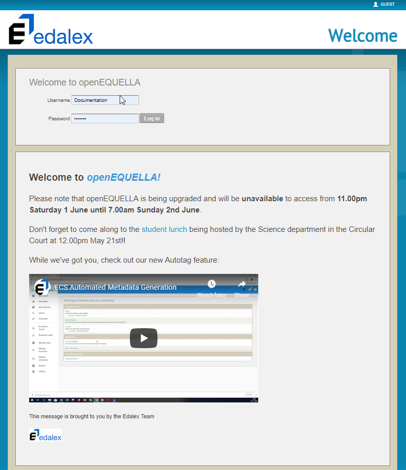
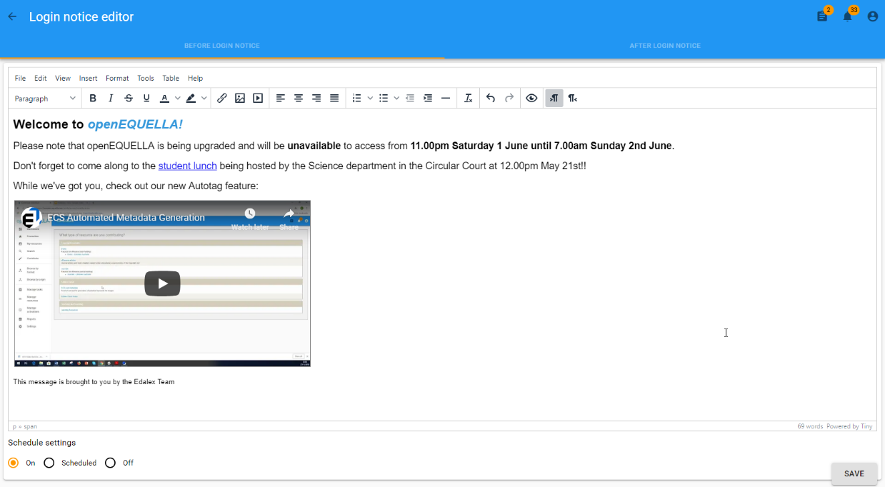

# openEQUELLA 2019.1 Features Guide

Login Notice Editor
-------------------

The ability to create and display a notice on the Login page will be included as
part of the openEQUELLA 2019.1 release, and is now ready for beta testing. This
feature enables administrators to create a notice to display on the Login page
using a rich text editor (TinyMCE 5.0.2), including adding images, links,
embedded videos and more, as well as being able to schedule the notice to
display within configured date and time parameters.

Please note that the Login page notice is in addition to the existing
functionality which allows a simple text message to display in a popup after a
user has logged in. This functionality has not changed, however access to the
configuration setting for this function has been incorporated into one setting
called **Login notice editor**.

An example of the new **Before login notice** is shown in Figure 1 and the
existing **After login notice** is shown in Figure 2.

**Figure 1 New ‘Before login’ notice**

**Figure 2 Existing 'After login’ notice**

### Accessing the Login notice editor

The Login notice editor is accessed from **Settings, General settings, Login
notice editor**. An example is shown in Figure 3.

**Figure 3 Accessing the Login notice editor**

### Login notice editor page 

The Login notice editor page displays two tabs, **BEFORE LOGIN NOTICE** and
**AFTER LOGIN NOTICE**. It also displays a **Back** arrow beside the page
heading in the top left (*Login notice editor*) that is used to return to the
Settings page without saving any changes made in the Login notice editor. An
example is shown in Figure 4.

**Figure 4 Login notice editor page**

### Before login notice tab

The **BEFORE LOGIN NOTICE** tab allows a notice to be created and formatted to
display to users on the openEQUELLA Login page. It can be displayed based on the
scheduling options selected. The tab includes:

-   **Rich text editor** – allows administrators to add and format text, images,
    videos, links and more. Images can be based on a URL or simply pasted into
    the editor.

-   **Schedule settings** – select from **On** (display on the login page),
    **Scheduled** (display for the time period configured) and **Off** (do not
    display).

-   **SAVE button** – saves changes.

An example showing content added using the rich text editor is shown in Figure
5.

**Figure 5 BEFORE LOGIN NOTICE tab**

#### Schedule settings

The Schedule settings section enables the Before login notice to be set to:

-   **On** – the notice always displays on the login page.

-   **Off** – the notice will not display on the login page.

-   **Scheduled** – the notice displays on the login page only between the
    configured dates and times. Clicking in the **Start date** and **End date**
    fields displays a date and time picker. Once the end date and time is
    reached, the notice no longer displays.

An example is shown in Figure 6.

**Figure 6 Schedule settings with Date/Time picker**

### After Login Notice tab

The **AFTER LOGIN NOTICE** tab allows a simple text notice to be entered to
display to users in a popup dialog box once they’ve logged in. The tab includes:

-   **Text box** – to enter notice message.

-   **CLEAR button** – clears the current message.

-   **SAVE button** – saves changes.

An example is shown in Figure 7.

**Figure 7 AFTER LOGIN NOTICE tab**
