[Home](https://equella.github.io/)

# openEQUELLA 2018.2 Features Guide

Table of Contents
* [openEQUELLA 2018.2 Features Overview](#openequella-20182-features-overview)
* [Usage Counts](#usage-counts)
* [Streamlined openEQUELLA Resource Attachments](#streamlined-openequella-resource-attachments)
* [Course Selector](#course-selector)
* [HTTP Referrers](#http-referrers)
* [Theme Editor](#theme-editor)

## openEQUELLA 2018.2 Features Overview
This guide provides an overview of the features released in openEQUELLA 2018.2.

The following features are included:
* **Views counts for summary pages and attachments** - Views counts can now be displayed for
summary pages and attachments. See [Usage Counts](#usage-counts).
* **Streamlined process for attaching openEQUELLA resources during contribution** - an option to
remove a number of dialogs during the selection of EQUELLA resources during contribution has
been added. See [Streamlined openEQUELLA Resource Attachments](#streamlined-openequella-resource-attachments).
* **Course selector updated across openEQUELLA** - the course selector has been updated to allow
searching of Title, Code and Description with a scrollable list. See [Course Selector](#course-selector).
* **HTTP Referrers added to log** - HTTP referrers are now captured in the audit log to enable
identification of an item’s LMS usage. See [HTTP Referrers](#http-referrers).
* **Theme Editor** - a new Theme Editor is available to apply colour schemes to the new UI template
and search page components and to upload logos. See [Theme Editor](#theme-editor).

### Important note regarding facet configuration
In openEQUELLA 6.6, when enabling the new Search UI page prototype, a simple facet search editor
enabled configuration of facet searches. Due to the further development of the new Search UI and
the creation of APIs for facets, openEQUELLA 2018.2 no longer has the facet search editor available.

Additionally, if facets were configured in your openEQUELLA 6.6 Search UI, upgrading to
openEQUELLA 2018.2 will result in those facets no longer displaying on the new Search UI page.
However, facets can be re-configured or created using REST APIs. It is expected that a user-friendly
Search UI Editor that will enable the configuration of default search pages including facets will be
included in our next release.

## Usage Counts
Suitably privileged users can view usage counts for both summary pages and attachments.

_NOTE: Counts start accumulating once the system is upgraded to openEQUELLA 2018.2._

### New ACL for Usage Counts
Users with the new ACL **VIEW_VIEWCOUNT** granted will be able to see the new view counts
displayed for each item and attachment.

### View Summary Page Views Counts
The Summary page **Views** count displays in the Details section of an item summary page for users
with the new VIEW_VIEWCOUNT privilege granted. An example is shown in Figure 1.

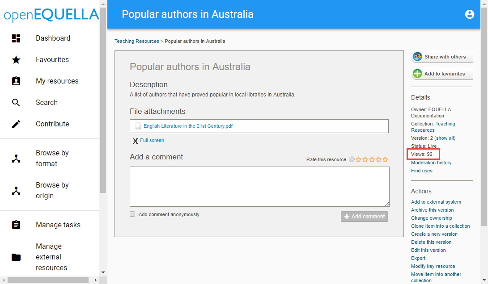

**Figure 1 Summary Page View Count**

The **Views** count shows the total number of views for the currently opened version of the item. The
number of views for each version of an item can also be viewed.

To view the Views counts for all item versions
1. Open the required item’s Summary page.
1. Click the **show all** link in the *Details* section, next to the *Version* number. The **Versions of this item** page displays, showing the **Views** for each version. An example is shown in Figure 2.

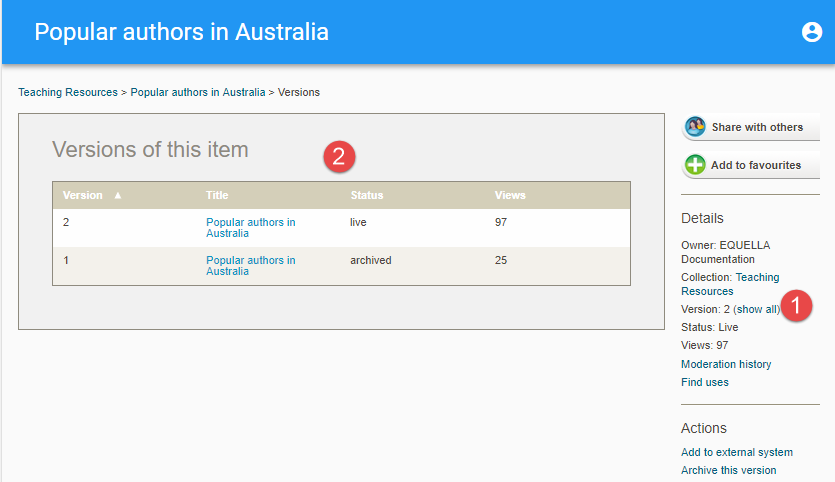

**Figure 2 Versions of This Item - Views Count**

### View Attachment View Counts
Attachment view counts display in the attachment drop-down for each attachment for users with the
new VIEW_VIEWCOUNT privilege granted. An example is shown in Figure 3.

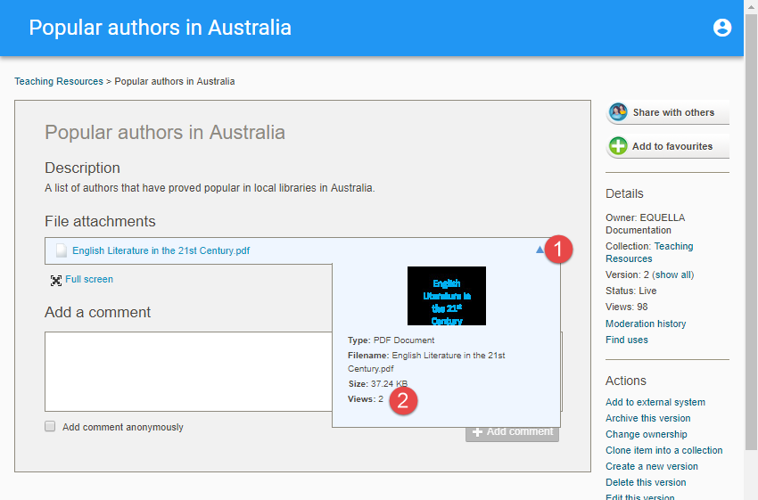

**Figure 3 Attachment View Count**

### Smart vs Normal Logging
Logging type (SMART or NORMAL) can be set in the  *mandatory.properties* file. Setting SMART logging
allows usage counts to occur per session rather than each time a user opens a summary page or an
attachment.

For example, if SMART logging is set, when a specific item summary page is opened multiple times by
a user in one session, the count will only go up by 1. If NORMAL logging is set, the count will increase
by one each time the user opens that item’s summary page during that session.

## Streamlined openEQUELLA Resource Attachments
When selecting existing openEQUELLA resources as attachments for an item, an option has been added to
reduce the number of pages that display during the process. Removing these pages provides a more
streamlined experience for contributors.

### Set Skip Checkout Page Option
A new option to **Skip checkout page** displays on the Attachments page in the Collection Definition
Editor.

To set the 'Skip checkout page' option
1. Open the **Collection Definition Editor** for the relevant collection from the Administration
Console.
1. From the *Wizard* tab, select the relevant **File attachment** wizard control. An example is shown in
Figure 4.
1. Make sure the **openEQUELLA Resources** attachment type is selected in the **Allow the following
attachment types:** section.
1. In the openEQUELLA Resources configuration section, select **Skip checkout page**.
1. Select **Save**.

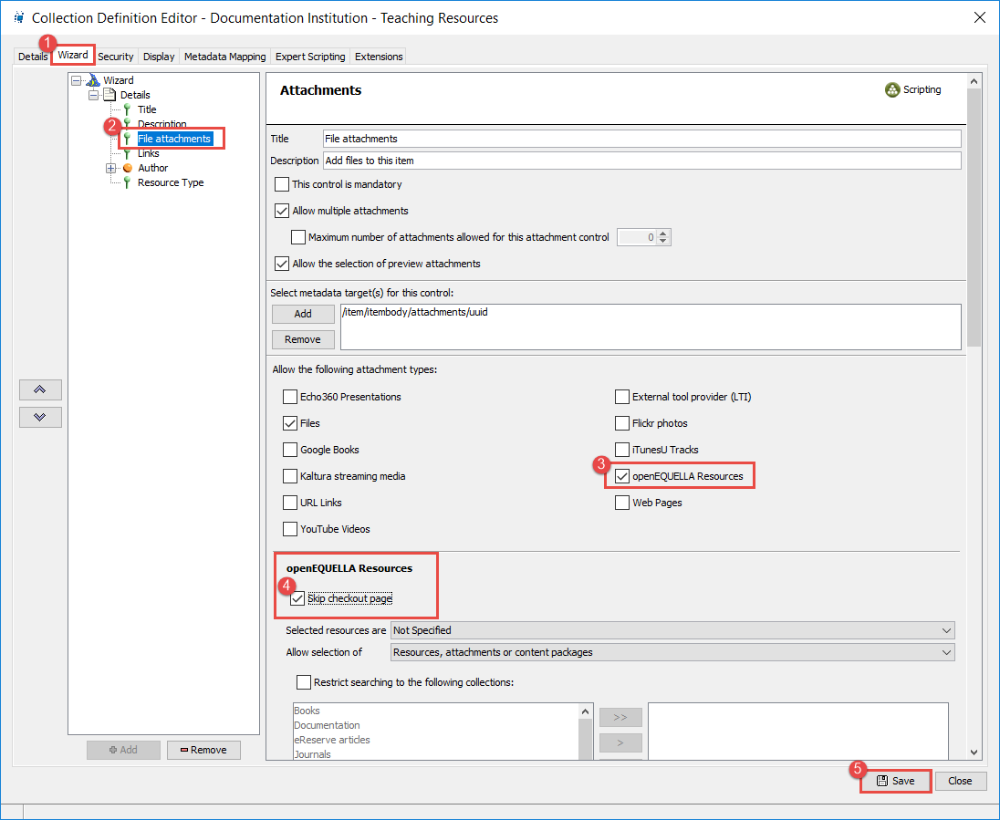

**Figure 4 New openEQUELLA Resources Option on the Attachments Wizard Page**

### Attach openEQUELLA Resources With New Option Selected
Once this option has been saved, the checkout page no longer displays during the contribution
process.

An example of the pages that display when selecting and returning openEQUELLA resources during
contribution when the new option is selected are shown in Figure 5 and Figure 6.

**Figure 5 Resources Selected**

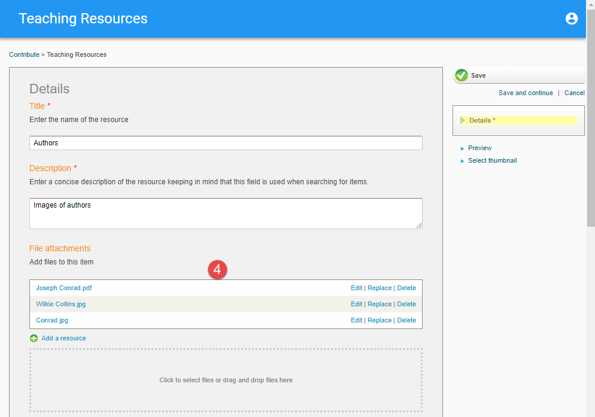

**Figure 6 Contribution Wizard Page With Returned openEQUELLA Resources**

If required, the **Edit** link beside each attachment can be used to make changes to the display name of the attachment.

## Course Selector
The openEQUELLA Course Selector has been updated to be scrollable and searchable. Any search
string entered will be matched with data stored in the Course Title, Description and Code fields. All
instances of the Course Selector within openEQUELLA have been updated.

An example with the scroll bar displayed is shown in Figure 7.

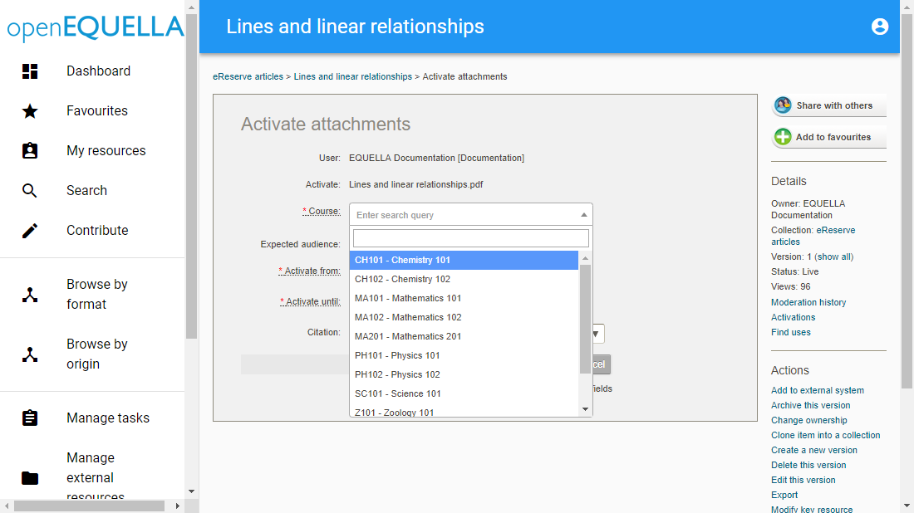

**Figure 7 Course Selector With Scroll Bar**

An example with search terms and results is shown in Figure 8.

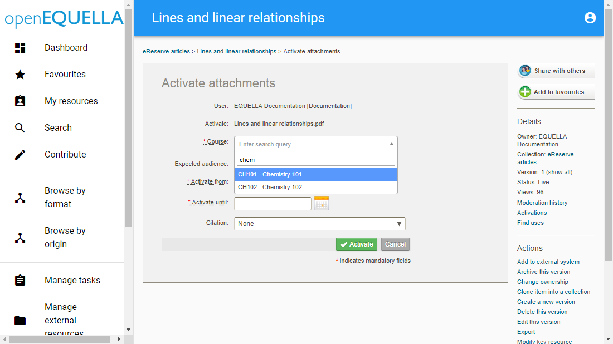

**Figure 8 Course Selector With Search Terms and Results**

## HTTP Referrers
HTTP referrers have been added to the database audit log, which enables reporting and identification
of the integrated LMS instances in which an item is being used.

Examples of a Postgres database with LMS HTTP referrers are shown in Figure 9 and Figure 10.

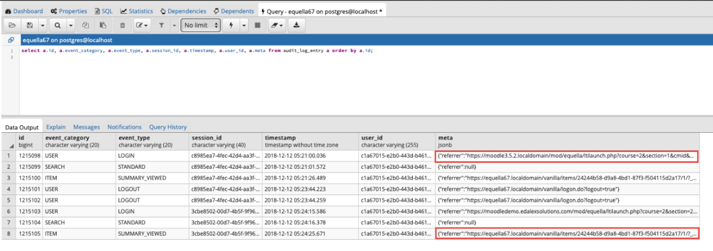

**Figure 9 Postgres - HTTP Referrers for Integrated LMSs**

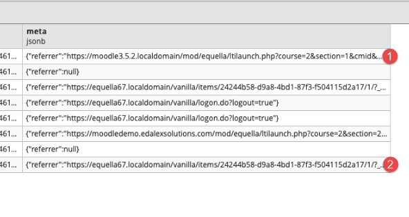

**Figure 10 Postgres - HTTP referrers for Integrated LMSs - Magnified**

## Theme Editor
The new Theme Editor enables administration users to apply theming to the new openEQUELLA UI
template, by selecting a colour scheme for page components and uploading a logo.

### Accessing the Theme Editor
The Theme Editor is accessed from the UI category of the Settings page.

#### To Access the Theme Editor
From the UI category of the Settings page, select the Edit Theme Settings button. An example is
shown in Figure 11.

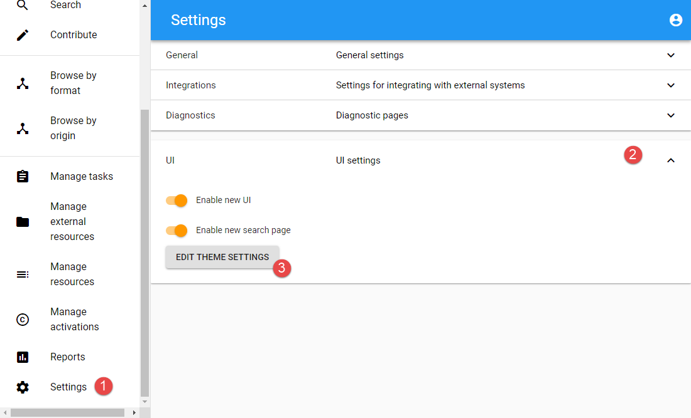

**Figure 11 UI Settings - Edit Theme Settings**

*NOTE: At a minimum, the **Enable new UI** needs to be turned on to access the Theme Editor.*

The **Theme Settings** page displays. An example is shown in Figure 12.

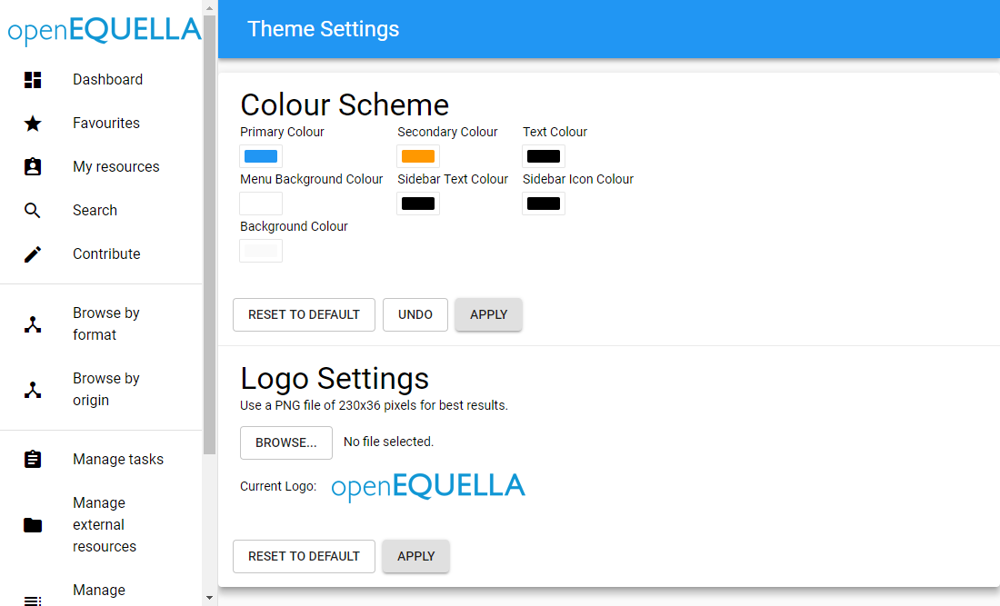

**Figure 12 Theme Settings Page**

### Applying a Colour Scheme
Colours can be selected and applied to specific areas of pages. Colours can be set for seven separate
components of the pages, however some of those components only display as part of the new Search
UI page.

#### Colour Scheme settings
The **Colour Scheme** area includes seven components, and colours can be set for each. Once colours
are selected, the **Apply** button is used to the refresh the page and apply the new colours.

The **Undo** button is used to undo the changes made within a configuration session (prior to the *Apply* button being used).

The **Reset to default** button is used to return to openEQUELLA default colours.

##### To Apply New Colours
1. Click the colour panel of the page component to be changed (for example, Primary Colour). A
colour selector displays, as shown in Figure 13.
1. Select the required colour by entering the HEX or RGB codes, if known, or by clicking one of the
solid colour squares at the bottom, which will change the colour palette. Select the required
colour by clicking in the colour palette. An example is shown in Figure 14.
1. Click the **Apply** button. The changes are applied to the relevant page component. An example is
shown in Figure 15.

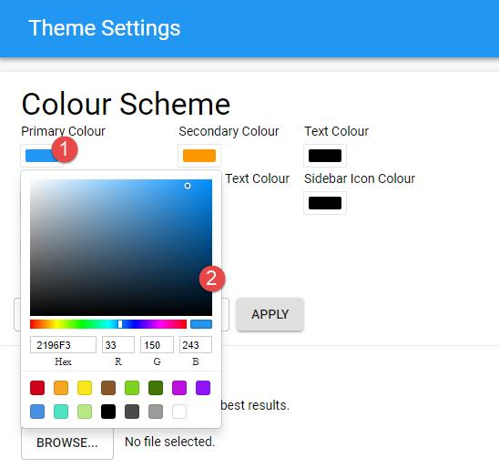

**Figure 13 Colour Selector**

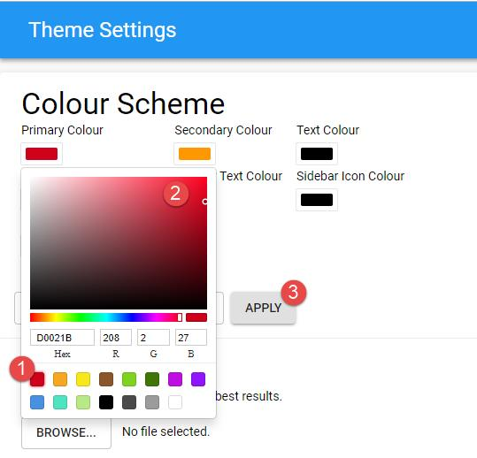

**Figure 14 Colour Selector With Changed Palette**

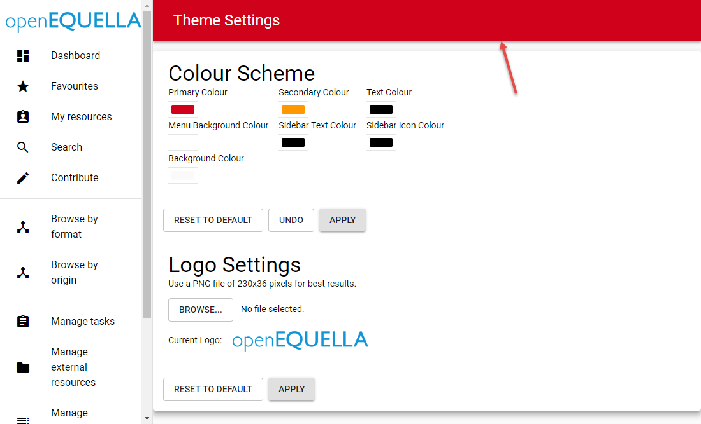

**Figure 15 Primary Colour Change Applied**

#### Colour Scheme Components
There are seven colour scheme components that can be changed:

##### Primary Colour
Changing the **Primary Colour** applies the new colour to the background of the main banner at the top
of each page, and the Title text on the new Search page. An example is shown in Figure 16.

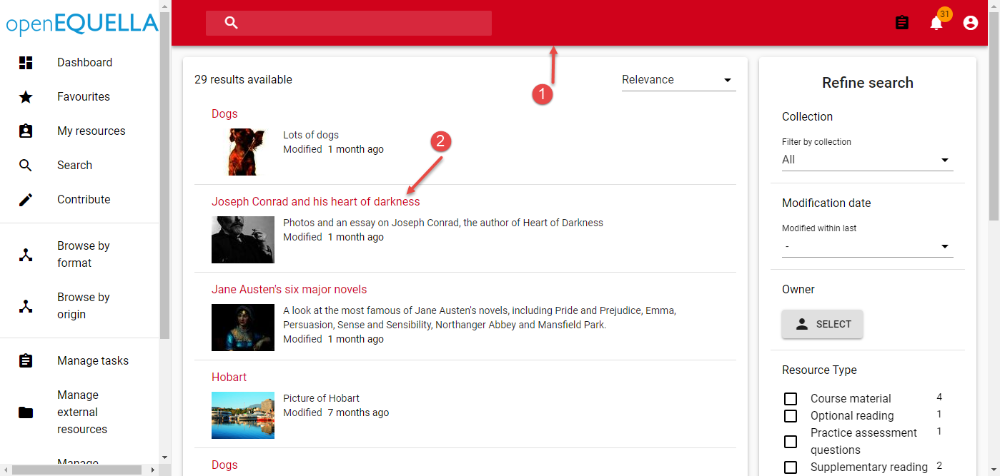

**Figure 16 Primary Colour Change – New Search Page**

##### Secondary Colour
Changing the **Secondary Colour** changes small control components such as the buttons to toggle
functionality and the Add button on the Courses page. An example is shown in Figure 17.

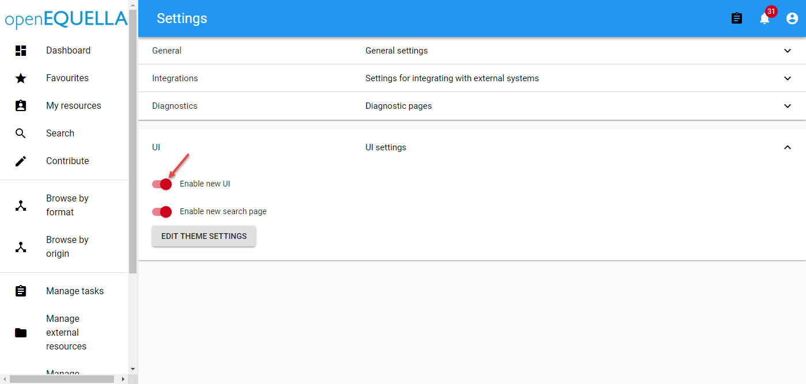

**Figure 17 Secondary Colour Components**

##### Text Colour
Changing the **Text Colour** changes some text. It does not affect text on the original search page.
Examples are shown in Figure 18 and Figure 19.

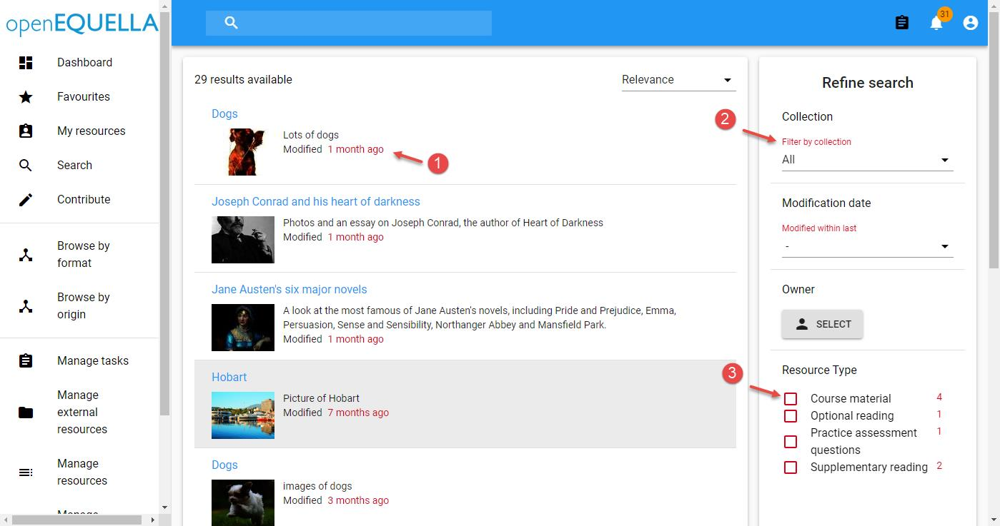

**Figure 18 Text Colour Change - New Search Page**

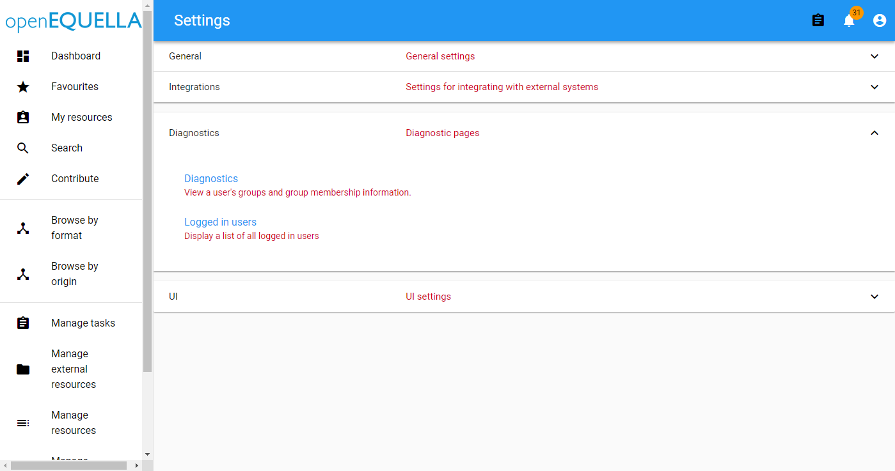

**Figure 19 Text Colour Change - Settings Page**

##### Menu Background Colour
Changing the **Menu Background Colour** changes the background of all menu panels, including the
navigation menu, results panel and filter panel. An example is shown in Figure 20.

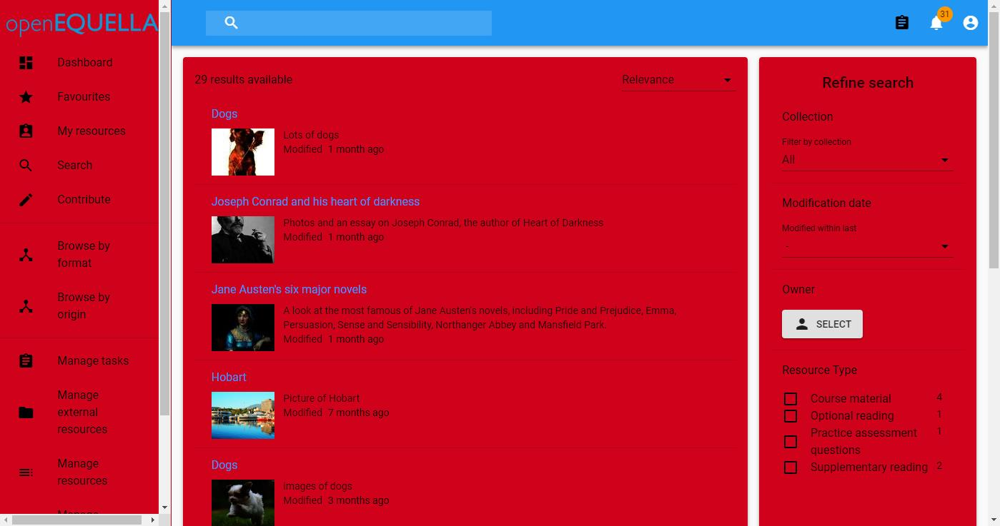

**Figure 20 Menu Background Colour Change - New Search Page**

##### Sidebar Text Colour
Changing the **Sidebar Text Colour** changes the text on the navigation menu, the filter panel and the
number of results text at the top of the results panel. An example is shown in Figure 21.

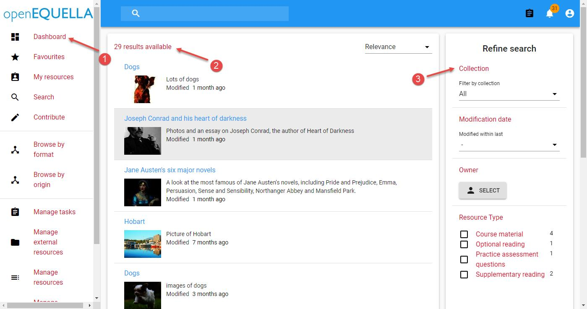

**Figure 21 Sidebar Text Colour Change - New Search UI**

##### Sidebar Icon Colour
Changing the **Sidebar Icon Colour** changes the colour of the icons on the navigation menu and some
other places. An example is shown in Figure 22.

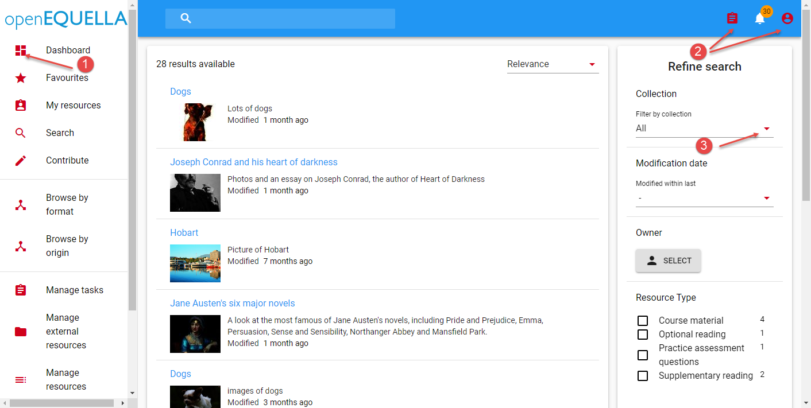

**Figure 22 Sidebar Icon Colour Change - New Search UI**

##### Background Colour
Changing the **Background Colour** changes the background colour of all pages. An example is shown in
Figure 23.

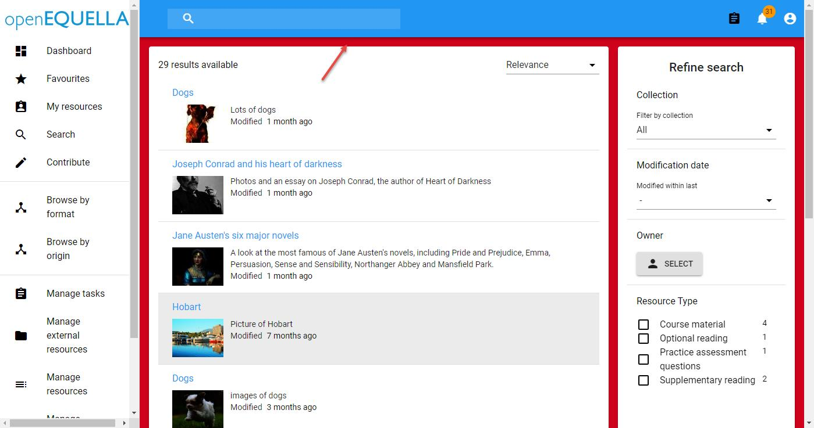

**Figure 23 Background Colour Change - New Search UI**

## Logo Settings
The Logo Settings area allows an alternative logo to be uploaded and displayed in the top left hand
corner of the screen.

*NOTE: For the best results, the logo png size should be 230x36 pixels. Logos of alternative sizes will be adjusted to these dimensions.*

To Upload a New logo
1. From the **Logo Settings** area of the Theme Settings page, click the **Browse** button to select and open the required file.
1. Click **Apply**. An example is shown in Figure 24.

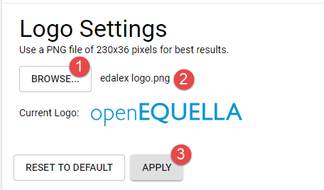

**Figure 24 Logo Settings**

The new logo displays. An example is shown in Figure 25.

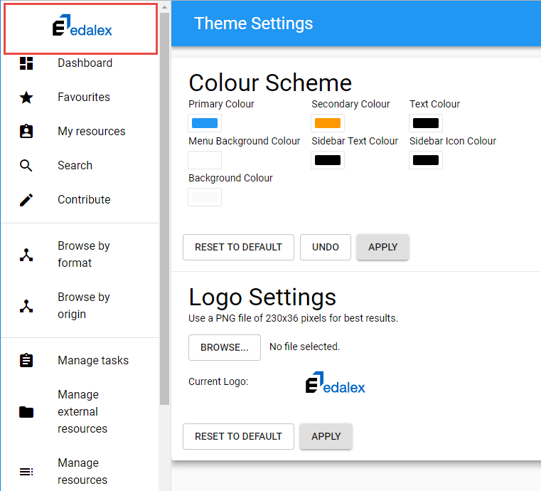

**Figure 25 Uploaded Logo Displayed**

Click **Reset to default** to return to the original logo.
